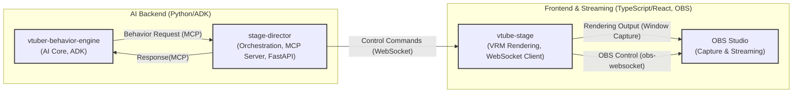

# AI V-Tuber System

## 概要 (Overview)

このプロジェクトは、AI（大規模言語モデル）によって制御される複数の V-Tuber キャラクターが対話し、YouTube などのプラットフォームで配信を行うシステムを構築することを目的としています。話題に応じて画像や Web ページを動的に表示し、OBS Studio と連携して配信を行います 。

### システム構成図 (System Architecture Diagram)



### コアコンポーネント (Core Components)

- **`vtuber-behavior-engine`**: AI エージェントがキャラクターの対話、感情、行動を生成するバックエンドシステム。Google Agent Development Kit (ADK) を活用します。
- **`stage-director`**: `vtuber-behavior-engine` からの指示を解釈し、`vtube-stage` を制御するコマンドに変換・送信する中間サーバー。WebSocket 通信と MCP (Model Context Protocol) の原則に基づいたツール提供を行います。
- **`vtube-stage`**: VRM モデルの描画、アニメーション、表情制御、コンテンツ表示を行うフロントエンド Web アプリケーション。Three.js と `@pixiv/three-vrm` を使用します。
- **OBS Studio 連携**: `obs-websocket` を介して配信ソフトウェア (OBS Studio) を制御します。

### AI 駆動開発アプローチ

このプロジェクトは、AI を開発プロセス全体で最大限に活用することを特徴としています。AI アシスタントを積極的に利用し、リサーチ、設計、コード生成支援、ドキュメント作成、ブレインストーミング、レビューなどの領域で協働します。AI は開発チームを強化するための強力なツールであり、最終的な意思決定と実装は開発チームが行いますが、プロセス全体を通じて AI との対話と協力を重視します。

## 主な機能 (Key Features - Planned)

- AI による自然なマルチキャラクター対話生成
- 対話内容に応じた感情表現（VRM BlendShape 制御）
- 話題に関連する画像や Web ページの動的表示
- VRM モデルのアニメーション制御
- OBS Studio との連携によるシーン切り替え、ソース表示/非表示の自動化
- マルチエージェントシステムによる協調動作（舞台制御、キャラクター制御）

## 技術スタック (Tech Stack)

- **AI Behavior Engine (`vtuber-behavior-engine`)**: Python, Google ADK, LLM (例: Gemini)
- **Stage Director (`stage-director`)**: Python, FastAPI, ADK (MCP Client として), WebSockets
- **VTuber Stage (`vtube-stage`)**: TypeScript, React, Vite, Three.js, @pixiv/three-vrm, WebSocket Client, obs-websocket-js
- **Communication**: WebSockets, ADK Internal / MCP Principles
- **Streaming Software**: OBS Studio
- **OBS Control**: obs-websocket

## はじめに (Getting Started)

このプロジェクトはモノレポ構成を採用しており、`packages/` ディレクトリ以下に各コンポーネントが含まれています。

1.  **リポジトリのクローン**:
    ```bash
    git clone [https://github.com/LongbowXXX/ai-tuber.git](https://github.com/LongbowXXX/ai-tuber.git)
    cd ai-tuber
    ```
2.  **依存関係のインストール**:
    各パッケージ (`vtuber-behavior-engine`, `stage-director`, `vtube-stage` ) のディレクトリに移動し、それぞれの `README.md` またはセットアップ手順 (`SetupGuide.md` ) に従って依存関係をインストールしてください (`uv` の利用を推奨)。
3.  **実行**:
    各コンポーネントの実行方法については、それぞれの `README.md` を参照してください。
4.  **開発プロセス**:
    このプロジェクトは反復型開発アプローチを採用しています。詳細な開発計画と各イテレーションの目標については、「AI V-Tuber システム：技術設計と開発に関する調査報告書 (改訂版 v2)」 および「反復型開発計画書」を参照してください。

## プロジェクト構成 (Project Structure)

```
/ai-vtuber-system/
├── .github/             # GitHub Actions ワークフロー
├── packages/            # 各コンポーネントのソースコード
│   ├── vtuber-behavior-engine/ # AI制御システム (Python, ADK)
│   ├── stage-director/      # 中間サーバー (Python, FastAPI)
│   └── vtube-stage/         # フロントエンド (TypeScript, React)
├── docs/                # ドキュメント (アーキテクチャ、API仕様など)
│   ├── architecture.md    # 詳細アーキテクチャ
│   ├── mcp_adk_explanation.md # MCP & ADK 解説
│   └── ai_powered_research/ # AIによる調査資料
├── scripts/             # 補助スクリプト
├── .gitignore
├── README.md            # このファイル
└── LICENSE              # ライセンス情報
```

詳細なアーキテクチャについては `docs/architecture.md` を参照してください。

## ライセンス (License)

このプロジェクトは(MIT LICENSE) の下で公開されています。

## VRM モデル、VRMA モーション

`/packages/vtube-stage/public` に配置されているリソースは動作確認用のサンプルです。  
本プロジェクトには動作確認用に **サンプル** として、個人商用利用可能、再配布可能で配布されているモデルやモーションを利用しています。  
各自で利用する際は、利用する状況（個人・商用など）に応じて **適切な モデル・モーションを用意してください**。

### VRM

- `ずんだもん`  
  https://hub.vroid.com/characters/821734897565535106/models/8611519130687999893

- `四国めたん`  
  https://hub.vroid.com/characters/6844984887981314416/models/4463092040338219016

### VRMA モーション

- `[CC0]Sachi VRMA 1`  
  https://booth.pm/ja/items/6412084

### 東北ずん子 ずんだもん プロジェクト キャラクター利用の手引き

本プロジェクトのソースコードは MIT License で公開していますが、サンプルとして利用しているキャラクターは利用制限があります。  
詳細については下記のガイドラインを参照してください。

- https://zunko.jp/guideline.html
