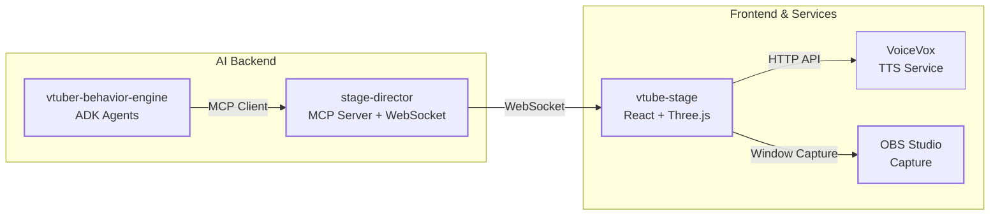

# AI V-Tuber System

## 概要 (Overview)

このプロジェクトは、AI（大規模言語モデル）によって制御される複数の V-Tuber キャラクターが対話し、YouTube などのプラットフォームで配信を行うシステムです。  
Google ADK (Agent Development Kit) によるマルチエージェントシステムと、MCP (Model Context Protocol) によるツール統合を特徴としています。

AI V-Tuber のデモ動画。エージェントの動きがわかりやすいように、左側に Google ADK の Web UI を表示させています。(OBS Studioで撮影）

https://github.com/user-attachments/assets/43fb0abb-b206-4c88-a2a1-f888108d71e1

### システム構成図 (System Architecture Diagram)



### コアコンポーネント (Core Components)

- **`vtuber-behavior-engine`**: AI コア。Google ADK を使用したマルチエージェントシステム。MCP Client として `stage-director` に接続し、キャラクターを制御します。
- **`stage-director`**: オーケストレーションハブ。MCP Server としてツールを提供し、WebSocket Server として `vtube-stage` にコマンドを送信します。
- **`vtube-stage`**: レンダリングエンジン。React + Three.js で VRM モデルを描画し、VoiceVox と連携して発話とリップシンクを行います。
- **VoiceVox**: 音声合成サービス。テキストから高品質な音声を生成します。

## 主な機能 (Key Features)

- **マルチエージェント対話**: キャラクター、ニュース、プレゼンテーションなど、役割の異なるエージェントが協調動作。
- **MCP ツール統合**: `speak`, `trigger_animation`, `display_markdown_text` などのツールによる統一的な制御。
- **リアルタイム VRM 制御**: 表情 (BlendShape)、ポーズ (VRMA)、視線 (LookAt) のリアルタイム更新。
- **音声合成とリップシンク**: VoiceVox を使用した自然な発話と、音声に同期した口パク。
- **Markdown 表示**: 資料やグラウンディング情報の動的表示。

## 技術スタック (Tech Stack)

- **AI Backend**: Python 3.11+, Google ADK, Gemini API, MCP (FastMCP)
- **Frontend**: TypeScript, React 19, Vite, Three.js, @pixiv/three-vrm
- **TTS**: VoiceVox
- **Streaming**: OBS Studio

## はじめに (Getting Started)

このプロジェクトはモノレポ構成を採用しており、`packages/` ディレクトリ以下に各コンポーネントが含まれています。

1. **リポジトリのクローン**:

   ```bash
   git clone https://github.com/LongbowXXX/ai-tuber.git
   cd ai-tuber
   ```

2. **VoiceVox のセットアップ**:
   VoiceVox をインストールし、起動してください（デフォルトポート: 50021）。

3. **各パッケージのセットアップ**:
   各ディレクトリ (`packages/*`) の `README.md` に従って、依存関係のインストールと環境変数の設定を行ってください。

   - `packages/stage-director`: `uv sync`
   - `packages/vtuber-behavior-engine`: `uv sync`
   - `packages/vtube-stage`: `npm install`

4. **実行**:
   以下の順序でコンポーネントを起動します。

   1. **VoiceVox**: アプリケーションを起動
   2. **Stage Director**: `uv run python src/stage_director/main.py`
   3. **VTube Stage**: `npm run dev` (ブラウザで開く)
   4. **Behavior Engine**: `uv run python src/vtuber_behavior_engine/main.py`

## プロジェクト構成 (Project Structure)

```text
/ai-vtuber-system/
├── packages/
│   ├── vtuber-behavior-engine/ # AI Core (ADK, MCP Client)
│   ├── stage-director/         # Orchestration (MCP Server, WebSocket)
│   └── vtube-stage/            # Frontend (React, Three.js)
├── docs/                       # Documentation
│   ├── architecture/           # Architecture details (Overview, Tech Stack, etc.)
│   ├── rules/                  # Coding conventions and Testing
│   └── ...
├── README.md                   # This file
└── LICENSE                     # License
```

## ドキュメント (Documentation)

詳細なドキュメントは `docs/` ディレクトリにあります。

- **アーキテクチャ**:
  - [アーキテクチャ概要](docs/architecture/overview.md)
  - [ディレクトリ構成](docs/architecture/directory-structure.md)
  - [技術スタック](docs/architecture/tech-stack.md)
  - [主要フロー](docs/architecture/key-flows.md)
  - [制約・落とし穴](docs/architecture/constraints.md)
- **開発ルール**:
  - [コーディング規約](docs/rules/coding-conventions.md)
  - [テスト方針](docs/rules/testing.md)
- **その他**:
  - [用語集](docs/glossary.md)
  - [MCP/ADK 解説](docs/mcp_adk_explanation.md)

## ライセンス (License)

MIT License - [LICENSE](LICENSE)

## VRM モデル、VRMA モーション

`/packages/vtube-stage/public` に配置されているリソースは動作確認用のサンプルです。
本プロジェクトには動作確認用に **サンプル** として、個人商用利用可能、再配布可能で配布されているモデルやモーションを利用しています。
各自で利用する際は、利用する状況（個人・商用など）に応じて **適切な モデル・モーションを用意してください**。

### VRM

- `ずんだもん`
  <https://hub.vroid.com/characters/821734897565535106/models/8611519130687999893>

- `四国めたん`
  <https://hub.vroid.com/characters/6844984887981314416/models/4463092040338219016>

### VRMA モーション

- `[CC0]Sachi VRMA 1`
  <https://booth.pm/ja/items/6412084>

### 東北ずん子 ずんだもん プロジェクト キャラクター利用の手引き

本プロジェクトのソースコードは MIT License で公開していますが、サンプルとして利用しているキャラクターは利用制限があります。
詳細については下記のガイドラインを参照してください。

- <https://zunko.jp/guideline.html>
