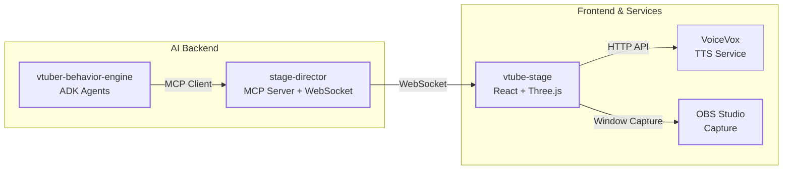
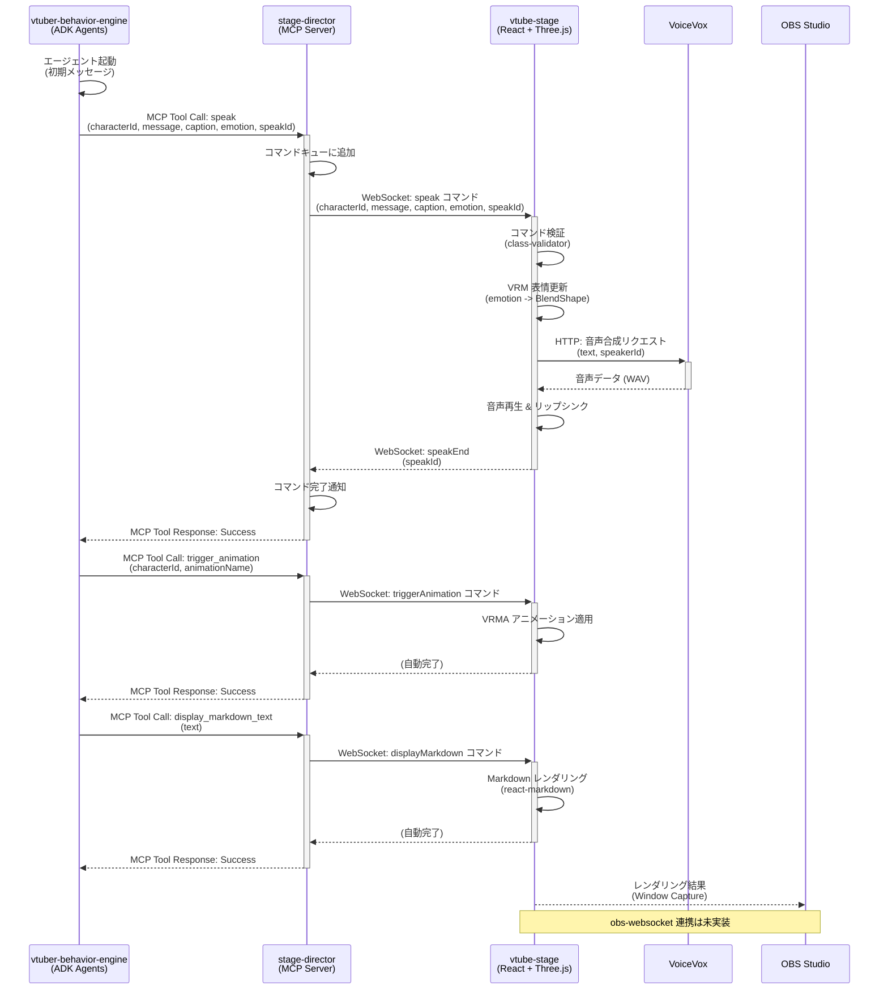

# AI V-Tuber システムアーキテクチャ

## 1. はじめに

### 1.1. 目的

本ドキュメントは、AI V-Tuber システムの技術的なアーキテクチャを包括的に記述することを目的とします。  
AI V-Tuber システムの全体的な目標は、リアルタイムでの対話、感情表現、および視覚的なパフォーマンスが可能で、OBS Studio を介してストリーミング配信できる、インタラクティブな AI 駆動型バーチャル YouTuber を作成することです。

このドキュメントは、システムの構造、主要コンポーネント、コンポーネント間の相互作用、データフロー、およびコア技術に関する詳細な情報を提供し、開発者、アーキテクト、および技術リーダーがシステムを理解、開発、保守、拡張、または統合する際の技術的なブループリントとして機能します。

### 1.2. スコープ

本ドキュメントは以下の内容を対象とします。

- システム全体の高レベルアーキテクチャ
- 主要コンポーネント (`vtuber-behavior-engine`, `stage-director`, `vtube-stage`, OBS Studio) の詳細な説明と責任範囲
- コンポーネント間の相互作用とエンドツーエンドのデータフロー
- 使用される通信プロトコル (WebSocket, ADK 内部通信/MCP 原則, obs-websocket)
- 各コンポーネントの主要な技術スタック

以下の内容はスコープ外とします。

- 特定の AI アルゴリズム（対話生成、感情分析など）の詳細な実装
- ユーザーインターフェース (UI) の具体的なデザイン
- コンポーネントの要求を超える詳細なデプロイメントインフラストラクチャ
- 網羅的なエラーハンドリングロジック

### 1.3. 対象読者

本ドキュメントの対象読者は、AI V-Tuber システムの開発、保守、拡張、または統合に関与するソフトウェア開発者、システムアーキテクト、およびテクニカルリードです。  
読者は、ソフトウェアアーキテクチャの概念、リアルタイムシステム、AI/LLM、およびウェブ技術に関する基本的な理解を有していることを前提とします。

### 1.4. ドキュメント規約

- コンポーネント名: 本文および図において、主要コンポーネントは `vtuber-behavior-engine`, `stage-director`, `vtube-stage`, OBS Studio のように `コード` スタイルで表記します。
- 図: システム構造やデータフローを視覚化するために、Mermaid 構文を使用した図を挿入します。
- 技術用語: 可能な限り標準的な技術用語を使用し、必要に応じて補足説明を加えます。

## 2. システムアーキテクチャ概要

AI V-Tuber システムは、モジュール化された設計原則に基づいて構築されており、各コンポーネントが特定の責任を担うことで、柔軟性、拡張性、保守性を高めています。システムは主に
4 つのコアコンポーネントで構成されています。

### 2.1. 高レベルアーキテクチャ図

以下の図は、システムの主要コンポーネントとその間の主要な通信経路を示しています。



### 2.2. コンポーネントの責任範囲

各コンポーネントの主な役割と責任範囲を以下に示します。

| コンポーネント名         | 主要な役割                                | 主要な責任範囲                                                                                                                                                                                                                   |
| :----------------------- | :---------------------------------------- | :------------------------------------------------------------------------------------------------------------------------------------------------------------------------------------------------------------------------------- |
| `vtuber-behavior-engine` | AI コア                                   | 対話生成、コンテキスト管理、感情分析/ラベリング、ADK/MCP を介した潜在的なツール利用                                                                                                                                              |
| `stage-director`         | オーケストレーションハブ                  | 対話フロー管理、Behavior Engine 内のエージェント/ツールの調整 (ADK オーケストレーション活用 )、セッション状態維持 、AI 出力 (対話、感情) の `vtube-stage` 用コマンドへの変換、WebSocket 通信管理                                 |
| `vtube-stage`            | リアルタイムレンダリングエンジン          | Three.js と `@pixiv/three-vrm` を使用した VRM モデルの読み込みとレンダリング 、`stage-director` からのコマンドに基づく表情 (BlendShape)、ポーズ、視線 (LookAt) の適用 、OBS Studio 制御のための `obs-websocket` クライアント機能 |
| OBS Studio               | キャプチャ & ストリーミングエンドポイント | `vtube-stage` からのレンダリング出力の受信 (通常はウィンドウ/ゲームキャプチャ経由)、シーン変更やソース表示/非表示のための `obs-websocket` によるリモート制御の可能性                                                             |

このコンポーネント分割は、システム全体の関心事を明確に分離します。特に重要な点は以下の通りです：

- **ADK によるマルチエージェントシステム**: `vtuber-behavior-engine` は Google の Agent Development Kit (ADK) を採用し、複数のエージェント（キャラクターエージェント、会話コンテキストエージェント、ニュースエージェント、プレゼンテーションエージェントなど）が協調動作する高度な AI システムを実現しています。
- **MCP (Model Context Protocol) によるツール統合**: `stage-director` は MCP Server として機能し、`vtuber-behavior-engine` から MCP Client として接続されます。これにより、AI エージェントが舞台制御（speak、trigger_animation、display_markdown_text）を統一されたインターフェースで実行できます。
- **WebSocket によるリアルタイム通信**: `stage-director` と `vtube-stage` 間は WebSocket で接続され、低遅延でのコマンド送信とレスポンスを実現しています。

このアーキテクチャは、単純なリクエスト/レスポンス型の LLM インタラクションを超え、より洗練され、モジュール化され、拡張可能な AI ビヘイビアをコードを通じて管理することを可能にしています。

## 3. コンポーネント間の相互作用とデータフロー

### 3.1. エンドツーエンドのワークフロー

典型的なインタラクションのシーケンスは、外部からの入力（例：ユーザーメッセージ）または内部トリガー（例：タイマーイベント）から始まり、OBS
Studio での最終的な視覚的出力に至るまで、以下のステップで進行します。

1. **AI エージェント起動**: `vtuber-behavior-engine` が ADK のマルチエージェントシステムを起動し、初期メッセージで対話を開始します。
2. **音声認識（オプション）**: 音声認識ツールがユーザーの発話を検出した場合、その内容がエージェントに渡されます。
3. **AI 処理とツール呼び出し**: ADK エージェントが対話を生成する際、MCP Client として `stage-director` の MCP Server に接続し、以下のツールを呼び出します：
   - `speak`: キャラクターの発話、感情、キャプションを指定
   - `trigger_animation`: アニメーション（ポーズ）をトリガー
   - `display_markdown_text`: Markdown テキストを表示
4. **コマンドキューイング**: `stage-director` は受信したツール呼び出しをコマンドキューに追加し、順次処理します。
5. **WebSocket 送信**: `stage-director` はキューからコマンドを取り出し、WebSocket 経由で `vtube-stage` に送信します。
6. **コマンド受信と検証**: `vtube-stage` はコマンドを受信し、`class-validator` を使用して検証します。
7. **VRM モデル更新**: `@pixiv/three-vrm` を使用して、感情に基づく表情（BlendShape）を VRM モデルに適用します。
8. **TTS とリップシンク**: VoiceVox API を呼び出して音声を生成し、音声に同期してリップシンク（口パク）を実行します。
9. **Markdown 表示**: 必要に応じて、画面に Markdown テキスト（資料、グラウンディング情報など）を表示します。
10. **完了通知**: TTS 再生完了後、`vtube-stage` は `speakEnd` コマンドを `stage-director` に送信します。
11. **同期制御**: `stage-director` は `speakEnd` を受信し、次のコマンド処理を続行します（`speak` ツールは完了まで待機）。
12. **OBS キャプチャ**: OBS Studio は `vtube-stage` のウィンドウをキャプチャし、配信映像として出力します。
    - **注**: obs-websocket による OBS 制御は現在未実装です。

### 3.2. シーケンス図

以下の Mermaid シーケンス図は、上記のワークフローにおけるコンポーネント間の主要なインタラクションとデータフローを示しています。



### 3.3. データペイロード

コンポーネント間で交換されるデータの構造と主要なフィールドの例を以下に示します。

#### Engine -> Director (MCP Tool Call)

```python
# speak ツール呼び出し
await stage_director_client.call_tool(
    "speak",
    {
        "character_id": "avatar1",
        "message": "こんにちは！今日はいい天気ですね。",
        "caption": "挨拶",
        "emotion": "happy"
    }
)

# trigger_animation ツール呼び出し
await stage_director_client.call_tool(
    "trigger_animation",
    {
        "character_id": "avatar1",
        "animation_name": "wave_pose"
    }
)

# display_markdown_text ツール呼び出し
await stage_director_client.call_tool(
    "display_markdown_text",
    {
        "text": "## 今日のトピック\n- AIの最新動向\n- 機械学習の応用例"
    }
)
```

#### Director -> Stage (WebSocket JSON)

```json
// speak コマンド
{
  "command": "speak",
  "payload": {
    "characterId": "avatar1",
    "message": "こんにちは！今日はいい天気ですね。",
    "caption": "挨拶",
    "emotion": "happy",
    "speakId": "550e8400-e29b-41d4-a716-446655440000"
  }
}

// triggerAnimation コマンド
{
  "command": "triggerAnimation",
  "payload": {
    "characterId": "avatar1",
    "animationName": "wave_pose"
  }
}

// displayMarkdown コマンド
{
  "command": "displayMarkdown",
  "payload": {
    "text": "## 今日のトピック\n- AIの最新動向\n- 機械学習の応用例"
  }
}
```

#### Stage -> Director (WebSocket JSON)

```json
// speakEnd コマンド（TTS 完了通知）
{
  "command": "speakEnd",
  "payload": {
    "characterId": "avatar1",
    "speakId": "550e8400-e29b-41d4-a716-446655440000"
  }
}
```

#### Stage -> VoiceVox (HTTP API)

```typescript
// 音声合成クエリ生成
POST http://localhost:50021/audio_query?text={text}&speaker={speakerId}

// 音声合成
POST http://localhost:50021/synthesis?speaker={speakerId}
Content-Type: application/json
Body: {音声合成クエリのJSON}

// レスポンス: audio/wav
```

**表: データフロー概要**

| ステージ                          | 送信元                   | 送信先                   | プロトコル/形式   | データ内容 (例)                                                                                          |
| :-------------------------------- | :----------------------- | :----------------------- | :---------------- | :------------------------------------------------------------------------------------------------------- |
| AI エージェント -> ツール呼び出し | `vtuber-behavior-engine` | `stage-director`         | MCP Tool Call     | `speak(character_id, message, caption, emotion)` <br/> `trigger_animation(character_id, animation_name)` |
| ツール応答 -> AI エージェント     | `stage-director`         | `vtuber-behavior-engine` | MCP Tool Response | `"Success"` または エラーメッセージ                                                                      |
| コマンド送信 -> ステージ描画      | `stage-director`         | `vtube-stage`            | WebSocket (JSON)  | `{command: "speak", payload: {...}}` <br/> `{command: "triggerAnimation", payload: {...}}`               |
| 完了通知 -> コマンド処理          | `vtube-stage`            | `stage-director`         | WebSocket (JSON)  | `{command: "speakEnd", payload: {speakId, characterId}}`                                                 |
| TTS リクエスト -> 音声生成        | `vtube-stage`            | VoiceVox                 | HTTP API          | `POST /audio_query?text=...&speaker=...` <br/> `POST /synthesis?speaker=...`                             |
| レンダリング -> キャプチャ        | `vtube-stage`            | OBS Studio               | Window Capture    | レンダリングされたピクセルデータ (OS レベル)                                                             |

## 4. コンポーネントの詳細

### 4.1. vtuber-behavior-engine (AI Core)

- **技術スタック**: Python 3.11+, Google ADK, LLM (Gemini), Google Cloud Speech
- **責務**:
  - マルチエージェントシステム: ADK を使用して複数のエージェント（キャラクターエージェント、会話コンテキストエージェント、ニュースエージェント、プレゼンテーションエージェントなど）を協調動作させます。
  - 対話生成: キャラクター設定とコンテキストに基づいて、一貫性のある対話を生成します。
  - 感情表現: 生成された対話に適切な感情ラベル（`happy`, `sad`, `neutral` など）を付与します。
  - コンテキスト管理: 対話履歴、キャラクター状態、会話の流れを維持します。
  - 音声認識統合: Google Cloud Speech API を使用してユーザーの音声入力を認識します（オプション）。
  - MCP Client: `stage-director` の MCP Server に接続し、舞台制御ツール（speak、trigger_animation、display_markdown_text）を呼び出します。
- **インタフェース**:
  - MCP Client として `stage-director` のツールを呼び出し
  - スタンドアロン実行（`main.py`）または ADK Web UI 経由での実行
- **主要ライブラリ/フレームワーク**:
  - `google-adk`: マルチエージェントシステムの基盤
  - `google-genai`: Gemini API クライアント
  - `google-cloud-speech`: 音声認識
  - `mcp`: Model Context Protocol クライアント
  - `chromadb`: ベクトルデータベース（コンテキスト管理用）

### 4.2. stage-director (MCP Server & WebSocket Hub)

- **技術スタック**: Python 3.11+, FastAPI, MCP (Model Context Protocol), WebSockets
- **責務**:
  - MCP Server: 3 つのツール（speak、trigger_animation、display_markdown_text）を `vtuber-behavior-engine` に提供します。
  - コマンドキューイング: MCP ツール呼び出しをコマンドキューに追加し、順次処理します。
  - 同期制御: `speak` ツールは TTS 完了まで待機し、AI エージェントのペースを制御します。
  - WebSocket サーバー: `vtube-stage` からの接続を受け入れ、コマンドを送信し、完了通知を受信します。
  - UUID 管理: 各 speak コマンドに UUID (speakId) を付与し、完了追跡を可能にします。
- **インタフェース**:
  - MCP Server として `vtuber-behavior-engine` にツールを提供（デフォルト: `0.0.0.0:8080`）
  - WebSocket サーバーとして `vtube-stage` と通信（デフォルト: `127.0.0.1:8000/ws`）
- **主要ライブラリ/フレームワーク**:
  - `fastapi`: WebSocket サーバー基盤
  - `mcp`: Model Context Protocol サーバー実装（FastMCP）
  - `pydantic`: データモデルとバリデーション
  - `uvicorn`: ASGI サーバー

### 4.3. vtube-stage (Real-time Rendering Engine)

- **技術スタック**: TypeScript, React 19, Vite, Three.js, `@pixiv/three-vrm`, Material-UI
- **責務**:
  - VRM レンダリング: Three.js と `@pixiv/three-vrm` を使用して VRM モデル（複数）を読み込み、レンダリングします。
  - リアルタイム更新: WebSocket で受信したコマンドに基づき、VRM モデルの表情（BlendShape）、ポーズ（VRMA）をリアルタイムに更新します。
  - コマンド検証: `class-validator` と `class-transformer` を使用して、受信したコマンドの型安全性を保証します。
  - VoiceVox TTS 統合: VoiceVox HTTP API を呼び出して音声を生成し、音声再生と同期してリップシンク（口パク BlendShape）を実行します。
  - Markdown 表示: `react-markdown` を使用して、資料やグラウンディング情報を画面に表示します。
  - UI 提供: Material-UI を使用した管理 UI（接続ステータス、デバッグ情報など）を提供します。
- **インタフェース**:
  - WebSocket クライアントとして `stage-director` に接続（デフォルト: `ws://localhost:8000/ws`）
  - HTTP クライアントとして VoiceVox API に接続（デフォルト: `http://localhost:50021`）
  - OBS Studio によるウィンドウキャプチャ
  - **注**: obs-websocket 連携は現在未実装
- **主要ライブラリ/フレームワーク**:
  - `react`, `react-dom`: UI フレームワーク
  - `three`: 3D レンダリングエンジン
  - `@pixiv/three-vrm`, `@pixiv/three-vrm-animation`: VRM モデルとアニメーション制御
  - `@react-three/fiber`, `@react-three/drei`: React 向け Three.js ラッパー
  - `@mui/material`: UI コンポーネント
  - `react-markdown`: Markdown レンダリング
  - `axios`: HTTP クライアント（VoiceVox API 用）
  - `class-validator`, `class-transformer`: 型安全なコマンド検証

### 4.4. OBS Studio (Capture & Streaming Endpoint)

- **技術スタック**: OBS Studio アプリケーション
- **責務**:
  - ウィンドウキャプチャ: `vtube-stage` のブラウザウィンドウをキャプチャします。
  - シーン合成: キャプチャした映像と背景、オーバーレイなどを組み合わせて最終的な配信画面を構成します。
  - エンコーディング/ストリーミング: 合成された画面を YouTube、Twitch などのプラットフォームにストリーミングします。
- **インタフェース**:
  - OS レベルでのウィンドウキャプチャ
  - **注**: obs-websocket によるリモート制御は現在未実装
- **設定**:
  - `vtube-stage` をキャプチャするためのウィンドウキャプチャソースの設定が必要です。

### 4.5. VoiceVox (TTS Service)

- **技術スタック**: VoiceVox エンジン（ローカルサービス）
- **責務**:
  - 音声合成: テキストから音声（WAV 形式）を生成します。
  - 話者サポート: 複数の話者 ID をサポートし、キャラクターごとに異なる声を使用できます。
    - avatar1: speakerId=3 (ずんだもん)
    - avatar2: speakerId=2 (四国めたん)
- **インタフェース**:
  - HTTP API（デフォルト: `http://localhost:50021`）
- **主要エンドポイント**:
  - `POST /audio_query`: 音声合成クエリの生成
  - `POST /synthesis`: 音声データの生成

## 5. 技術スタック概要

| コンポーネント           | 言語/環境        | 主要フレームワーク/ライブラリ                                                                                                                                        |
| :----------------------- | :--------------- | :------------------------------------------------------------------------------------------------------------------------------------------------------------------- |
| `vtuber-behavior-engine` | Python 3.11+     | Google ADK, google-genai, google-cloud-speech, mcp, chromadb                                                                                                         |
| `stage-director`         | Python 3.11+     | FastAPI, MCP (FastMCP), pydantic, uvicorn, websockets                                                                                                                |
| `vtube-stage`            | TypeScript       | React 19, Vite, Three.js, @pixiv/three-vrm, @pixiv/three-vrm-animation, @react-three/fiber, @mui/material, react-markdown, axios, class-validator, class-transformer |
| VoiceVox                 | ローカルサービス | VoiceVox エンジン (HTTP API)                                                                                                                                         |
| OBS Studio               | アプリケーション | OBS Studio                                                                                                                                                           |

## 6. 非機能要件と考慮事項

- リアルタイム性: `stage-director` から `vtube-stage` へのコマンド送信、および `vtube-stage` での VRM
  モデル更新は、スムーズなアニメーションを実現するために低遅延である必要があります。WebSocket
  はこの要件に適しています 。AI の応答生成 (`vtuber-behavior-engine`) は最も遅延が大きいボトルネックとなる可能性があり、最適化が必要です。ADK
  の非同期実行 (`run_async`) が役立つ可能性があります 。
- パフォーマンス: `vtube-stage` での Three.js レンダリングは、特に複雑なモデルやエフェクトを使用する場合、効率的である必要があります。GPU
  アクセラレーションを活用し、不要な再レンダリングを避けることが重要です 。
- 拡張性:
  - AI 能力: ADK/MCP の採用により、新しいツールやエージェントを `vtuber-behavior-engine`
    に追加して機能を拡張することが容易になります 。
  - キャラクター: 新しい VRM モデルを追加し、関連する設定 (`stage-director` での感情マッピングなど)
    を行うことで、複数のキャラクターをサポートできます。
  - インタラクション: WebSocket プロトコルを拡張して、`stage-director` と `vtube-stage`
    の間でより多くの種類のコマンド（例: 環境エフェクト、小道具の表示）をサポートできます。
- 保守性: コンポーネント間の明確な分離と、ADK による構造化された AI
  ロジックの実装は、システムの保守性を向上させます。各コンポーネントは独立してテストおよびデプロイできます。
- 設定可能性: 感情と表情のマッピング、キャラクター設定、OBS 接続情報などは、設定ファイルまたは環境変数で管理可能にすることが望ましいです。
- エラーハンドリング: 各コンポーネントは、通信エラー (WebSocket 切断、OBS 接続失敗) や内部エラー (AI
  モデルエラー、レンダリングエラー) を適切に処理し、可能な限り回復するか、明確なエラーログを出力する必要があります。ADK
  はエラー処理に関する機能を提供する可能性があります 。

## 7. デプロイメントアーキテクチャ (概要)

- `vtuber-behavior-engine` と `stage-director`: これらは Python アプリケーションであり、同じマシンまたは別々のマシン (
  コンテナ化されている可能性あり) で実行できます。ADK コンポーネント間の通信は内部的に処理されます 。
- `vtube-stage`: これは Web アプリケーションであり、ローカルマシン上のブラウザで実行されます。ビルドされた静的ファイルは、ローカルの
  HTTP サーバー (`vite preview` や `serve` など) またはクラウドストレージから提供できます。
- OBS Studio: 通常、`vtube-stage` が実行されているのと同じマシンで実行されます。
- 通信:
  - `stage-director` と `vtube-stage` はローカルネットワーク経由で WebSocket で通信します。
  - `vtube-stage` と OBS Studio はローカルネットワーク経由で `obs-websocket` で通信します。

コンテナ化 (Docker) を使用して、バックエンドコンポーネント (`vtuber-behavior-engine`, `stage-director`)
のデプロイメントと依存関係の管理を簡素化することを検討できます。

## 8. 今後の検討事項

- TTS/リップシンク: 具体的な実装方法 (ブラウザの Web Speech API、外部 TTS サービス、リップシンクライブラリの選定) を決定する必要があります。
- 詳細な感情マッピング: 感情ラベルから具体的な BlendShape 値へのマッピングロジックを詳細に設計する必要があります。
- 複数キャラクターのサポート: 複数のキャラクターを同時に、または切り替えて表示する場合の `stage-director` と `vtube-stage` のアーキテクチャを詳細化する必要があります。ADK のマルチエージェント機能がここで役立つ可能性があります 。
- ユーザーインタラクション: 視聴者からのコメントなどをリアルタイムで処理し、AI の入力とするための具体的な方法を検討する必要があります (例: YouTube Live Chat API 連携)。これは ADK
  のツールとして実装できます 。
- 永続化: 対話履歴やキャラクター設定などのデータをどのように永続化するか (データベース、ファイルなど) を決定する必要があります。
