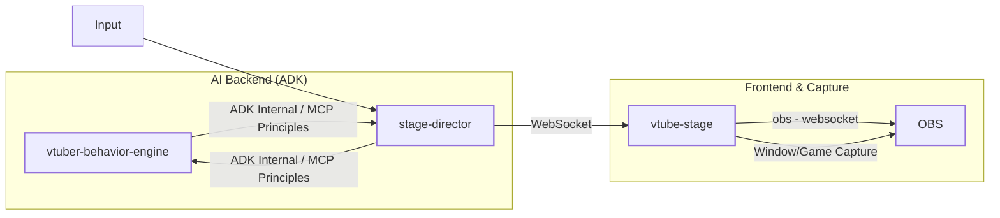
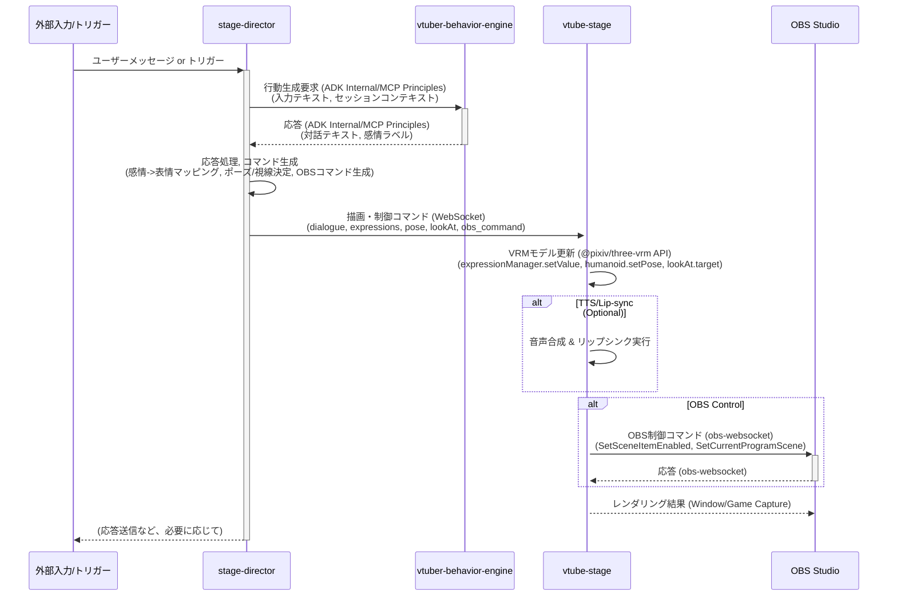

# AI V-Tuber システムアーキテクチャ

## 1. はじめに

### 1.1. 目的

本ドキュメントは、AI V-Tuber システムの技術的なアーキテクチャを包括的に記述することを目的とします。  
AI V-Tuberシステムの全体的な目標は、リアルタイムでの対話、感情表現、および視覚的なパフォーマンスが可能で、OBS Studio を介してストリーミング配信できる、インタラクティブな AI 駆動型バーチャル YouTuber を作成することです。  

このドキュメントは、システムの構造、主要コンポーネント、コンポーネント間の相互作用、データフロー、およびコア技術に関する詳細な情報を提供し、開発者、アーキテクト、および技術リーダーがシステムを理解、開発、保守、拡張、または統合する際の技術的なブループリントとして機能します。

### 1.2. スコープ

本ドキュメントは以下の内容を対象とします。

- システム全体の高レベルアーキテクチャ
- 主要コンポーネント (`vtuber-behavior-engine`, `stage-director`, `vtube-stage`, OBS Studio) の詳細な説明と責任範囲
- コンポーネント間の相互作用とエンドツーエンドのデータフロー
- 使用される通信プロトコル (WebSocket, ADK 内部通信/MCP 原則, obs-websocket)
- 各コンポーネントの主要な技術スタック

以下の内容はスコープ外とします。

- 特定の AI アルゴリズム（対話生成、感情分析など）の詳細な実装
- ユーザーインターフェース (UI) の具体的なデザイン
- コンポーネントの要求を超える詳細なデプロイメントインフラストラクチャ
- 網羅的なエラーハンドリングロジック

### 1.3. 対象読者

本ドキュメントの対象読者は、AI V-Tuber システムの開発、保守、拡張、または統合に関与するソフトウェア開発者、システムアーキテクト、およびテクニカルリードです。  
読者は、ソフトウェアアーキテクチャの概念、リアルタイムシステム、AI/LLM、およびウェブ技術に関する基本的な理解を有していることを前提とします。  

### 1.4. ドキュメント規約

- コンポーネント名: 本文および図において、主要コンポーネントは `vtuber-behavior-engine`, `stage-director`, `vtube-stage`, OBS Studio のように `コード` スタイルで表記します。
- 図: システム構造やデータフローを視覚化するために、Mermaid 構文を使用した図を挿入します。
- 技術用語: 可能な限り標準的な技術用語を使用し、必要に応じて補足説明を加えます。

## 2. システムアーキテクチャ概要

AI V-Tuber システムは、モジュール化された設計原則に基づいて構築されており、各コンポーネントが特定の責任を担うことで、柔軟性、拡張性、保守性を高めています。システムは主に
4 つのコアコンポーネントで構成されています。

### 2.1. 高レベルアーキテクチャ図

以下の図は、システムの主要コンポーネントとその間の主要な通信経路を示しています。



### 2.2. コンポーネントの責任範囲

各コンポーネントの主な役割と責任範囲を以下に示します。

| コンポーネント名                 | 主要な役割                  | 主要な責任範囲                                                                                                                                                              |
|:-------------------------|:-----------------------|:---------------------------------------------------------------------------------------------------------------------------------------------------------------------|
| `vtuber-behavior-engine` | AI コア                  | 対話生成、コンテキスト管理、感情分析/ラベリング、ADK/MCP を介した潜在的なツール利用                                                                                                                       |
| `stage-director`         | オーケストレーションハブ           | 対話フロー管理、Behavior Engine 内のエージェント/ツールの調整 (ADK オーケストレーション活用 )、セッション状態維持 、AI 出力 (対話、感情) の `vtube-stage` 用コマンドへの変換、WebSocket 通信管理                                        |
| `vtube-stage`            | リアルタイムレンダリングエンジン       | Three.js と `@pixiv/three-vrm` を使用した VRM モデルの読み込みとレンダリング 、`stage-director` からのコマンドに基づく表情 (BlendShape)、ポーズ、視線 (LookAt) の適用 、OBS Studio 制御のための `obs-websocket` クライアント機能 |
| OBS Studio               | キャプチャ & ストリーミングエンドポイント | `vtube-stage` からのレンダリング出力の受信 (通常はウィンドウ/ゲームキャプチャ経由)、シーン変更やソース表示/非表示のための `obs-websocket` によるリモート制御の可能性                                                                 |

このコンポーネント分割は、システム全体の関心事を明確に分離します。特に、バックエンドコンポーネント (
`vtuber-behavior-engine` と `stage-director`) に Google の Agent Development Kit (ADK)を採用している点は重要です。  
ADKはコードファーストの開発アプローチ、複雑なエージェント間の連携（マルチエージェントオーケストレーション）、そして広範なツールエコシステムとの統合を重視しています。  
これは、本システムが単純なリクエスト/レスポンス型のLLM インタラクションを超え、より洗練され、モジュール化され、拡張可能な
AIビヘイビアをコードを通じて管理することを目指していることを示唆しています。このアーキテクチャは、開発の複雑性を増す可能性がある一方で、システムの潜在的な能力を大幅に高めます。

## 3. コンポーネント間の相互作用とデータフロー

### 3.1. エンドツーエンドのワークフロー

典型的なインタラクションのシーケンスは、外部からの入力（例：ユーザーメッセージ）または内部トリガー（例：タイマーイベント）から始まり、OBS
Studio での最終的な視覚的出力に至るまで、以下のステップで進行します。

1. 入力受信: `stage-director` が入力を受け取ります (例: 外部 API 経由、またはユーザーが直接対話する場合は WebSocket
   メッセージ経由)。
2. 行動生成要求: `stage-director` は `vtuber-behavior-engine` を呼び出します。これは ADK
   のエージェントインタラクションメカニズム (例: `run_async`  やエージェント間の委譲 ) を使用して行われる可能性が高いです。
3. AI 処理: `vtuber-behavior-engine` は入力を処理し、必要に応じて ADK/MCP を介してツールを使用し
   、対話テキストと感情ラベル（複数可）を生成します。
4. 応答返却: `vtuber-behavior-engine` は生成された応答 (テキスト、感情ラベル) を `stage-director` に返します。
5. 応答処理とコマンド生成: `stage-director` は応答を処理し、感情から表情へのマッピングを行い
   、必要なポーズや視線の調整を決定し、場合によっては OBS コマンドを生成します。
6. ステージへのコマンド送信: `stage-director` は、対話テキスト (TTS/リップシンク用)、表情ウェイト、ポーズデータ、視線ターゲット、OBS
   コマンドなどを含むコマンドを WebSocket 経由で `vtube-stage` に送信します 。
7. VRM モデル更新: `vtube-stage` はコマンドを受信し`@pixiv/three-vrm` を使用して VRM モデルを更新します 。
8. 音声合成とリップシンク (潜在的): `vtube-stage` は、対話テキストに基づいて Text-to-Speech (TTS)
   とリップシンクを実行する可能性があります。(注: TTS/リップシンクコンポーネントは明示的に要求されていませんが、V-Tuber
   には暗黙的に必要です。これは `vtube-stage` の一部であるか、`stage-director`
   が呼び出す別のサービスである可能性があります。)
9. OBS 制御: `vtube-stage` は、必要に応じて `obs-websocket` 経由で OBS Studio にコマンド (`SetCurrentScene`,
   `SetSceneItemEnabled` など) を送信します 。
10. 最終キャプチャ: OBS Studio は `vtube-stage` からレンダリングされた出力をキャプチャします。

### 3.2. シーケンス図

以下の Mermaid シーケンス図は、上記のワークフローにおけるコンポーネント間の主要なインタラクションとデータフローを示しています。



### 3.3. データペイロード

コンポーネント間で交換されるデータの構造と主要なフィールドの例を以下に示します。

- Director -> Engine (ADK 呼び出し):
    - 形式: Python の関数呼び出し引数 (辞書など)
    - 例: `{'input_text': 'こんにちは！', 'session_id': 'xyz123', 'context': {...}}`
- Engine -> Director (ADK 応答):
    - 形式: Python の関数戻り値 (辞書など)
    - 例: `{'dialogue': 'どうもこんにちは！', 'emotions': {'happy': 0.9, 'surprised': 0.1}}`
- Director -> Stage (WebSocket メッセージ):
    - 形式: JSON
    - 例:
      ```json
      {
        "dialogue": "今日はいい天気ですね！",
        "expressions": {
          "happy": 0.8,
          "relaxed": 0.3,
          "blink": 0.95
        },
        "pose": {
        },
        "lookAt": { "x": 0.1, "y": 1.5, "z": 5.0 },
        "obs_command": {
          "requestType": "SetSceneItemEnabled",
          "requestData": {
            "sceneName": "メインシーン",
            "sceneItemId": 1,
            "sceneItemEnabled": true
          }
        }
      }
      ```

- Stage -> OBS (obs-websocket リクエスト):
    - 形式: JSON (obs-websocket プロトコル仕様準拠)
    - 例:
      ```json
      {
        "op": 6,
        "d": {
          "requestType": "SetSceneItemEnabled",
          "requestId": "unique-request-id-123",
          "requestData": {
            "sceneName": "メインシーン",
            "sceneItemId": 1,
            "sceneItemEnabled": true
          }
        }
      }
      ```

表 2: データフロー概要

| ステージ             | 送信元                      | 送信先                      | プロトコル/形式                      | データ内容 (例)                                                     |
|:-----------------|:-------------------------|:-------------------------|:------------------------------|:--------------------------------------------------------------|
| 入力受付 -> AI 処理要求  | `stage-director`         | `vtuber-behavior-engine` | ADK Internal / MCP Principles | `{'input_text': '...', 'session_id': '...', ...}`             |
| AI 処理応答 -> 応答処理  | `vtuber-behavior-engine` | `stage-director`         | ADK Internal / MCP Principles | `{'dialogue': '...', 'emotions': {'happy': 0.8, ...}}`        |
| コマンド生成 -> ステージ描画 | `stage-director`         | `vtube-stage`            | WebSocket (JSON)              | `{dialogue, expressions, pose, lookAt, obs_command}`          |
| ステージ制御 -> OBS 制御 | `vtube-stage`            | OBS Studio               | obs-websocket (JSON)          | `{"op": 6, "d": {"requestType": "SetSceneItemEnabled", ...}}` |
| ステージ描画 -> キャプチャ  | `vtube-stage`            | OBS Studio               | Window/Game Capture           | レンダリングされたピクセルデータ (OS レベル)                                     |

## 4. コンポーネントの詳細

### 4.1. vtuber-behavior-engine (AI Core)

- 技術スタック: Python, ADK , LLM (例: Gemini)
- 責務:
    - 対話生成: 入力に基づいて一貫性のある、文脈に沿った対話を生成します。ADK の能力を活用し、単なる 1 回の LLM
      呼び出しではなく、複数のエージェントやツールを連携させる可能性があります 。
    - 感情分析/ラベリング: 生成された対話や入力から感情を推測し、ラベル（例: `happy`, `sad`, `angry`
      ）とその強度（0.0〜1.0）を付与します 。ADK
      内で専用の感情分析エージェントまたはツールを使用することも可能です 。
    - コンテキスト管理: 対話履歴、キャラクター設定、現在の状態などを維持し、一貫したパーソナリティと行動を保証します。ADK
      はセッション管理のメカニズムを提供する可能性があります 。
    - ツール利用 (ADK/MCP): ADK の機能を通じて、外部 API やカスタム Python ツールを呼び出して、より複雑なタスク (Web
      検索、画像生成指示など) を実行する可能性があります 。
- インタフェース:
    - ADK を介して `stage-director` から呼び出される Python 関数/メソッド 。
    - ADK/MCP を介して外部ツール/サービスにアクセスする可能性 。
- 主要ライブラリ/フレームワーク:
    - `google-adk`: エージェント、ツール、オーケストレーション機能を提供 。
    - LLM クライアントライブラリ (例: `google-generativeai`)。
    - 必要に応じて、感情分析ライブラリ (例: `transformers`)。

### 4.2. stage-director (Orchestration Hub)

- 技術スタック: Python, ADK , WebSocket サーバー (例: `websockets`, `FastAPI`)
- 責務:
    - オーケストレーション: システム全体のフローを制御し、ADK を介して `vtuber-behavior-engine`
      内のエージェント/ツール群を調整します 。
    - 状態管理: 現在の対話状態、キャラクターの感情状態、セッション情報などを管理します 。
    - コマンド変換: `vtuber-behavior-engine` からの AI 出力 (対話、感情ラベル) を `vtube-stage`
      が理解できる具体的なコマンド (表情の BlendShape 値、ポーズ、視線、TTS テキスト) に変換します
      。これには感情と表情の間のカスタムマッピングロジックが含まれます。
    - WebSocket 通信: `vtube-stage` とのリアルタイム双方向通信を管理します 。
- インタフェース:
    - ADK を介して `vtuber-behavior-engine` と通信 。
    - WebSocket サーバーとして `vtube-stage` からの接続を受け入れ、コマンドを送信 。
    - (オプション) 外部システムからの入力を受け付ける API エンドポイント。
- 主要ライブラリ/フレームワーク:
    - `google-adk`: オーケストレーションとエンジンとの通信に使用 。
    - WebSocket ライブラリ (例: `websockets`, `FastAPI[websockets]`) 。
    - (オプション) Web フレームワーク (例: `FastAPI`, `Flask`) API エンドポイント用。

### 4.3. vtube-stage (Real-time Rendering Engine)

- 技術スタック: TypeScript, React , Vite , Three.js , `@pixiv/three-vrm` , WebSocket
  クライアント , `obs-websocket-js` (または同等)
- 責務:
    - VRM 読み込み/表示: VRM ファイルをロードし、Three.js シーン内にレンダリングします 。
    - リアルタイム更新: `stage-director` から WebSocket で受信したコマンドに基づいて、VRM モデルの表情 (BlendShape)
      、ポーズ、視線 (LookAt) をリアルタイムに更新します 。
    - OBS 制御: `obs-websocket-js` を使用して OBS Studio
      に接続し、シーン切り替えやソース表示/非表示などのコマンドを送信します 。
    - UI 提供 (最小限): 開発/デバッグ用の基本的な UI (例: 接続ステータス表示) を提供します。
    - (潜在的) TTS/リップシンク: 受信した対話テキストに基づいて Web Speech API
      や他のライブラリを使用して音声合成を行い、その音声に合わせてリップシンク (口パク) の BlendShape を駆動します。
- インタフェース:
    - WebSocket クライアントとして `stage-director` に接続し、コマンドを受信 。
    - `obs-websocket-js` を介して OBS Studio の WebSocket サーバーに接続し、コマンドを送信 。
    - Web ブラウザ内でレンダリングされ、OBS Studio によってキャプチャされます。
- 主要ライブラリ/フレームワーク:
    - `react`, `react-dom`: UI 構築 。
    - `three`: 3D レンダリングの基盤 。
    - `@pixiv/three-vrm`: VRM モデルの読み込みと制御 。
    - `obs-websocket-js`: OBS Studio との通信 。
    - 標準 WebSocket API またはライブラリ (例: `socket.io-client`)。
    - (潜在的) リップシンクライブラリ。

### 4.4. OBS Studio (Capture & Streaming Endpoint)

- 技術スタック: C++/Qt (OBS 本体), `obs-websocket` プラグイン (WebSocket サーバー)
- 責務:
    - シーン合成: `vtube-stage` のレンダリング結果 (ウィンドウ/ゲームキャプチャ)
      、背景、オーバーレイ、その他のソースを組み合わせて最終的な配信画面を構成します。
    - エンコーディング/ストリーミング: 合成された画面を指定されたプラットフォーム (YouTube, Twitch など)
      にストリーミングします。
    - リモート制御: `obs-websocket` プラグインを介して、`vtube-stage`
      からのシーン切り替えやソース制御コマンドを受け付けます 。
- インタフェース:
    - OS レベルで `vtube-stage` のウィンドウ/アプリケーションをキャプチャします。
    - `obs-websocket` サーバーとして、`vtube-stage` からの接続とコマンドを受け付けます 。
- 設定:
    - `obs-websocket` プラグインのインストールと有効化が必要です。
    - `vtube-stage` をキャプチャするための適切なソース (ウィンドウキャプチャ、ゲームキャプチャ) の設定が必要です。

## 5. 技術スタック概要

| コンポーネント                  | 言語         | 主要フレームワーク/ライブラリ                                                                                                  |
|:-------------------------|:-----------|:-----------------------------------------------------------------------------------------------------------------|
| `vtuber-behavior-engine` | Python     | ADK, LLM クライアント (例: `google-generativeai`), (オプション) 感情分析ライブラリ                                                    |
| `stage-director`         | Python     | ADK, WebSocket サーバー (例: `websockets`, `FastAPI`), (オプション) Web フレームワーク                                            |
| `vtube-stage`            | TypeScript | React, Vite, Three.js, `@pixiv/three-vrm`, WebSocket クライアント, `obs-websocket-js` (または同等), (オプション) TTS/リップシンクライブラリ |
| OBS Studio               | C++/Qt     | obs-websocket (プラグイン)                                                                                            |

## 6. 非機能要件と考慮事項

- リアルタイム性: `stage-director` から `vtube-stage` へのコマンド送信、および `vtube-stage` での VRM
  モデル更新は、スムーズなアニメーションを実現するために低遅延である必要があります。WebSocket
  はこの要件に適しています 。AI の応答生成 (`vtuber-behavior-engine`) は最も遅延が大きいボトルネックとなる可能性があり、最適化が必要です。ADK
  の非同期実行 (`run_async`) が役立つ可能性があります 。
- パフォーマンス: `vtube-stage` での Three.js レンダリングは、特に複雑なモデルやエフェクトを使用する場合、効率的である必要があります。GPU
  アクセラレーションを活用し、不要な再レンダリングを避けることが重要です 。
- 拡張性:
    - AI 能力: ADK/MCP の採用により、新しいツールやエージェントを `vtuber-behavior-engine`
      に追加して機能を拡張することが容易になります 。
    - キャラクター: 新しい VRM モデルを追加し、関連する設定 (`stage-director` での感情マッピングなど)
      を行うことで、複数のキャラクターをサポートできます。
    - インタラクション: WebSocket プロトコルを拡張して、`stage-director` と `vtube-stage`
      の間でより多くの種類のコマンド（例: 環境エフェクト、小道具の表示）をサポートできます。
- 保守性: コンポーネント間の明確な分離と、ADK による構造化された AI
  ロジックの実装は、システムの保守性を向上させます。各コンポーネントは独立してテストおよびデプロイできます。
- 設定可能性: 感情と表情のマッピング、キャラクター設定、OBS 接続情報などは、設定ファイルまたは環境変数で管理可能にすることが望ましいです。
- エラーハンドリング: 各コンポーネントは、通信エラー (WebSocket 切断、OBS 接続失敗) や内部エラー (AI
  モデルエラー、レンダリングエラー) を適切に処理し、可能な限り回復するか、明確なエラーログを出力する必要があります。ADK
  はエラー処理に関する機能を提供する可能性があります 。

## 7. デプロイメントアーキテクチャ (概要)

- `vtuber-behavior-engine` と `stage-director`: これらは Python アプリケーションであり、同じマシンまたは別々のマシン (
  コンテナ化されている可能性あり) で実行できます。ADK コンポーネント間の通信は内部的に処理されます 。
- `vtube-stage`: これは Web アプリケーションであり、ローカルマシン上のブラウザで実行されます。ビルドされた静的ファイルは、ローカルの
  HTTP サーバー (`vite preview` や `serve` など) またはクラウドストレージから提供できます。
- OBS Studio: 通常、`vtube-stage` が実行されているのと同じマシンで実行されます。
- 通信:
    - `stage-director` と `vtube-stage` はローカルネットワーク経由で WebSocket で通信します。
    - `vtube-stage` と OBS Studio はローカルネットワーク経由で `obs-websocket` で通信します。

コンテナ化 (Docker) を使用して、バックエンドコンポーネント (`vtuber-behavior-engine`, `stage-director`)
のデプロイメントと依存関係の管理を簡素化することを検討できます。

## 8. 今後の検討事項

- TTS/リップシンク: 具体的な実装方法 (ブラウザの Web Speech API、外部 TTS サービス、リップシンクライブラリの選定) を決定する必要があります。
- 詳細な感情マッピング: 感情ラベルから具体的な BlendShape 値へのマッピングロジックを詳細に設計する必要があります。
- 複数キャラクターのサポート: 複数のキャラクターを同時に、または切り替えて表示する場合の `stage-director` と `vtube-stage` のアーキテクチャを詳細化する必要があります。ADK のマルチエージェント機能がここで役立つ可能性があります 。
- ユーザーインタラクション: 視聴者からのコメントなどをリアルタイムで処理し、AI の入力とするための具体的な方法を検討する必要があります (例: YouTube Live Chat API 連携)。これは ADK
  のツールとして実装できます 。
- 永続化: 対話履歴やキャラクター設定などのデータをどのように永続化するか (データベース、ファイルなど) を決定する必要があります。
