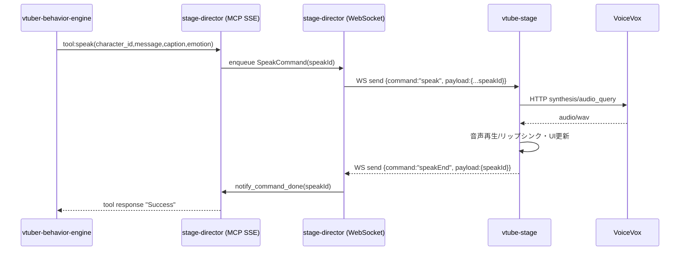

<!-- This document is generated and updated by .github/prompts/doc-sync.prompt.md -->

# 主要フロー（Key Flows）

## 起動フロー（ローカル開発）

README の推奨順序:

1. VoiceVox（デフォルト `localhost:50021`）を起動
2. `stage-director` を起動: `uv run python src/stage_director/main.py`
3. `vtube-stage` を起動: `npm run dev`
4. `vtuber-behavior-engine` を起動: `uv run python src/vtuber_behavior_engine/main.py`

## フロー 1: 発話（speak）

### 目的

AI が生成したセリフを、画面表示 + TTS + 感情表現として再生し、完了を AI 側へ同期します。

### シーケンス

### 実装ポイント

- `stage-director` は `speak` をキューに入れた後、`wait_for_command(speak_id)` で **完了まで待機**します。
- `vtube-stage` は TTS 完了後 `speakEnd` を送信し、次のコマンド実行を解放します。

## フロー 2: アニメーション（trigger_animation）

- AI → MCP `trigger_animation(character_id, animation_name)`
- `stage-director` が `triggerAnimation` コマンドをキューへ
- `vtube-stage` が `currentAnimationName` を更新し、アニメーション再生

## フロー 3: Markdown 表示（display_markdown_text）

- AI → MCP `display_markdown_text(text)`
- `stage-director` が `displayMarkdown` コマンドをキューへ
- `vtube-stage` が `stage.currentMarkdownText` を更新し、オーバーレイ表示

## フロー 4: コマンド検証（vtube-stage）

`vtube-stage` は受信した JSON を `class-validator` で検証します。

- 実装: `packages/vtube-stage/src/utils/command_validator.ts`
- 方式: `command` 値によりクラスを切り替えて `plainToInstance` → `validate`

## エントリポイント一覧

| 種別                 | 場所                                                                 | 説明                                                |
| -------------------- | -------------------------------------------------------------------- | --------------------------------------------------- |
| Stage Director 起動  | `packages/stage-director/src/stage_director/main.py`                 | WebSocket + MCP(SSE) を `asyncio.gather` で同時起動 |
| Behavior Engine 起動 | `packages/vtuber-behavior-engine/src/vtuber_behavior_engine/main.py` | 既定で News Agent を起動し初期メッセージを投入      |
| Frontend 起動        | `packages/vtube-stage/src/main.tsx`                                  | React のルートをマウント                            |
