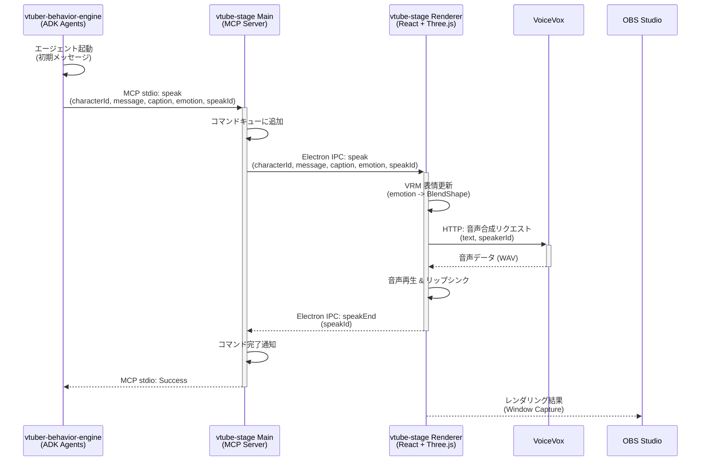
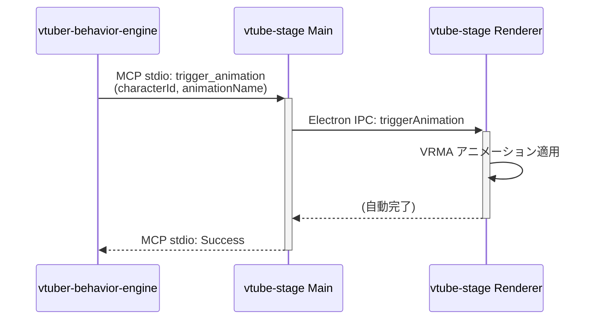
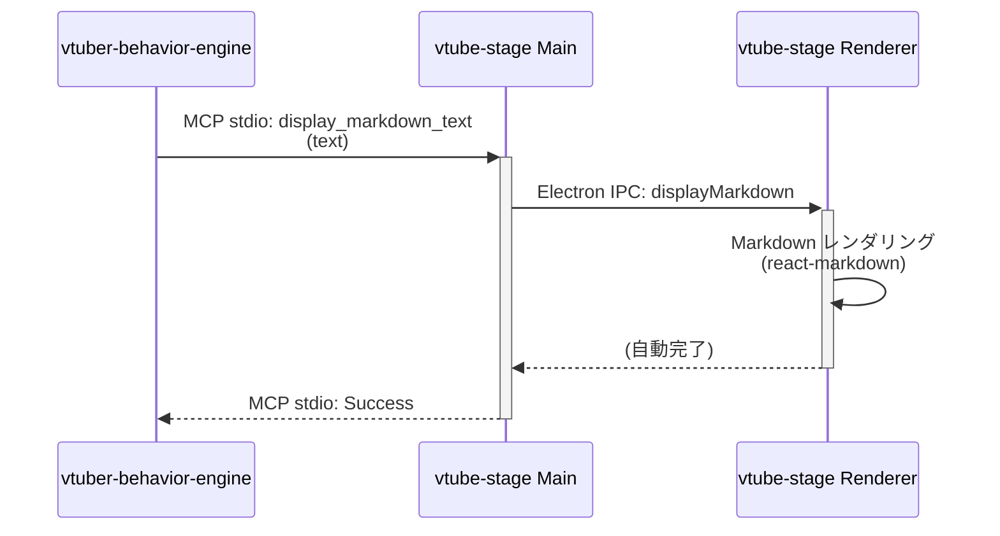

<!-- このドキュメントは .github/prompts/doc-sync.prompt.md によって生成および更新されています -->

# 主要フロー（Key Flows）

## 1. 起動フロー（ローカル開発）

README の推奨順序:

1. VoiceVox（デフォルト `localhost:50021`）を起動
2. `vtube-stage` (Electron) を起動: `npm run dev`
3. `vtuber-behavior-engine` を起動: `uv run python src/vtuber_behavior_engine/main.py`

## 2. エンドツーエンドのワークフロー

典型的なインタラクションのシーケンスは、外部からの入力（例：ユーザーメッセージ）または内部トリガー（例：タイマーイベント）から始まり、OBS Studio での最終的な視覚的出力に至るまで、以下のステップで進行します。

1. **AI エージェント起動**: `vtuber-behavior-engine` が ADK のマルチエージェントシステムを起動し、初期メッセージで対話を開始します。
2. **音声認識（オプション）**: 音声認識ツールがユーザーの発話を検出した場合、その内容がエージェントに渡されます。
3. **AI 処理とツール呼び出し**: ADK エージェントが対話を生成する際、MCP Client として `vtube-stage` の Main Process (MCP Server) に stdio 経由で接続し、以下のツールを呼び出します：
   - `speak`: キャラクターの発話、感情、キャプションを指定
   - `trigger_animation`: アニメーション（ポーズ）をトリガー
   - `display_markdown_text`: Markdown テキストを表示
4. **MCP 通信**: `vtube-stage` の Main Process が stdio 経由で MCP ツール呼び出しを受信します。
5. **コマンドキューイング**: Main Process は受信したツール呼び出しをコマンドキューに追加し、順次処理します。
6. **IPC 送信**: Main Process はキューからコマンドを取り出し、Electron IPC 経由で Renderer Process に送信します。
7. **コマンド受信と検証**: Renderer Process はコマンドを受信し、必要に応じて検証します。
8. **VRM モデル更新**: `@pixiv/three-vrm` を使用して、感情に基づく表情（BlendShape）を VRM モデルに適用します。
9. **TTS とリップシンク**: VoiceVox API を呼び出して音声を生成し、音声に同期してリップシンク（口パク）を実行します。
10. **Markdown 表示**: 必要に応じて、画面に Markdown テキスト（資料、グラウンディング情報など）を表示します。
11. **完了通知**: TTS 再生完了後、Renderer Process は IPC 経由で Main Process に `speakEnd` を送信します。
12. **同期制御**: Main Process は完了を受信し、MCP 経由で AI に返答します。AI は次のコマンド処理を続行します（`speak` ツールは完了まで待機）。
13. **OBS キャプチャ**: OBS Studio は `vtube-stage` のウィンドウをキャプチャし、配信映像として出力します。

## 3. シーケンス図

### フロー 1: 発話（speak）

AI が生成したセリフを、画面表示 + TTS + 感情表現として再生し、完了を AI 側へ同期します。

### フロー 2: アニメーション（trigger_animation）

### フロー 3: Markdown 表示（display_markdown_text）

## 4. 実装ポイント

- **同期制御**: `vtube-stage` Main Process は `speak` をキューに入れた後、`wait_for_command(speak_id)` で **完了まで待機**します。
- **完了通知**: Renderer Process は TTS 完了後 `speakEnd` を IPC 経由で Main Process に送信し、Main Process は MCP 経由で AI に返答し、次のコマンド実行を解放します。
- **プロセス間通信**: Electron IPC を使用して Main Process と Renderer Process 間でコマンドとイベントをやり取りします。

## 5. エントリポイント一覧

| 種別                 | 場所                                                                 | 説明                                                         |
| -------------------- | -------------------------------------------------------------------- | ------------------------------------------------------------ |
| VTube Stage 起動     | `packages/vtube-stage/electron/main.ts`                              | Electron メインプロセス起動、MCP Server (stdio) を開始      |
| MCP Server           | `packages/vtube-stage/electron/mcp-server.ts`                        | stdio MCP Server 実装、ツール定義                            |
| Behavior Engine 起動 | `packages/vtuber-behavior-engine/src/vtuber_behavior_engine/main.py` | 既定で News Agent を起動し、stdio MCP で vtube-stage に接続 |
| Renderer 起動        | `packages/vtube-stage/src/main.tsx`                                  | React のルートをマウント                                     |
