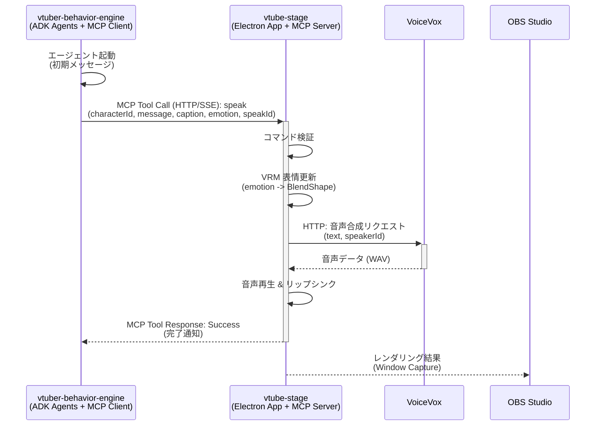
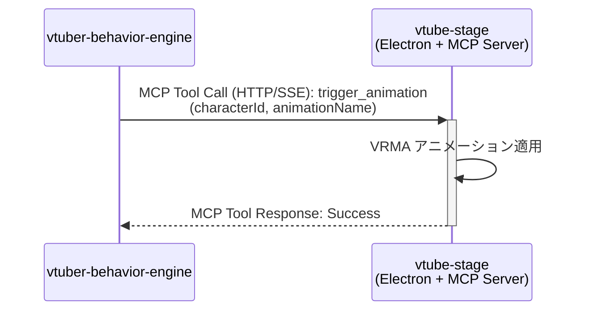
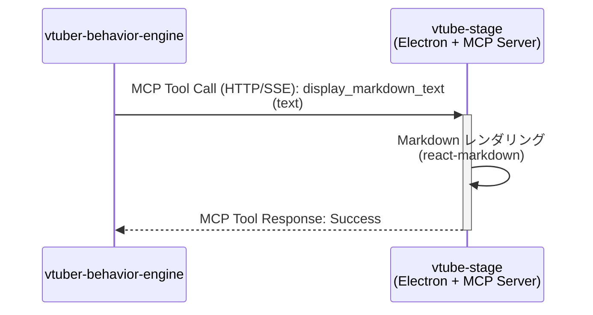

<!-- このドキュメントは .github/prompts/doc-sync.prompt.md によって生成および更新されています -->

# 主要フロー（Key Flows）

## 1. 起動フロー（ローカル開発）

README の推奨順序:

1. VoiceVox（デフォルト `localhost:50021`）を起動
2. `vtube-stage` を Electron アプリとして起動: `npm run dev`（MCP サーバーは自動起動、`http://localhost:8080/sse` で待機）
3. `vtuber-behavior-engine` を起動: `uv run python src/vtuber_behavior_engine/main.py`（MCP クライアントとして `vtube-stage` に接続）

## 2. エンドツーエンドのワークフロー

典型的なインタラクションのシーケンスは、外部からの入力（例：ユーザーメッセージ）または内部トリガー（例：タイマーイベント）から始まり、OBS Studio での最終的な視覚的出力に至るまで、以下のステップで進行します。

1. **AI エージェント起動**: `vtuber-behavior-engine` が ADK のマルチエージェントシステムを起動し、初期メッセージで対話を開始します。
2. **音声認識（オプション）**: 音声認識ツールがユーザーの発話を検出した場合、その内容がエージェントに渡されます。
3. **AI 処理とツール呼び出し**: ADK エージェントが対話を生成する際、MCP Client として `vtube-stage` の MCP Server (`http://localhost:8080/sse`) に接続し、以下のツールを呼び出します：
   - `speak`: キャラクターの発話、感情、キャプションを指定
   - `trigger_animation`: アニメーション（ポーズ）をトリガー
   - `display_markdown_text`: Markdown テキストを表示
4. **コマンド受信と検証**: `vtube-stage` はツール呼び出しを受信し、内部で検証します。
5. **VRM モデル更新**: `@pixiv/three-vrm` を使用して、感情に基づく表情（BlendShape）を VRM モデルに適用します。
6. **TTS とリップシンク**: VoiceVox API を呼び出して音声を生成し、音声に同期してリップシンク（口パク）を実行します。
7. **Markdown 表示**: 必要に応じて、画面に Markdown テキスト（資料、グラウンディング情報など）を表示します。
8. **完了通知**: TTS 再生完了後、`vtube-stage` は MCP レスポンスとして完了を AI に返します。
9. **同期制御**: AI は完了レスポンスを受信し、次のコマンド処理を続行します（`speak` ツールは完了まで待機）。
10. **OBS キャプチャ**: OBS Studio は `vtube-stage` の Electron ウィンドウをキャプチャし、配信映像として出力します。

## 3. シーケンス図

### フロー 1: 発話（speak）

AI が生成したセリフを、画面表示 + TTS + 感情表現として再生し、完了を AI 側へ同期します。

### フロー 2: アニメーション（trigger_animation）

### フロー 3: Markdown 表示（display_markdown_text）

## 4. 実装ポイント

- **同期制御**: `vtube-stage` の MCP サーバーは `speak` リクエストを受信した後、音声再生完了まで **待機してからレスポンスを返す** ことで完了を同期します。
- **完了通知**: `vtube-stage` は TTS 完了後、MCP レスポンスとして完了を AI に返し、次のコマンド実行を解放します。
- **Electron 統合**: `vtube-stage` は Electron アプリとして、GUI ウィンドウ（1920x1080）と MCP サーバー（`http://localhost:8080/sse`）を同時に提供します。

## 5. エントリポイント一覧

| 種別                 | 場所                                                                 | 説明                                                  |
| -------------------- | -------------------------------------------------------------------- | ----------------------------------------------------- |
| Electron Main        | `packages/vtube-stage/src/electron/main.ts`                          | Electron アプリ起動、MCP サーバー起動                 |
| MCP Server           | `packages/vtube-stage/src/mcp/server.ts`                             | HTTP/SSE エンドポイント (`http://localhost:8080/sse`) |
| Frontend 起動        | `packages/vtube-stage/src/main.tsx`                                  | React のルートをマウント（1920x1080 GUI）            |
| Behavior Engine 起動 | `packages/vtuber-behavior-engine/src/vtuber_behavior_engine/main.py` | 既定で News Agent を起動し初期メッセージを投入        |
