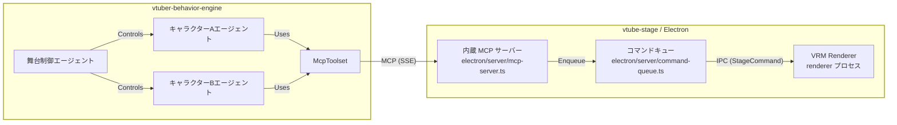

# MCP (Model Context Protocol) と ADK (Agent Development Kit) の解説

## 1. はじめに

このドキュメントは、AI V-Tuber システム開発プロジェクトにおいて中心的な役割を担う **Model Context Protocol (MCP)** と **Agent Development Kit (ADK)** について、開発メンバー向けにその概念、目的、および本プロジェクトにおける具体的な利用方法を解説するものです。

これらの技術を理解することは、コンポーネント間の連携を把握し、効率的な開発を進める上で不可欠です。

## 2. Model Context Protocol (MCP)

### 2.1. MCPとは？

MCPは、大規模言語モデル (LLM) アプリケーションが外部のコンテキスト（データソースやツール）と対話するための標準化されたオープンプロトコルです 。

簡単に言えば、様々なデバイスを接続できるUSB-Cポートのように、MCPは多様なAIモデル、アプリケーション、そして外部ツール（本プロジェクトでは `vtube-stage` の制御機能など）を標準的な方法で接続するための共通インターフェースを提供することを目指しています 。

従来、アプリケーションごとに外部ツールとの連携方法を個別に実装する必要がありましたが（M x N 問題）、MCPを利用することで、ツール提供側（サーバー）とツール利用側（クライアント）がそれぞれMCPに準拠すれば、相互接続性が格段に向上します 。

### 2.2. 本プロジェクトにおけるMCPの役割と利用方法

本プロジェクトでは、AIの「思考」部分と「表現」部分を分離し、その間のインターフェースをMCPで標準化しています。

* `vtube-stage`（内蔵 MCP サーバー）の役割:
  * `vtube-stage` は Electron アプリケーションであり、その main プロセスに MCP サーバー（`electron/server/mcp-server.ts`、`@modelcontextprotocol/sdk` + Express）を内蔵しています。これはMCPにおけるサーバーの役割に相当します。
  * MCP サーバーは以下の 4 つのツールを公開します。
    * `speak`: キャラクターに発話させる（`character_id`, `message`, `caption`, `emotion`, `style` 等。発話完了まで待機）
    * `trigger_animation`: アニメーションを再生する（`wave`, `agree`, `no`, `fear`, `victory`, `punch`）
    * `display_markdown_text`: Markdown テキストを画面に表示する
    * `control_camera`: カメラを制御する（`default`, `intro`, `closeUp`, `fullBody`, `lowAngle`, `highAngle`, `sideRight`, `sideLeft` 等のプリセット + `target_id` + `duration`）
  * AIからのツール呼び出しを StageCommand（JSON コマンド）に変換し、コマンドキュー（`electron/server/command-queue.ts`）を経由して Electron の IPC で renderer プロセスに送信します。
  * トランスポートは SSE が既定（既定 `127.0.0.1:8080`、`GET /sse` + `POST /messages`）で、`--transport=stdio` で stdio も選択できます。
* `vtuber-behavior-engine` (ADK) の役割:
  * `vtuber-behavior-engine` 内のAIエージェントは、これらの「ツール」を利用して `vtube-stage` を制御します。これはMCPにおけるクライアントの役割に相当します。ADKの `McpToolset` 機能 を利用して、`vtube-stage` の内蔵 MCP サーバーが提供するツールを呼び出します。

利点:

* 関心の分離: AIロジック (`vtuber-behavior-engine`) と描画/演出ロジック (`vtube-stage`) を明確に分離できます。
* 標準化されたインターフェース: MCP サーバーが提供するツール（API）が明確に定義されるため、`vtuber-behavior-engine` はその内部実装を意識する必要がありません。
* 再利用性と拡張性: 将来的に別のツール（例: 外部知識データベース）を追加する場合も、同様のMCP原則に基づいたインターフェースで連携させやすくなります。

### 2.3. 主要な概念 (参考)

* MCP Host: ユーザーが操作するアプリケーション（例: チャットUI）。本プロジェクトでは直接対応するコンポーネントはありません。
* MCP Client: MCPサーバーと通信するコンポーネント。本プロジェクトでは `vtuber-behavior-engine` 内のADKエージェントが `McpToolset` を介してこの役割を担います。
* MCP Server: ツールやリソースを提供するコンポーネント。本プロジェクトでは `vtube-stage` の内蔵 MCP サーバー（歴史的経緯からサーバー名は `stage-director`）がこの役割を担います。
* Tools: サーバーが提供する具体的な機能（関数）。`vtube-stage` が定義する `speak` や `trigger_animation` などがこれに該当します。
* Resources: サーバーが提供するデータ（例: ファイル内容）。本プロジェクトでは直接利用しませんが、概念として存在します。
* Prompts: サーバーが提供する定型的なワークフロー。本プロジェクトでは直接利用しません。

## 3. Agent Development Kit (ADK)

### 3.1. ADKとは？

ADKは、Googleが提供するオープンソースのPythonフレームワークであり、AIエージェントおよびマルチエージェントシステム (MAS) の構築、評価、デプロイを目的としています 。

主な特徴は以下の通りです。

* コードファースト: 設定ファイルではなく、Pythonコードでエージェントのロジック、ツール、連携フロー（オーケストレーション）を直接記述します 。これにより高い柔軟性と制御性を実現します。
* マルチエージェント: 複数の専門エージェント（例: 舞台制御、キャラクター担当）を階層的に構成し、協調させるシステムを構築するのに適しています 。
* オーケストレーション: エージェント間の実行フローを制御するための様々な方法（逐次実行、並列実行、LLMによる動的ルーティングなど）を提供します 。
* ツール統合: カスタムPython関数、OpenAPI仕様、そしてMCPツールなど、様々な外部機能を「ツール」としてエージェントに組み込むことができます 。
* 状態管理: エージェントのセッション状態（対話履歴、現在の状況など）を管理する仕組みを提供します 。
* Google Cloud連携: GeminiモデルやVertex AI Agent Engineとの親和性が高い設計ですが、他のLLMや環境でも利用可能です 。

### 3.2. 本プロジェクトにおけるADKの役割と利用方法

本プロジェクトでは、`vtuber-behavior-engine` の実装にADKを採用しています。

* マルチエージェント構成:
* システム全体の進行や舞台演出を管理する「舞台制御エージェント」と、各キャラクターの対話や感情表現を担当する「キャラクターエージェント」をADKのエージェントとして実装します 。
* これらのエージェントを階層的に構成し、舞台制御エージェントがキャラクターエージェントを調整（オーケストレーション）します 。
* 対話と行動生成:
* 各エージェント（特にキャラクターエージェント）は、ADKの `LlmAgent`  などを利用して、ペルソナに基づいた対話や行動（感情など）を生成します。
* 状態管理:
* ADKのセッション管理機能 (`session.state` など)  を利用して、現在の話題、対話履歴、キャラクターの感情状態などのコンテキスト情報をエージェント間で共有します。
* `vtube-stage`（内蔵 MCP サーバー）との連携 (McpToolset):
* `vtuber-behavior-engine` 内のエージェントは、`vtube-stage` が提供する舞台制御機能（発話、アニメーション、Markdown 表示、カメラ制御）を「ツール」として認識します。
* ADKの `McpToolset` を使用して `vtube-stage` の内蔵 MCP サーバーに SSE で接続し（接続先は環境変数 `STAGE_DIRECTOR_MCP_SERVER_URL`、例: `http://localhost:8080/sse`）、これらのツールを呼び出すことで、`vtube-stage` の制御を行います。例えば、キャラクターエージェントが発話を決定したら、`McpToolset` を介して `speak(character_id='...', message='...', caption='...', emotion='happy')` ツールを呼び出します。

### 3.3. 主要な概念

* Agent: ADKにおける基本的な実行単位 (`LlmAgent`, `SequentialAgent`, `CustomAgent` など) 。
* Tool: エージェントが利用できる外部機能（Python関数、MCPツール、他のエージェントなど）。
* Orchestration: 複数のエージェントやツールの実行順序や連携方法を制御すること 。
* Session State (`session.state`): 同じ実行コンテキスト内でエージェント間でデータを共有するための辞書 。
* `McpToolset`: ADKエージェントがMCPサーバーに接続し、そのツールを利用するためのクラス 。

## 4. MCPとADKの関係性 (本プロジェクトにおいて)

本プロジェクトにおけるMCPとADKの関係は以下の通りです。

* ADK (`vtuber-behavior-engine`) は、システムの「頭脳」として、対話生成、意思決定、エージェント間の協調動作を担当します。
* MCPインターフェース（`vtube-stage` 内蔵 MCP サーバーのツール群）は、ADKの「頭脳」がシステムの「身体」（`vtube-stage` の描画・TTS）を制御するための標準化された方法を提供します。
* ADK `McpToolset` は、ADKの「頭脳」がこの標準化されたインターフェースを利用するための具体的な接続手段となります。

この連携により、AIロジックの変更が描画実装に直接影響を与えず、逆もまた然りという、モジュール性の高いシステムを実現します。

## 5. さらに学ぶために

* ADK 公式ドキュメント: [https://google.github.io/adk-docs/](https://google.github.io/adk-docs/)
* ADK GitHubリポジトリ: [https://github.com/google/adk-python](https://github.com/google/adk-python)
* ADK サンプル: [https://github.com/google/adk-samples](https://github.com/google/adk-samples)
* MCP 公式サイト: [https://modelcontextprotocol.io/](https://modelcontextprotocol.io/)
* MCP 仕様書: [https://modelcontextprotocol.io/specification/2025-03-26](https://modelcontextprotocol.io/specification/2025-03-26)
* MCP GitHubリポジトリ: [https://github.com/modelcontextprotocol](https://github.com/modelcontextprotocol)
