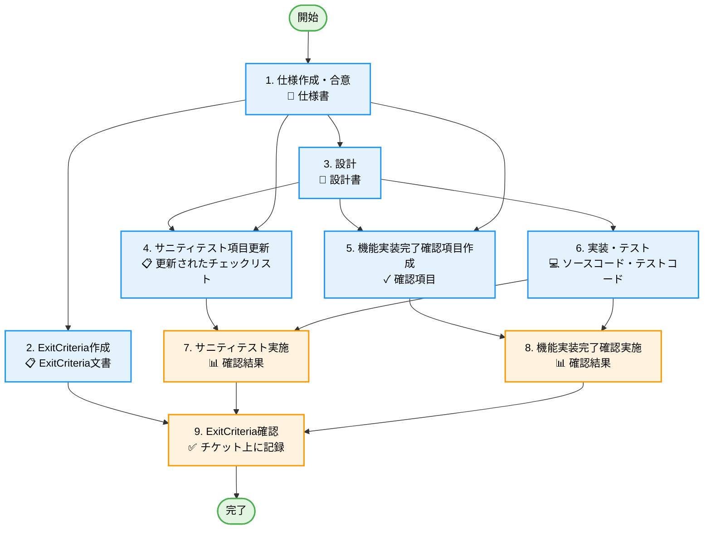

# 機能追加・変更タスクの詳細

[← 作業フローに戻る](./workflow.md)

## タスク一覧

### 1. 仕様作成・合意

**成果物**: 更新された仕様書（Git 管理）

**目的**: 機能の要件を明確にし、チーム全体の共通認識を形成する

**作業内容**:

- 機能の目的と背景を明確化
- ユーザーストーリーや要件の洗い出し
- 仕様書の作成・更新
- プロダクトオーナーとの合意形成
- Git 上での仕様書の管理

**チェックポイント**:

- [ ] 機能の目的が明確に記載されている
- [ ] ユーザーストーリーが定義されている
- [ ] 非機能要件も含まれている
- [ ] プロダクトオーナーの承認を得ている
- [ ] 仕様書が Git にコミットされている

---

### 2. ExitCriteria 作成

**成果物**: ExitCriteria 文書(プロジェクト管理ツールで管理)

**目的**: ストーリー完了の基準を明確にし、品質を担保する

**作業内容**:

- 仕様に基づく完了基準の定義
- 確認項目の洗い出し
- ExitCriteria 文書の作成

**必須項目**:

- [ ] ExitCriteria 作成後に仕様変更があった場合、以降の確認項目に反映されていること
- [ ] すべての仕様が確定され、合意されていること
- [ ] 仕様変更が Git 上の資料に反映されていること
- [ ] 仕様に基づいて設計が行われており、設計変更が Git 上に反映されていること
- [ ] 仕様に基づいて、サニティテスト項目が更新されていること
- [ ] 仕様に基づいて、機能実装完了確認用の動作確認項目が作成されていること
- [ ] 変更されたサニティテスト項目が実施されていること

**依存関係**: 1. 仕様作成・合意

---

### 3. 設計

**成果物**: 更新された設計書（Git 管理）

**目的**: 実装方針を明確にし、品質と保守性を確保する

**作業内容**:

- 仕様をもとに技術的な設計を実施
- アーキテクチャ設計
- インターフェース設計
- データモデル設計
- 設計レビューの実施
- チームでの合意形成

**重要な注意点**:

- 仕様の不備や不明点があれば、**憶測で行動せず必ず確認する**
- 仕様見直しや仕様ドキュメントの改善が必要な場合は、**チケット化する**

**チェックポイント**:

- [ ] 仕様がすべて設計に反映されている
- [ ] 既存システムとの整合性が確認されている
- [ ] パフォーマンスへの影響が考慮されている
- [ ] エラーハンドリングが設計されている
- [ ] テスト容易性が考慮されている
- [ ] チームのレビューを受けている
- [ ] 設計書が Git にコミットされている

**依存関係**: 1. 仕様作成・合意

---

### 4. サニティテスト項目更新

**成果物**: 更新されたサニティテスト項目（ファイル形式はプロジェクトに応じて選択）

**目的**: リリース前に全体の機能を簡単にチェックするためのテスト項目を最新仕様に保つ

**作業内容**:

- 仕様・設計に基づく確認項目の追加・更新
- 既存項目の見直し（不要な項目の削除、内容の修正）
- チェックリストファイルの更新
  - **形式の選択**: Excel (`.xlsx`), Markdown (`.md`), CSV (`.csv`), Google Sheets 等、プロジェクトに適した形式を選択
  - ファイルはリリースごとに分けず、常に最新のアプリ仕様に合わせた単一ファイルで管理
  - アプリの基本動作全般をカバーする項目を維持
  - リリースタグ時点では、アプリの動作と確認項目が完全に一致
- Git へのコミット（大きなバイナリファイルの場合は Git LFS を利用）

**チェックポイント**:

- [ ] 新機能の動作確認項目が追加されている
- [ ] 既存機能への影響を確認する項目が含まれている
- [ ] 変更により不要になった項目が削除または更新されている
- [ ] 確認項目がアプリの最新仕様と一致している
- [ ] チェックリストファイルが Git で管理されている（必要に応じて Git LFS を使用）

**依存関係**: 1. 仕様作成・合意、3. 設計

---

### 5. 機能実装完了確認項目作成

**成果物**: 機能実装完了確認項目(プロジェクト管理ツールで管理)

**目的**: 当該機能の実装完了を判断する基準を明確化

**作業内容**:

- 仕様・設計に基づく確認項目の作成
- 正常系・異常系のテストケース定義
- 境界値テストの定義

**チェックポイント**:

- [ ] すべての仕様項目に対応する確認項目がある
- [ ] 正常系・異常系の両方が網羅されている

**依存関係**: 1. 仕様作成・合意、3. 設計

---

### 6. 実装・テスト

**成果物**: ソースコード、テストコード（Git 管理）

**目的**: 設計に基づいて機能を実装し、品質を確保する

**作業内容**:

- 設計に基づく実装
- ユニットテストの作成
- コードレビューの実施
- 継続的インテグレーションの実施

**実装の原則**:

- **実装量が多い場合**: 適切な単位でチケットを分割する
- **チケット分割する場合**: 最初にスケルトンクラスを投入することを検討する
- **破壊的変更の場合**: feature ブランチを作成する（メイン開発ブランチをアプリが動かない状態にしないこと）

**チェックポイント**:

- [ ] 設計通りに実装されている
- [ ] コーディング規約に従っている
- [ ] ユニットテストが作成されている
- [ ] テストカバレッジが基準を満たしている
- [ ] コードレビューが完了している
- [ ] CI が通過している
- [ ] ソースコードが Git にコミットされている

**依存関係**: 3. 設計

---

### 7. サニティテスト実施

**成果物**: サニティテスト実施結果(プロジェクト管理ツールで管理)

**目的**: 全体機能の簡易確認を実施し、デグレがないことを確認する

**作業内容**:

- 更新されたサニティテストチェックリストに基づく動作確認
- 結果の記録(チケットコメント)
- 問題が発見された場合の対応

**チェックポイント**:

- [ ] すべての確認項目が実施されている
- [ ] 結果が記録されている
- [ ] 問題があれば適切に対応されている
- [ ] チケットに確認結果が記録されている

**依存関係**: 4. サニティテスト項目更新、6. 実装・テスト

---

### 8. 機能実装完了確認実施

**成果物**: 機能実装完了確認結果(プロジェクト管理ツールで管理)

**目的**: 当該機能の実装完了を確認する

**作業内容**:

- 作成された確認項目に基づく動作確認
- 結果の記録(チケットコメント)
- 問題が発見された場合の対応

**チェックポイント**:

- [ ] すべての確認項目が実施されている
- [ ] 正常系・異常系の両方が確認されている
- [ ] 結果が記録されている
- [ ] 問題があれば適切に対応されている
- [ ] チケットに確認結果が記録されている

**依存関係**: 5. 機能実装完了確認項目作成、6. 実装・テスト

---

### 9. ExitCriteria 確認

**成果物**: プロジェクト管理ツール上に確認結果を記録

**目的**: ストーリーが完了基準を満たしていることを確認する

**作業内容**:

- ExitCriteria 文書に基づく最終確認
- すべての成果物の確認
- チケットに確認結果をコメントとして記録

**チェックポイント**:

- [ ] ExitCriteria のすべての項目が確認されている
- [ ] Git 管理対象の成果物(コード・仕様・設計等)が Git 上に存在する
- [ ] ドキュメントが最新の状態に更新されている
- [ ] チームの承認が得られている
- [ ] チケットに確認完了が記録されている

**依存関係**: 2. ExitCriteria 作成、7. サニティテスト実施、8. 機能実装完了確認実施

---

## タスクフロー図

**図の凡例**:

- 🟢 緑色: 開始/完了ノード
- 🔵 青色: 作業タスク（成果物作成）
- 🟠 オレンジ色: 確認・検証タスク

[← 作業フローに戻る](./workflow.md)
