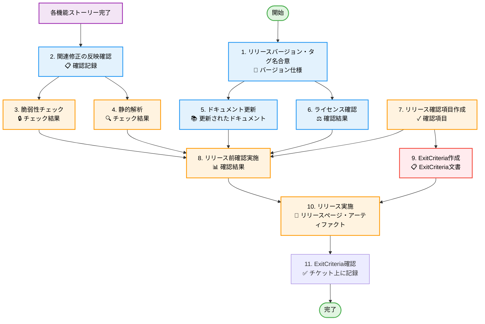

# リリースタスクの詳細

[← 作業フローに戻る](./workflow.md)

## 概要

アプリをリリースする場合は、リリース用ストーリーを作成する。
バグ修正やストーリーにならない小さなタスクも、リリースストーリに紐づける。

## タスク一覧

### 1. リリースバージョン・タグ名合意

**成果物**: プロジェクト管理ツール上に合意内容を記録

**目的**: リリースバージョンの命名規則と内容を明確化する

**作業内容**:

- セマンティックバージョニング（SemVer）に基づくバージョン決定
  - MAJOR.MINOR.PATCH (例: 1.2.3)
  - MAJOR: 破壊的変更
  - MINOR: 後方互換性のある機能追加
  - PATCH: 後方互換性のあるバグ修正
- Git タグ名の決定（例: v1.2.3）
- リリースノートの骨子作成
- チケットに合意内容を記録

**チェックポイント**:

- [ ] バージョン番号がセマンティックバージョニングに従っている
- [ ] タグ名が命名規則に従っている
- [ ] チームの合意が得られている
- [ ] チケットに合意内容が記録されている

**依存関係**: なし

---

### 2. 関連修正の反映確認

**成果物**: プロジェクト管理ツール上に確認結果を記録

**目的**: リリースストーリーに紐づくすべての変更が含まれていることを確認

**作業内容**:

- リリースストーリーに紐づいたバグ修正の確認
- リリースストーリーに紐づいた機能追加・変更の確認
- マージ漏れのチェック
- コンフリクトの解消確認
- チケットに確認結果を記録

**チェックポイント**:

- [ ] すべての関連チケットがクローズされている
- [ ] すべてのプルリクエストがマージされている
- [ ] ブランチのコンフリクトが解消されている
- [ ] チケットに確認結果が記録されている

**依存関係**: 各機能ストーリー完了

---

### 3. 脆弱性チェック

**成果物**: 脆弱性チェック結果（Git 管理）

**目的**: セキュリティリスクを特定し、対処する

**作業内容**:

- 依存ライブラリの脆弱性スキャン
  - Python: `pip-audit` または `safety`
  - Node.js: `npm audit` または `yarn audit`
- 既知の脆弱性データベースとの照合
- 脆弱性が発見された場合の対応
  - Critical/High: 必ず修正
  - Medium: リスク評価の上、対応判断
  - Low: 記録し、次回以降で対応検討

**チェックポイント**:

- [ ] すべての依存ライブラリがスキャンされている
- [ ] Critical/High の脆弱性がすべて対応されている
- [ ] 残存する脆弱性のリスク評価が記録されている
- [ ] チケットにチェック結果が記録されている

**依存関係**: 2. 関連修正の反映確認

---

### 4. 静的解析

**成果物**: 静的解析結果(プロジェクト管理ツールで管理)

**目的**: 静的解析により潜在的なバグや品質問題を検出する

**作業内容**:

- 静的解析ツールの実行
  - 例: Coverity, SonarQube, CodeQL, Pylint, ESLint 等
- 検出された問題の分析
- 優先度の高い問題の修正
- False Positive の判定と記録
- チケットにチェック結果を記録

**チェックポイント**:

- [ ] 静的解析が実行されている
- [ ] Critical な問題がすべて対応されている
- [ ] 対応しない問題の理由が記録されている
- [ ] チケットに結果が記録されている

**依存関係**: 2. 関連修正の反映確認

---

### 5. ドキュメント更新

**成果物**: 更新されたドキュメント（Git 管理）

**目的**: ユーザーと開発者が最新情報にアクセスできるようにする

**作業内容**:

- README.md の更新
  - バージョン番号
  - 新機能の説明
  - 破壊的変更の警告
- CHANGELOG.md または変更履歴の更新
  - 新機能（Added）
  - 変更（Changed）
  - 廃止予定（Deprecated）
  - 削除（Removed）
  - バグ修正（Fixed）
  - セキュリティ（Security）
- HowToUse/チュートリアルの更新
- API 仕様書の更新（該当する場合）
- 依存ライブラリリストの更新

**チェックポイント**:

- [ ] README.md が更新されている
- [ ] CHANGELOG.md が更新されている
- [ ] バージョン番号がすべてのドキュメントで一致している
- [ ] 破壊的変更が明確に記載されている
- [ ] ドキュメントが Git にコミットされている

**依存関係**: 1. リリースバージョン・タグ名合意

---

### 6. ライセンス確認

**成果物**: ライセンス一覧ファイル(Git 管理)、ライセンス確認結果(プロジェクト管理ツールで管理)

**目的**: 利用ライブラリのライセンスが適切であることを確認し、法的リスクを回避する

**作業内容**:

- 依存ライブラリのライセンス一覧取得
  - Python: `pip-licenses` または `licensecheck`
  - Node.js: `license-checker` または `npm-license-crawler`
- ライセンス一覧ファイルの更新
  - ファイル形式: Markdown (`.md`), JSON (`.json`), CSV (`.csv`) 等
  - 格納場所例: `docs/licenses.md` または `LICENSES.md`
  - Git へのコミット
- ライセンスの種類確認
  - 商用利用可能か
  - コピーレフト条項の有無（GPL 系の確認）
  - 帰属表示の要否確認
- 問題のあるライセンスの特定と対応
  - GPL 系ライセンスの依存関係確認
  - ライセンス不明なライブラリの調査
  - 必要に応じてライブラリの置き換え検討
- ライセンス表記の更新（LICENSES ファイル、NOTICE ファイル等）
- チケットに確認結果を記録

**チェックポイント**:

- [ ] ライセンス一覧ファイルが最新の状態に更新されている
- [ ] ライセンス一覧ファイルが Git にコミットされている
- [ ] すべての依存ライブラリのライセンスが確認されている
- [ ] 商用利用に問題のあるライセンスがない
- [ ] GPL 系ライセンスによる汚染リスクがない
- [ ] 必要なライセンス表記が適切に行われている
- [ ] チケットに確認結果が記録されている

**依存関係**: 2. 関連修正の反映確認

---

### 7. リリース確認項目作成

**成果物**: プロジェクト管理ツール上に確認項目を記録

**目的**: リリース前の最終確認基準を明確化する

**作業内容**:
チケットにリリース確認項目を記録。以下が含まれる:

#### 6.1 動作確認

- リリースストーリーに紐づいた修正の動作確認項目
- リリースストーリーに紐づいた機能追加・変更ストーリーの ExitCriteria 確認

#### 6.2 品質・セキュリティ

- 脆弱性チェック完了確認
- 静的解析完了確認
- ライセンス確認完了確認

#### 6.3 ドキュメント

- README/HowToUse/変更履歴の更新確認
- ユーザーに公開している仕様・設計の更新確認
- 依存ライブラリリストの更新確認

#### 6.4 リリースアーティファクト

- ビルド成果物の作成確認
- サンプルコード/データの準備確認

#### 6.5 バージョン管理

- ソースコード内のバージョン番号更新確認
- package.json / pyproject.toml 等のバージョン更新確認

**チェックポイント**:

- [ ] すべての確認項目が網羅されている
- [ ] 確認項目が具体的で実行可能である
- [ ] チケットに確認項目が記録されている

**依存関係**: 1. リリースバージョン・タグ名合意

---

### 8. リリース前確認実施

**成果物**: プロジェクト管理ツール上に確認結果を記録

**目的**: リリース基準を満たしていることを確認する

**作業内容**:

- 7 で作成した確認項目に基づく確認の実施
- 各確認項目の結果記録
- 問題が発見された場合の対応
- チケットに確認結果を記録

**チェックポイント**:

- [ ] すべての確認項目が実施されている
- [ ] すべての確認項目がパスしている
- [ ] 問題があれば適切に対応されている
- [ ] チケットに確認結果が記録されている

**依存関係**: 3. 脆弱性チェック、4. 静的解析、5. ドキュメント更新、6. ライセンス確認、7. リリース確認項目作成

---

### 9. ExitCriteria 作成

**成果物**: ExitCriteria 文書(プロジェクト管理ツールで管理)

**目的**: リリース完了の基準を明確にする

**必須項目**:

- [ ] リリース前確認がすべて実施され、パスしていること
- [ ] リリースが完了していること
  - [ ] リリースページが作成されていること
  - [ ] リリース案内が送信されていること
  - [ ] Git タグが作成されていること
  - [ ] リリースアーティファクトが公開されていること

**チェックポイント**:

- [ ] ExitCriteria がすべて記載されている
- [ ] チケットに ExitCriteria が記録されている

**依存関係**: 7. リリース確認項目作成

---

### 10. リリース実施

**成果物**: リリースページ、リリースアーティファクト

**目的**: 新バージョンを正式にリリースする

**作業内容**:

- Git タグの作成
  ```bash
  git tag -a v1.2.3 -m "Release version 1.2.3"
  git push origin v1.2.3
  ```
- GitHub リリースページの作成
  - リリースノートの記載
  - アーティファクトのアップロード
- パッケージレジストリへの公開（該当する場合）
  - Python: PyPI
  - Node.js: npm
- リリース案内の送信

**チェックポイント**:

- [ ] Git タグが作成され、プッシュされている
- [ ] GitHub リリースページが作成されている
- [ ] リリースノートが記載されている
- [ ] アーティファクトがアップロードされている
- [ ] パッケージレジストリに公開されている（該当する場合）
- [ ] リリース案内が送信されている

**依存関係**: 8. リリース前確認実施、9. ExitCriteria 作成

---

### 11. ExitCriteria 確認

**成果物**: プロジェクト管理ツール上に確認結果を記録

**目的**: リリースストーリーが完了基準を満たしていることを確認する

**作業内容**:

- ExitCriteria 文書に基づく最終確認
- すべての成果物の確認
- チケットに確認結果をコメントとして記録

**チェックポイント**:

- [ ] ExitCriteria のすべての項目が確認されている
- [ ] リリースページが公開されている
- [ ] リリース案内が送信されている
- [ ] すべてのドキュメントが最新の状態に更新されている
- [ ] チームの承認が得られている
- [ ] チケットに確認完了が記録されている

**依存関係**: 10. リリース実施

---

## タスクフロー図



**図の凡例**:

- 🟢 緑色: 開始/完了ノード
- 🟣 紫色: 前提条件（他ストーリーの完了）
- 🔵 青色: 作業タスク（成果物作成）
- 🟠 オレンジ色: 品質確認・検証タスク
- 🔴 赤色: リリース基準作成タスク

[← 作業フローに戻る](./workflow.md)
