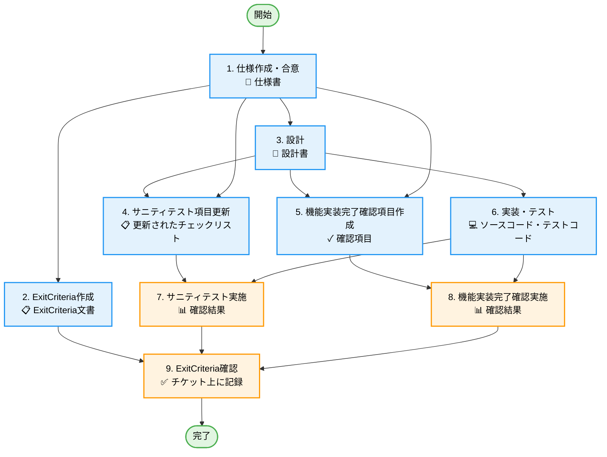
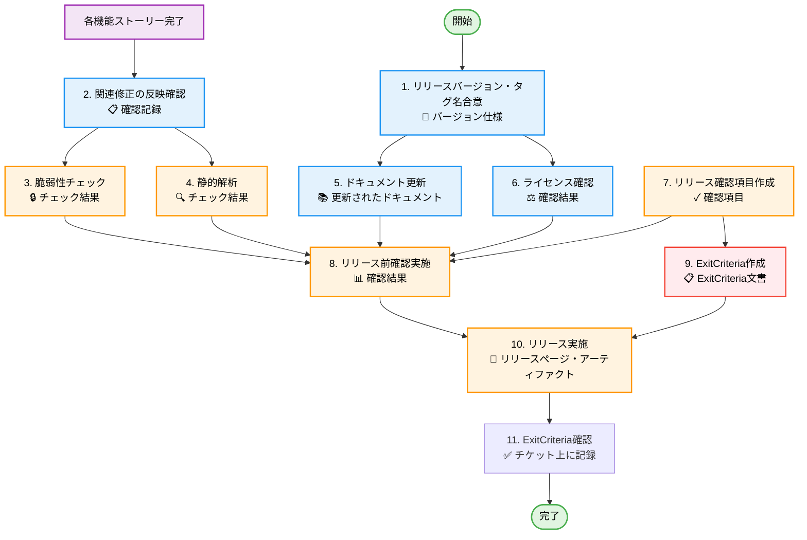

# 作業フロー

当プロジェクトにおける、基本的な作業のフロー

## 概要

本プロジェクトでは、以下の 2 つの主要なストーリータイプで開発を進めます:

- **機能追加・変更**: 新機能の追加や既存機能の変更を行うストーリー
- **リリース**: アプリケーションを本番環境にリリースするストーリー

### タスク管理と進捗記録

本プロジェクトでは、**プロジェクト管理ツール**（例: JIRA、Redmine、GitHub Issues 等）を使用してタスク管理と進捗記録を行います。

**プロジェクト管理ツールで管理する項目**:

- ストーリー・タスクの進捗状況
- バージョン名の合意記録
- 関連修正の反映確認記録
- リリース確認項目と実施結果
- ExitCriteria 文書と確認結果
- 機能実装完了確認項目
- テスト実施結果(サニティテスト、機能確認、リリース前確認)
- 品質チェック結果(脆弱性、静的解析)

**Git で管理する項目**:

- ソースコード、テストコード
- 仕様書、設計書
- サニティテストチェックリスト
- ドキュメント(README、CHANGELOG、API 仕様書等)

これにより、作業進捗はプロジェクト管理ツールで一元管理し、技術的資産は Git でバージョン管理するという明確な役割分担を実現しています。

## 関連ドキュメント

- [用語集](./glossary.md) - 専門用語の説明
- [成果物一覧](./deliverables.md) - 各タスクで作成される成果物の詳細
- [機能追加・変更の詳細](./feature_task_details.md) - タスクの詳細手順とチェックリスト
- [リリースの詳細](./release_task_details.md) - リリースタスクの詳細手順とチェックリスト
- [チケットテンプレート](./ticket_templates/README.md) - プロジェクト管理ツール用のチケットテンプレート

## WBS (Work Breakdown Structure)

### 機能追加・変更ストーリー

基本は 1 機能 1 ストーリーで機能的に独立していること。
ストーリー間で影響しあう場合は、ストーリーの切り方を見直すこと。

**図の凡例**:

- 🟢 緑色: 開始/完了ノード
- 🔵 青色: 作業タスク（成果物作成）
- 🟠 オレンジ色: 確認・検証タスク

**詳細手順**: [機能追加・変更の詳細](./feature_task_details.md)を参照

### リリースストーリー

アプリをリリースする場合は、リリース用ストーリーを作成する。
バグ修正やストーリーにならない小さなタスクも、リリースストーリに紐づける。

**図の凡例**:

- 🟢 緑色: 開始/完了ノード
- 🟣 紫色: 前提条件（他ストーリーの完了）
- 🔵 青色: 作業タスク（成果物作成）
- 🟠 オレンジ色: 品質確認・検証タスク
- 🔴 赤色: リリース基準作成タスク

**詳細手順**: [リリースの詳細](./release_task_details.md)を参照

## タスク実施の原則

1. **依存関係の遵守**: WBS の依存関係に従って作業を進める
2. **成果物の確認**: 各タスク完了時に成果物が作成されていることを確認
3. **適切な管理**: 技術的資産(コード・仕様・設計等)は Git で、実施記録や確認結果はプロジェクト管理ツールで管理する
4. **合意の徹底**: 仕様・設計はチームの合意を得てから次工程へ進む
5. **ブランチ戦略**: 破壊的変更の場合は feature ブランチを使用
