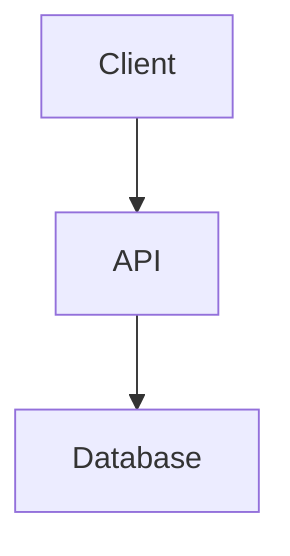

# 設計ドキュメント: [Feature Name]

## 1. 概要

[設計の高レベル要約]

## 2. アーキテクチャ図（Mermaid）



## 3. Data Model

- **User**: `id`, `name`, `email`
- ...

## 4. API / Interface Definitions

```typescript
interface IService {
  doSomething(): void;
}
```

## 5. 重要な判断とトレードオフ

- 判断 A vs B...
