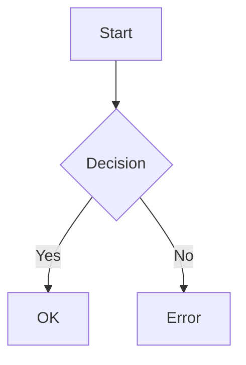

<!-- この文書は @Architect により生成されました -->

# 仕様: {{TITLE}}

<metadata>

| Metadata       | Value                        |
| :------------- | :--------------------------- |
| **Status**     | Draft / In Review / Approved |
| **要件ソース** | [要件へのリンク]             |

</metadata>

<overview>

## 1. 概要

### 背景

[なぜこの変更が必要か？どの問題を解決するか？]

### 目標

[この機能/変更の具体的な目的は何か？]

### スコープ

- **Included**:

  - [Item 1]
  - [Item 2]

- **Excluded**:
  - [Item 1]
  - [Item 2]

### 不確実性と未解決の質問

<!-- ドメインエキスパートまたはプロダクトオーナーへの確認が必要な項目を列挙する。 -->

- [ ] [Question 1]
- [ ] [Question 2]

</overview>

<requirements>

## 2. 要件

### ユーザーストーリー

<!-- ルール: ユーザーストーリーに技術用語（クラス名、DB カラム等）を入れない。価値に集中する。 -->

- As a **[Role]**, I want to **[Action]**, so that **[Benefit]**.

- **[役割]** として、**[行動]** したい。なぜなら **[利益]** が得られるから。

### 受け入れ基準（Gherkin）

<!-- 振る舞い仕様には明示的な Gherkin 構文を使う。技術用語は使わない。 -->
<!-- Tip: 複雑なロジックでは 'Rule' キーワードでシナリオをグルーピングする（ガイドライン Pattern A）。 -->
<gherkin>

```gherkin
Feature: [Feature Name]

Scenario: [Scenario Name]
Given [Precondition]
When [Action]
Then [Result]
```

</gherkin>

### 非機能要件

- **性能**: [例: 遅延 < 200ms]
- **セキュリティ**: [例: 認証が必要]
- **信頼性**: [例: 稼働率 99.9%]

</requirements>

<technical_design>

## 3. 技術設計

### アーキテクチャ / フロー

<!-- 視覚的なフロー表現に Mermaid を使用する（特に複雑ロジック）。 -->

<mermaid_diagram>



</mermaid_diagram>

### ロジック仕様

<logic_details>
[詳細な擬似コード、または複雑ロジック向けの追加 Gherkin。非常に複雑な場合は 'Rule' キーワードを使用する。]
</logic_details>

### データモデル

<data_definitions>
[インターフェース定義、スキーマ変更]
interface Example {
id: string;
}
</data_definitions>

### API 変更

<api_definitions>
[新規または変更されたエンドポイント]
</api_definitions>

</technical_design>

<verification_plan>

## 4. 検証計画

### 自動テスト

[実装すべきテストケース。可能なら Gherkin シナリオを参照する。]

### 手動検証

[手動テスト手順]
</verification_plan>
