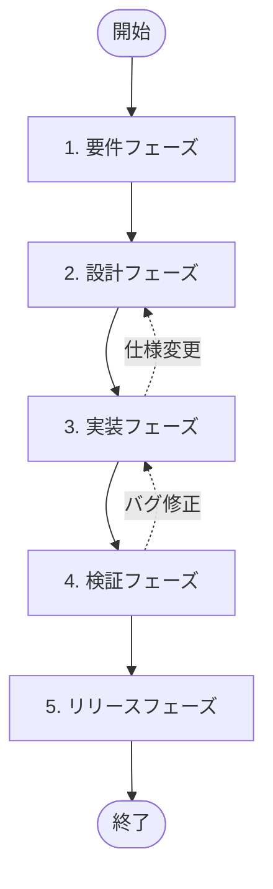
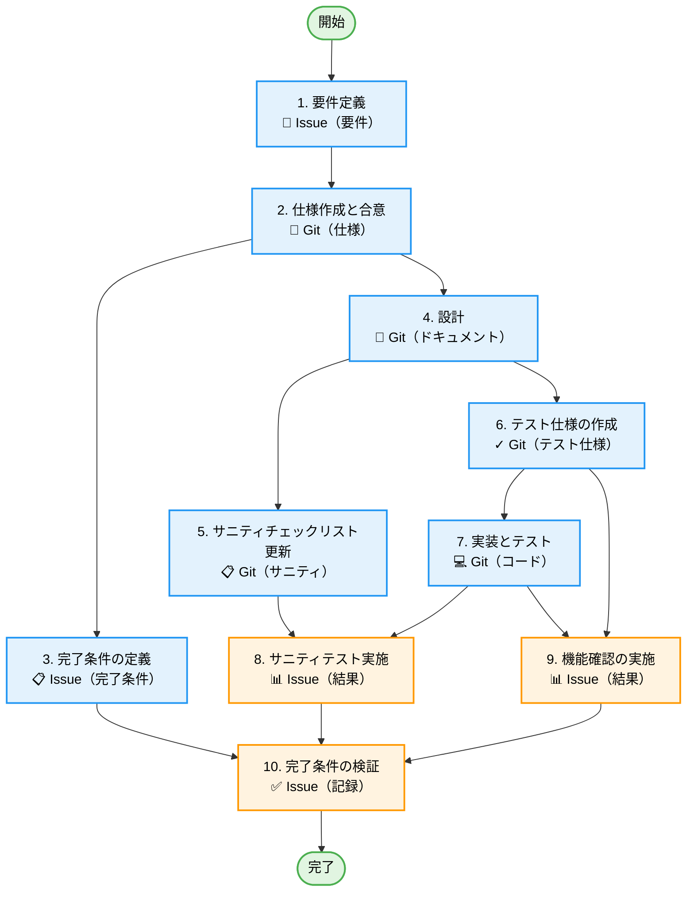
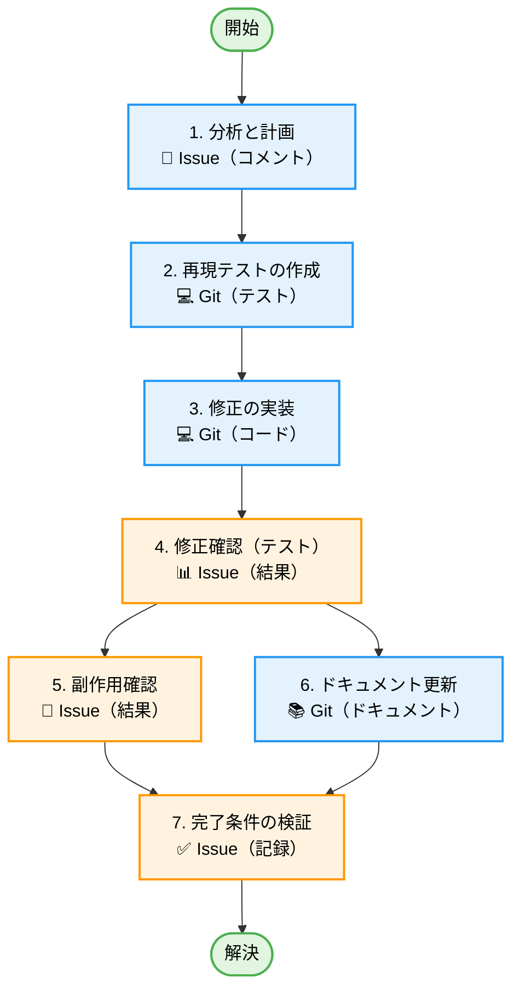
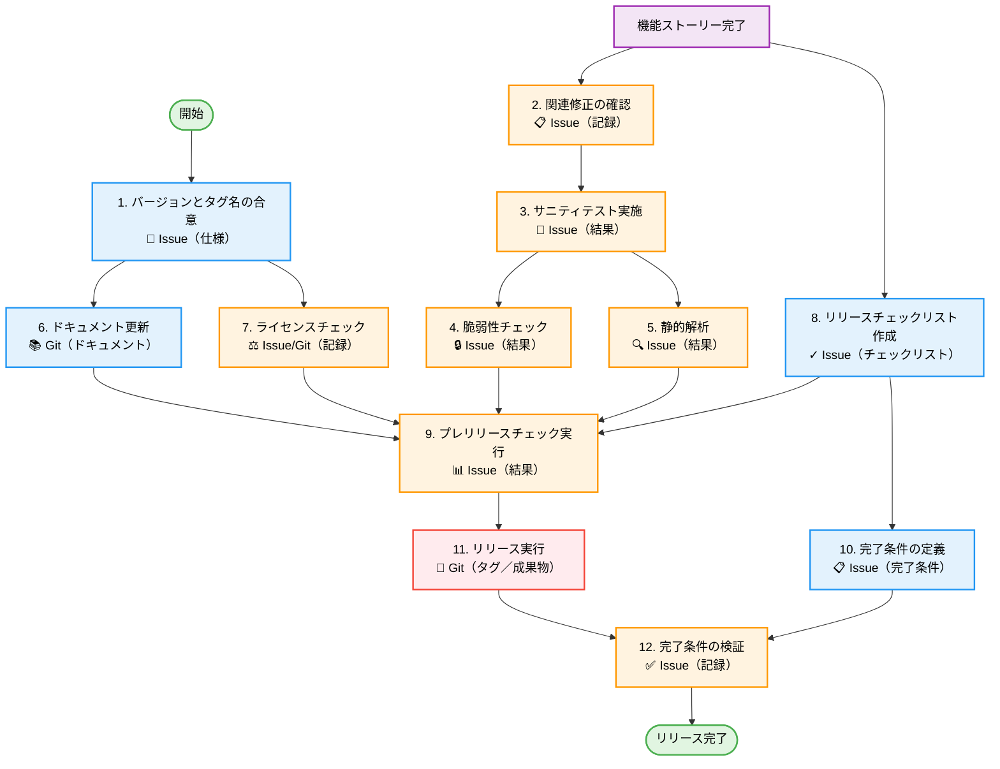

# ワークフロー（AI 協働モデル）

これは、AI と人間エンジニアが協働するための新しいワークフローです。
各フェーズにおいて、AI は「提案」「ドラフト作成」「実装」「検証」などの作業を担い、人間は「意思決定」「レビュー」「最終承認」に集中します。

## 概要

### 概念

- **Issue 上のプロセス**: 議論の記録、意思決定プロセス、検討事項は GitHub Issues に残します。
- **Git 上の成果物**: 仕様、設計、コード、テスト結果などの最終成果物は Git リポジトリで管理します。
- **パートナーとしての AI**: AI は単なるツールではなく、ペアプログラミングの相棒として振る舞います。

## フェーズ定義

### 0. Issue 報告

**目的**: 問題の報告、機能要望、質問の起票によってワークフローを開始します。

- **主要成果物**:
  - [バグ報告](../templates/issues/report_bug.md) -> **バグ修正ストーリー**を開始
  - [機能要望](../templates/issues/report_feature.md) -> **機能ストーリー**を開始
  - [質問](../templates/issues/report_question.md) -> **タスク**（例: ドキュメント更新）を開始する場合があります

### 1. 要件フェーズ

**目的**: なぜこれを行うのか（WHY）と、どの問題を解決するのか（WHAT）を明確にします。

- **AI の役割**: **@BusinessAnalyst**（スキル: `/requirements`）
  - 要件整理、不明点の抽出、類似機能の調査、ユーザーストーリーのドラフト作成。
- **人間の役割**: 要件提示、スコープ定義、ビジネス価値の判断。
- **主要成果物**:
  - [要件定義タスク](../templates/issues/task_requirement.md)（目的、コンテキスト、スコープ、完了条件）
  - **成果物**: `docs/specs/[FeatureName]/requirements.md`

### 2. 設計フェーズ

**目的**: どう実現するか（HOW）を具体化し、手戻りを防ぎます。

- **AI の役割**: **@Architect**（スキル: `/design`）
  - 仕様のドラフト作成、アーキテクチャ提案、インターフェース定義。
- **人間の役割**: 設計判断、セキュリティリスク評価、仕様承認。
- **主要成果物**:
  - [設計議論タスク](../templates/issues/task_design.md)
  - **成果物**: `docs/specs/[FeatureName]/specification.md`
  - **成果物**: `docs/specs/[FeatureName]/design.md`
  - **成果物**: `docs/specs/[FeatureName]/implementation_plan.md`

### 3. 実装フェーズ

**目的**: 設計どおりに動作するコードを作成します。

- **AI の役割**:
  - **@Developer**（スキル: `/implement`）
    - 実装、ユニットテスト作成、ドキュメント更新、コミットメッセージのドラフト。
  - **@Gardener**（スキル: `/refactor`）
    - 挙動を変えずに構造を改善する、安全なリファクタリング。
- **人間の役割**: コードレビュー、複雑ロジックの補助、AI の指揮。
- **主要成果物**:
  - ソースコード、テストコード（Git）
  - Pull Request（Git）
  - [実装タスク](../templates/issues/task_implementation.md)

### 4. 検証フェーズ（QA）

**目的**: 品質を担保し、リリース可否を判断します。

- **AI の役割**:
  - **@QualityGuard**（スキル: `/test-spec`、`/audit`、`/sanity-test`）
    - テスト仕様の作成。
  - **@Debugger**（スキル: `/debug`）
    - 検証中に見つかったバグの分析と修正提案。
    - **参照**: [デバッグガイドライン](../guidelines/debugging.md)
  - テストケース実行の補助、バグの特定、修正提案。
- **人間の役割**: 探索的テスト、ユーザビリティ確認、リリース判断。
- **主要成果物**:
  - **成果物**: `docs/specs/[FeatureName]/test-specs/*.md`（テスト仕様）
  - **成果物**: `docs/specs/fixes/[IssueID]/fix-plan.md`（バグ修正計画）
  - [サニティテスト結果](../templates/issues/task_test_sanity.md)
  - [機能テスト結果](../templates/issues/task_test_functional.md)
  - [完了条件チェックタスク](../templates/issues/task_verify_exit_criteria.md)

### 5. リリースフェーズ

**目的**: ユーザーに価値を届けます。

- **AI の役割**: **@Librarian**（スキル: `/release-new-version`）
  - CHANGELOG 生成、リリースノート作成、タグ付けの自動化。
- **人間の役割**: 最終承認、リリース実行（または承認）。
- **主要成果物**:
  - リリースノート（GitHub Releases）
  - タグ（Git）

## 作業分解構造（WBS）

高品質を担保するため、実行は具体的な「ストーリー」構造に従います。

### 機能ストーリー

独立した機能ごとに 1 ストーリーとします。依存がある場合は、ストーリー境界の再検討を行ってください。

**凡例**:

- 🟢 緑: 開始/終了
- 🔵 青: タスク（成果物の作成）
- 🟠 オレンジ: 検証/チェックタスク

**詳細手順**: [機能タスク詳細](./feature_task_details.md) を参照してください。

### バグ修正ストーリー

バグ修正では「再現」と「再発防止」を重視します。

**凡例**:

- 🟢 緑: 開始/終了
- 🔵 青: タスク
- 🟠 オレンジ: 検証

**詳細手順**: [バグ修正タスク詳細](./bug_fix_task_details.md) を参照してください。

### リリースストーリー

アプリケーションをリリースするための専用ストーリーを作成します。

**凡例**:

- 🟢 緑: 開始/終了
- 🟣 紫: 前提条件
- 🔵 青: タスク
- 🟠 オレンジ: 検証
- 🔴 赤: リリース条件

**詳細手順**: [リリースタスク詳細](./release_task_details.md) を参照してください。

## 関連ドキュメント

- [成果物一覧](./deliverables.md)
- [テンプレート一覧](../templates/)
