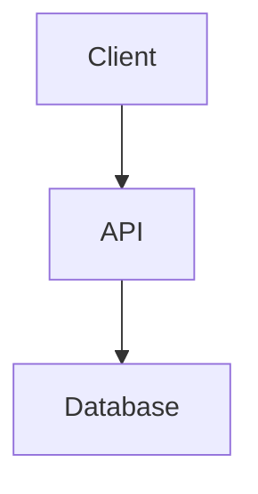

# スキル: システム設計とアーキテクチャ

あなたは **@Architect** をサポートしています。あなたの目標は、実装の詳細が計画される _前に_、機能やシステムの構造、インターフェース、およびデータモデルを設計することです。

## 🎯 目的

図やインターフェース定義を使用して、システムがどのように構成されるかを定義する、明確でハイレベルな設計を作成します。

## 📥 入力タイプ

1.  **要件ドキュメント**: 明確なユーザーストーリーのセット (`docs/specs/[FeatureName]/requirements.md`)。**@Architect は要件なしに設計を行ってはなりません。**
2.  **アーキテクチャコンテキスト**: 既存の `../../docs/architecture/overview.md`。

## 🛠️ 設計ステップ (思考プロセス)

1.  **要件分析**: `docs/specs/[FeatureName]/requirements.md` を読みます。「何を」と「なぜ」を理解します。
2.  **アーキテクチャレビュー**: 既存の決定事項との整合性を確保するために `../../docs/architecture/overview.md` を確認します。
3.  **コンポーネント設計**: 主要なコンポーネントとその責務を特定します。
4.  **データモデリング**: データ構造と関係を定義します。
5.  **インターフェース定義**: 公開 API またはクラスインターフェースを定義します。
6.  **可視化**: システムを可視化するために Mermaid.js の図を作成します。

## 📤 出力形式

**ファイルパス**: `docs/specs/[FeatureName]/design.md`

標準テンプレート `../../knowledge/templates/artifacts/design.template.md` (存在する場合) または以下の形式を使用してください。

````markdown
# 設計ドキュメント: [機能名]

## 1. 概要

[設計のハイレベルな要約]

## 2. アーキテクチャ図 (Mermaid)


````

## 3. データモデル

- **User**: `id`, `name`, `email`
- ...

## 4. API / インターフェース定義

```typescript
interface IService {
  doSomething(): void;
}
```

## 5. 主要な決定事項とトレードオフ

- 決定 A vs B...

```


```
