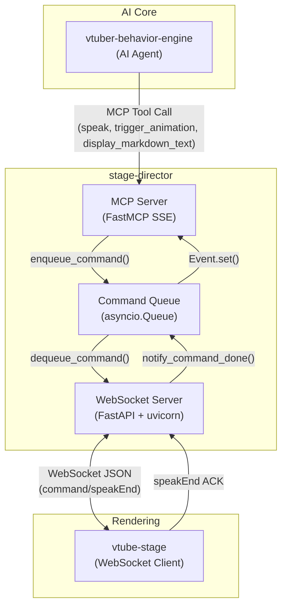
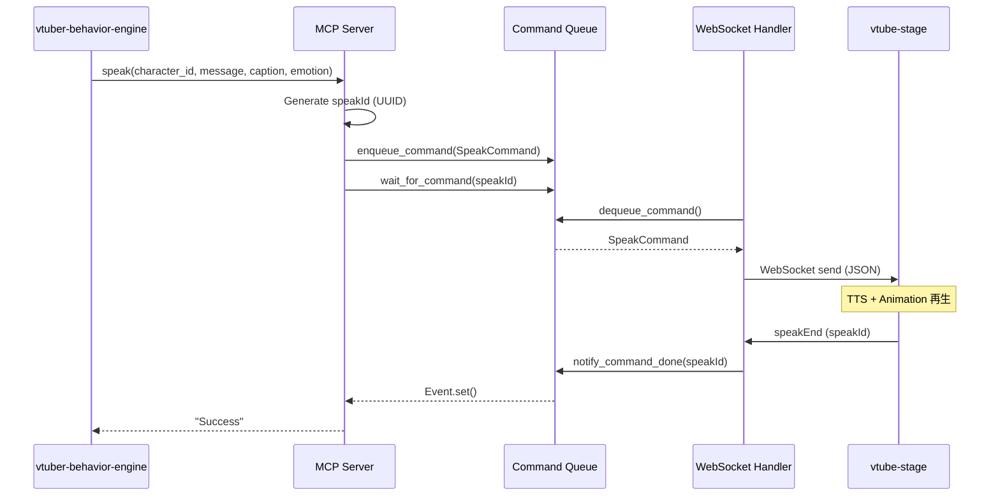

<!-- このドキュメントは .github/prompts/document-project.prompt.md によって生成・更新されています -->

# アーキテクチャ概要

## システム概要

`stage-director` は、AI V-Tuber システムにおける**舞台監督**として機能するパッケージです。MCP (Model Context Protocol) サーバーとして AI エージェント (`vtuber-behavior-engine`) からの指示を受け取り、WebSocket を介してリアルタイムレンダリングエンジン (`vtube-stage`) へコマンドを中継します。

### 主な役割

1. **MCP Server**: AI エージェントに対して発話・アニメーション・テキスト表示ツールを提供
2. **WebSocket Server**: `vtube-stage` との双方向リアルタイム通信
3. **コマンドキューイング**: 非同期コマンドの順序制御
4. **同期制御**: 発話完了 (TTS) の待機による発話ペース制御

## 主要コンポーネント

| コンポーネント        | ファイル                       | 責務                                             |
| --------------------- | ------------------------------ | ------------------------------------------------ |
| **Main**              | `main.py`                      | アプリケーションエントリーポイント、サーバー起動 |
| **MCP Server**        | `stage_director_mcp_server.py` | MCP ツール定義・SSE サーバー                     |
| **FastAPI Server**    | `stage_director_server.py`     | WebSocket サーバー (uvicorn)                     |
| **WebSocket Handler** | `websocket_handler.py`         | クライアント接続管理・コマンド送信・ACK 処理     |
| **Command Queue**     | `command_queue.py`             | 共有キューとコマンド完了イベント管理             |
| **Models**            | `models.py`                    | Pydantic コマンドモデル定義                      |

## アーキテクチャ図

### コンポーネント図

### シーケンス図（speak コマンド）

## データフロー

### コマンドフロー

1. **入力**: AI エージェントが MCP ツールを呼び出す
2. **キューイング**: コマンドが `asyncio.Queue` に追加される
3. **送信**: WebSocket ハンドラがキューからコマンドを取り出し、JSON として送信
4. **ACK**: `vtube-stage` が `speakEnd` を返送し、待機中の MCP ツールが完了

### データ形式

- **コマンド**: Pydantic モデル → JSON (camelCase キー)
- **WebSocket メッセージ**: `{ "command": "...", "payload": { ... } }`

## 設計の背景と判断理由

### 非同期デュアルサーバー

- **理由**: MCP (SSE) と WebSocket を同時に稼働させる必要があるため、`asyncio.gather` で並列起動
- **利点**: 単一プロセスで両方のプロトコルを処理、リソース効率が良い

### 共有キューによるコマンド管理

- **理由**: MCP ツールと WebSocket ハンドラが別々の非同期タスクで動作するため、スレッドセーフな通信が必要
- **実装**: `asyncio.Queue` + `asyncio.Event` による非同期待機

### speakId による同期制御

- **理由**: 発話コマンドは TTS 完了まで待機する必要がある（発話ペース制御）
- **実装**: UUID を発行し、`speakEnd` ACK で完了を通知

### camelCase JSON キー

- **理由**: `vtube-stage` (TypeScript) との API 契約を維持
- **実装**: Pydantic モデルのフィールド名を camelCase で定義
