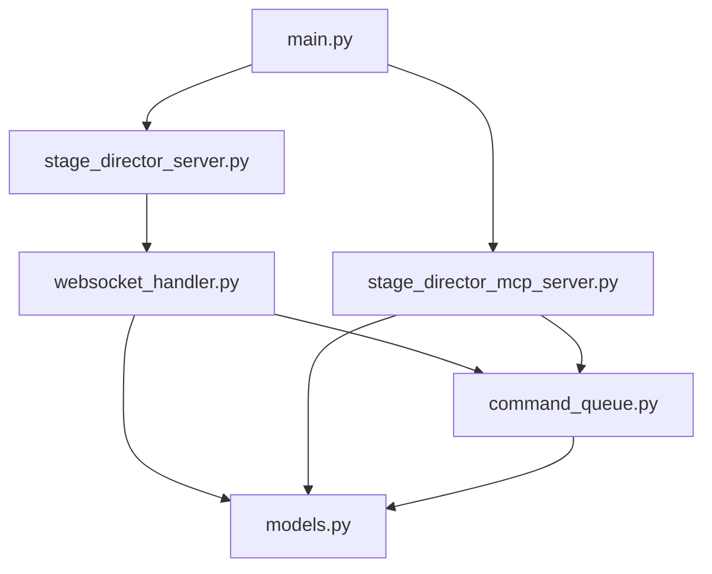
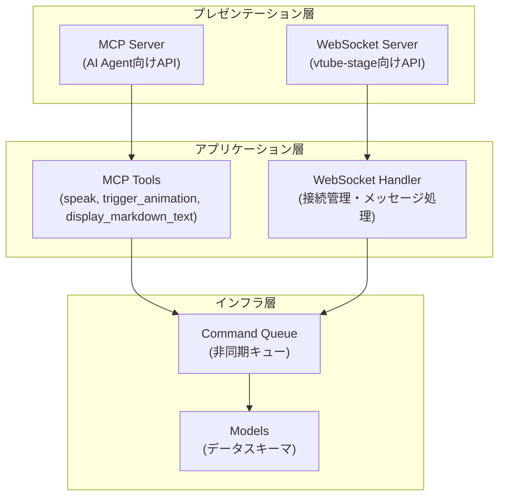

<!-- このドキュメントは .github/prompts/document-project.prompt.md によって生成・更新されています -->

# ディレクトリ構造ガイド

## 全体構成

```
stage-director/
├── .github/
│   ├── copilot-instructions.md    # Copilot 向けプロジェクト指示
│   └── prompts/                   # プロンプトテンプレート
├── agents-docs/                   # LLM向けドキュメント（本ディレクトリ）
├── src/
│   └── stage_director/            # メインパッケージ
│       ├── __init__.py
│       ├── main.py                # エントリーポイント
│       ├── models.py              # Pydantic コマンドモデル
│       ├── command_queue.py       # 共有キューとイベント管理
│       ├── stage_director_mcp_server.py   # MCP サーバー
│       ├── stage_director_server.py       # FastAPI サーバー
│       └── websocket_handler.py   # WebSocket 接続ハンドラ
├── tests/
│   └── tests_stage_director/      # テストモジュール
│       ├── __init__.py
│       └── test_dummy.py          # ダミーテスト
├── pyproject.toml                 # プロジェクト設定・依存関係
├── README.md                      # プロジェクト概要
├── SetupGuide.md                  # セットアップガイド
└── .env                           # 環境変数（gitignore）
```

## 各ディレクトリ・ファイルの責務

### `/src/stage_director/`

メインアプリケーションコード。

| ファイル                       | 役割                                                                                                                           | 依存先                                               |
| ------------------------------ | ------------------------------------------------------------------------------------------------------------------------------ | ---------------------------------------------------- |
| `main.py`                      | エントリーポイント。`dotenv` で `.env` を読み込み、FastAPI WebSocket サーバーと MCP SSE サーバーを `asyncio.gather` で同時起動 | `stage_director_server`, `stage_director_mcp_server` |
| `models.py`                    | Pydantic ベースのコマンドスキーマ定義。`StageCommand` Union 型と `create_command_json` ヘルパー                                | なし（独立）                                         |
| `command_queue.py`             | 共有 `asyncio.Queue` とコマンド完了待機用 `asyncio.Event` を提供                                                               | `models`                                             |
| `stage_director_mcp_server.py` | FastMCP で MCP ツール (`speak`, `trigger_animation`, `display_markdown_text`) を定義し、SSE サーバーを起動                     | `command_queue`, `models`                            |
| `stage_director_server.py`     | FastAPI アプリ定義、uvicorn で WebSocket サーバー起動、`/ws` エンドポイント登録                                                | `websocket_handler`                                  |
| `websocket_handler.py`         | WebSocket 接続管理、コマンドキューからの送信、`speakEnd` ACK 処理                                                              | `command_queue`, `models`                            |

### `/tests/tests_stage_director/`

pytest ベースのテストコード。

- **役割**: ユニットテスト・統合テスト
- **主要ファイル**:
  - `test_dummy.py` - CI 動作確認用のダミーテスト
- **テスト実行**: `uv run pytest`

### `/.github/`

GitHub Copilot 用の設定とプロンプト。

- `copilot-instructions.md` - プロジェクト固有のコーディング指示
- `prompts/` - 再利用可能なプロンプトテンプレート

### `/agents-docs/`

LLM エージェント向けのアーキテクチャドキュメント（本ドキュメント群）。

## モジュール間の依存関係図



## レイヤー構造



## ファイル命名規則

- **モジュール名**: `snake_case` (例: `command_queue.py`)
- **テストファイル**: `test_` プレフィックス (例: `test_dummy.py`)
- **設定ファイル**: 標準的な名前 (`pyproject.toml`, `.env`)
