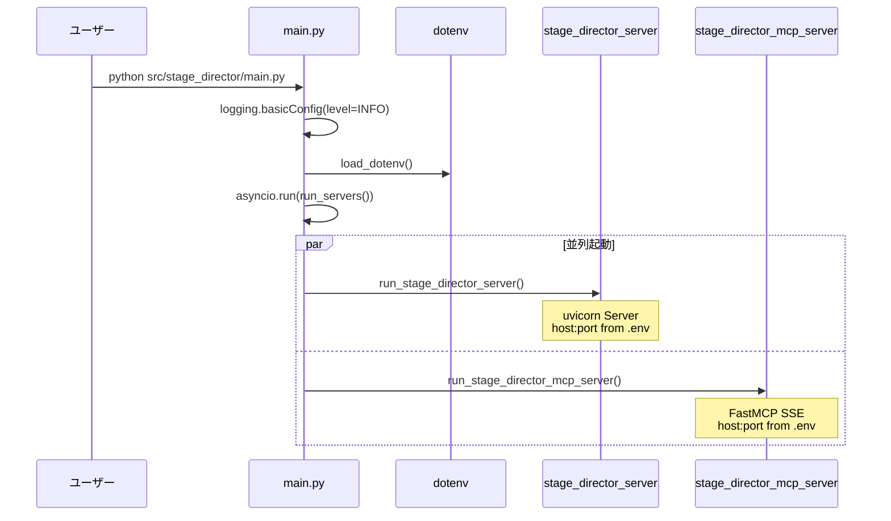
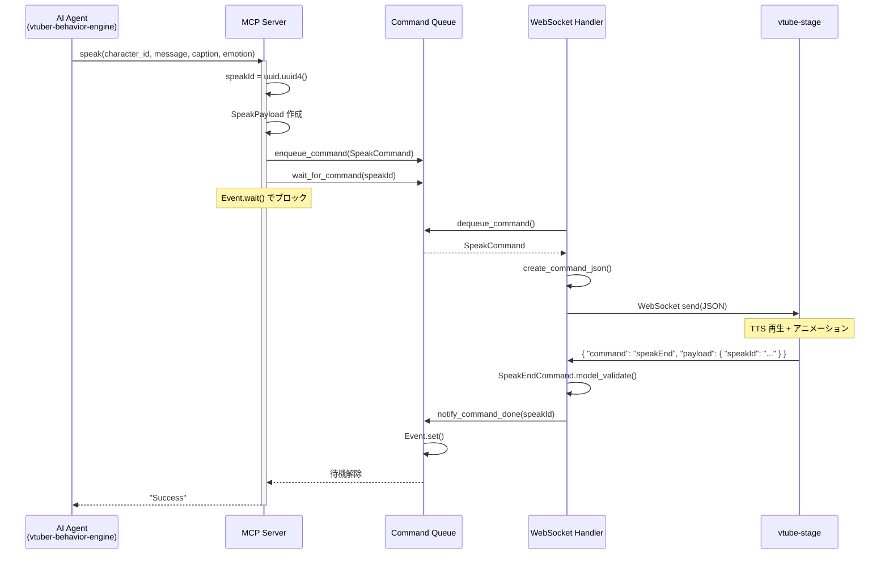
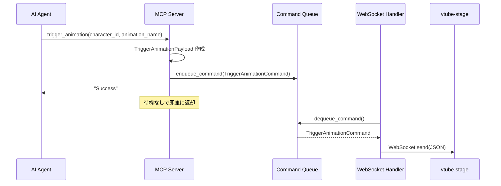
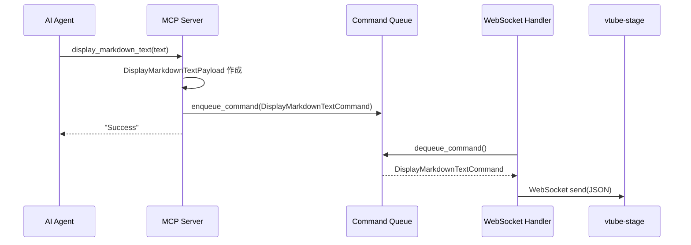
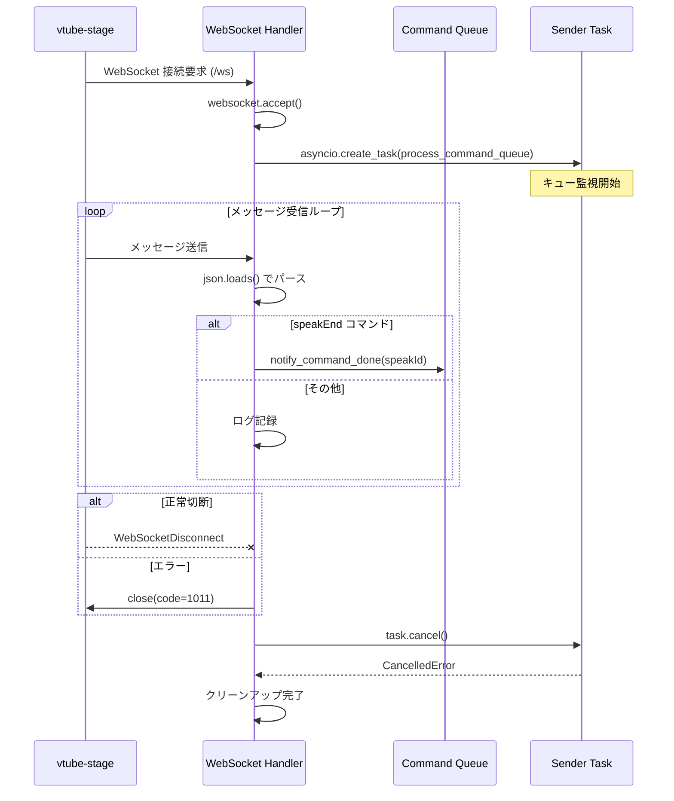

<!-- このドキュメントは .github/prompts/document-project.prompt.md によって生成・更新されています -->

# 主要な機能フロー

## エントリーポイント

### アプリケーション起動フロー

### 関連ファイル

- `src/stage_director/main.py` - エントリーポイント、サーバー起動
- `src/stage_director/stage_director_server.py` - FastAPI + uvicorn サーバー
- `src/stage_director/stage_director_mcp_server.py` - MCP SSE サーバー

### 処理の流れ

1. `logging.basicConfig(level=logging.INFO)` でルートロガー設定
2. `dotenv.load_dotenv()` で `.env` ファイルを読み込み
3. `asyncio.run(run_servers())` でメインループ開始
4. `asyncio.gather()` で WebSocket サーバーと MCP サーバーを並列起動
5. `KeyboardInterrupt` でグレースフルシャットダウン

---

## ユースケース 1: speak（発話コマンド）

### 概要

AI エージェントがキャラクターに発話させる。TTS 完了まで待機し、発話ペースを制御する。

### シーケンス図

### 関連ファイル

- `src/stage_director/stage_director_mcp_server.py` - `speak()` ツール定義
- `src/stage_director/models.py` - `SpeakPayload`, `SpeakCommand`, `SpeakEndCommand`
- `src/stage_director/command_queue.py` - `enqueue_command()`, `wait_for_command()`, `notify_command_done()`
- `src/stage_director/websocket_handler.py` - `speakEnd` ACK 処理

### 処理の流れ

1. AI エージェントが `speak(character_id, message, caption, emotion)` を呼び出す
2. MCP ツールが UUID (`speakId`) を生成
3. `SpeakPayload` → `SpeakCommand` を作成
4. `enqueue_command()` でキューに追加
5. `wait_for_command(speakId)` で `asyncio.Event.wait()` 開始
6. WebSocket ハンドラが `dequeue_command()` でコマンドを取得
7. `create_command_json()` で JSON 化して送信
8. `vtube-stage` が TTS 再生後に `speakEnd` を送信
9. ハンドラが `notify_command_done(speakId)` で Event を set
10. MCP ツールの待機が解除、`"Success"` を返却

---

## ユースケース 2: trigger_animation（アニメーション再生）

### 概要

キャラクターにポーズやアニメーションを実行させる。即時発火型で待機なし。

### シーケンス図

### 関連ファイル

- `src/stage_director/stage_director_mcp_server.py` - `trigger_animation()` ツール定義
- `src/stage_director/models.py` - `TriggerAnimationPayload`, `TriggerAnimationCommand`

### 処理の流れ

1. AI エージェントが `trigger_animation(character_id, animation_name)` を呼び出す
2. `TriggerAnimationPayload` → `TriggerAnimationCommand` を作成
3. `enqueue_command()` でキューに追加
4. 即座に `"Success"` を返却（ACK 待機なし）
5. WebSocket ハンドラがコマンドを取得して送信

---

## ユースケース 3: display_markdown_text（Markdown テキスト表示）

### 概要

画面に Markdown テキストを表示する。即時発火型で待機なし。

### シーケンス図

### 関連ファイル

- `src/stage_director/stage_director_mcp_server.py` - `display_markdown_text()` ツール定義
- `src/stage_director/models.py` - `DisplayMarkdownTextPayload`, `DisplayMarkdownTextCommand`

---

## ユースケース 4: WebSocket 接続管理

### 概要

`vtube-stage` クライアントの接続確立・維持・切断処理。

### シーケンス図

### 関連ファイル

- `src/stage_director/websocket_handler.py` - `websocket_endpoint()`, `process_command_queue()`
- `src/stage_director/stage_director_server.py` - `/ws` エンドポイント登録

### 処理の流れ

1. クライアントが `/ws` に接続
2. `websocket.accept()` で接続受け入れ
3. `process_command_queue()` タスクをバックグラウンドで開始
4. メインループでクライアントからのメッセージを受信
5. `speakEnd` の場合は `notify_command_done()` を呼び出し
6. 切断時は Sender タスクをキャンセルしてクリーンアップ
