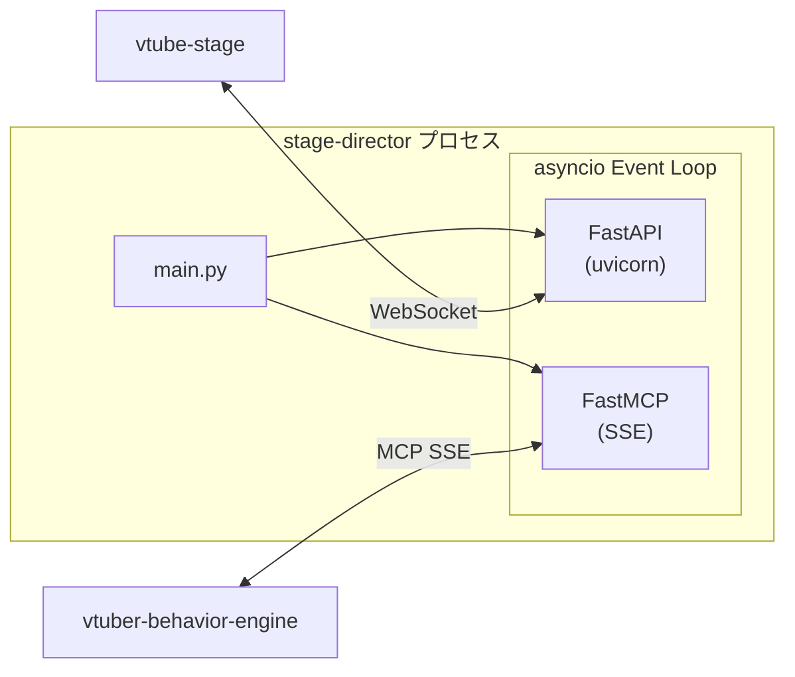

<!-- このドキュメントは .github/prompts/document-project.prompt.md によって生成・更新されています -->

# 技術スタックと依存関係

## 主要な技術スタック

| カテゴリ                 | 技術          | バージョン |
| ------------------------ | ------------- | ---------- |
| **言語**                 | Python        | >= 3.11    |
| **Web フレームワーク**   | FastAPI       | 0.120.0    |
| **ASGI サーバー**        | uvicorn       | >= 0.38.0  |
| **MCP フレームワーク**   | mcp (FastMCP) | >= 1.19.0  |
| **データバリデーション** | Pydantic      | >= 2.12.3  |
| **WebSocket**            | websockets    | >= 15.0.1  |

## 主要な依存ライブラリ

### 本番依存関係

| ライブラリ          | バージョン | 用途                                    |
| ------------------- | ---------- | --------------------------------------- |
| `fastapi`           | 0.120.0    | WebSocket サーバー、HTTP エンドポイント |
| `uvicorn[standard]` | >= 0.38.0  | ASGI サーバー（ホットリロード付き）     |
| `mcp[cli]`          | >= 1.19.0  | MCP SSE サーバー、ツール定義            |
| `pydantic`          | >= 2.12.3  | コマンドモデル定義、バリデーション      |
| `websockets`        | >= 15.0.1  | WebSocket 通信サポート                  |
| `python-dotenv`     | >= 1.0.0   | `.env` ファイル読み込み                 |
| `setuptools`        | >= 80.9.0  | パッケージビルド                        |
| `wheel`             | >= 0.45.1  | パッケージビルド                        |

### 開発依存関係

| ライブラリ              | バージョン | 用途                       |
| ----------------------- | ---------- | -------------------------- |
| `black`                 | >= 24.10.0 | コードフォーマッター       |
| `flake8`                | >= 7.1.1   | リンター                   |
| `flake8-copyright`      | >= 0.2.4   | 著作権ヘッダーチェック     |
| `mypy`                  | >= 1.11.2  | 静的型チェック             |
| `pytest`                | >= 8.3.3   | テストフレームワーク       |
| `pytest-asyncio`        | >= 0.24.0  | 非同期テストサポート       |
| `pytest-cov`            | >= 5.0.0   | カバレッジ計測             |
| `pytest-html`           | >= 4.1.1   | HTML テストレポート        |
| `respx`                 | >= 0.21.1  | HTTP モック                |
| `sphinx`                | 8.1.3      | ドキュメント生成           |
| `sphinx-rtd-theme`      | 3.0.1      | Sphinx テーマ              |
| `myst-parser`           | 4.0.0      | Markdown パーサー (Sphinx) |
| `sphinxcontrib-mermaid` | 1.0.0      | Mermaid 図表サポート       |

## 外部サービスとの連携

### vtube-stage（WebSocket クライアント）

- **プロトコル**: WebSocket
- **エンドポイント**: `ws://<host>:<port>/ws`
- **データ形式**: JSON (camelCase キー)
- **メッセージタイプ**:
  - 送信: `speak`, `triggerAnimation`, `displayMarkdown`
  - 受信: `speakEnd`

### vtuber-behavior-engine（MCP クライアント）

- **プロトコル**: MCP over SSE (Server-Sent Events)
- **エンドポイント**: `http://<mcp_host>:<mcp_port>/`
- **提供ツール**:
  - `speak` - 発話コマンド
  - `trigger_animation` - アニメーション再生
  - `display_markdown_text` - Markdown テキスト表示

## 開発ツール

### パッケージマネージャー

- **uv**: Python パッケージマネージャー・仮想環境管理
  - `uv venv` - 仮想環境作成
  - `uv sync --extra dev` - 依存関係インストール
  - `uv run <command>` - 仮想環境内でコマンド実行

### ビルドシステム

- **setuptools + wheel**: パッケージビルド
- ソースディレクトリ: `src/`

### 品質管理ツール

| ツール | コマンド         | 設定ファイル     |
| ------ | ---------------- | ---------------- |
| Black  | `uv run black .` | `pyproject.toml` |
| Flake8 | `uv run flake8`  | -                |
| mypy   | `uv run mypy .`  | `pyproject.toml` |
| pytest | `uv run pytest`  | `pyproject.toml` |

### 環境変数

`.env` ファイルで設定（`main.py` で `dotenv.load_dotenv()` により読み込み）:

| 変数名                    | デフォルト値 | 説明                     |
| ------------------------- | ------------ | ------------------------ |
| `STAGE_DIRECTOR_HOST`     | `127.0.0.1`  | WebSocket サーバーホスト |
| `STAGE_DIRECTOR_PORT`     | `8000`       | WebSocket サーバーポート |
| `STAGE_DIRECTOR_MCP_HOST` | `0.0.0.0`    | MCP サーバーホスト       |
| `STAGE_DIRECTOR_MCP_PORT` | `8080`       | MCP サーバーポート       |

## Python バージョン要件

- **最小バージョン**: Python 3.11
- **ターゲットバージョン (Black)**: Python 3.10 (互換性のため)

## ランタイム構成

