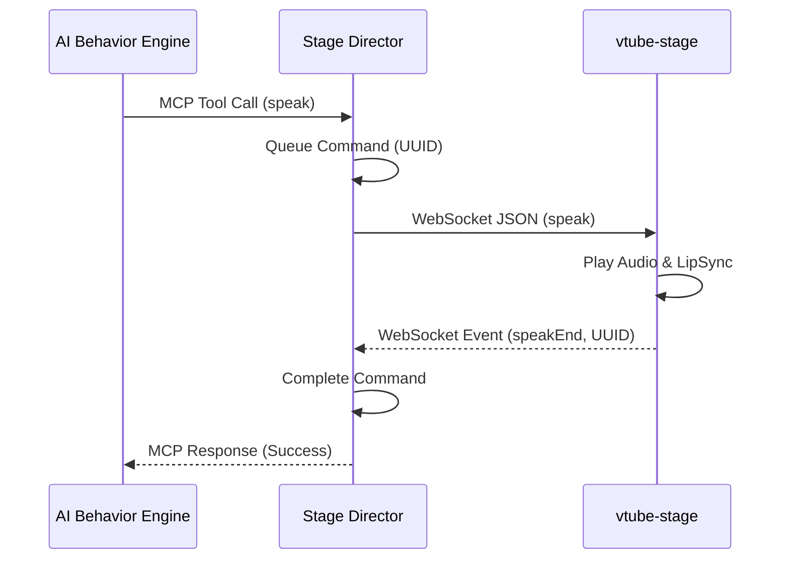

<!-- このドキュメントは .github/prompts/doc-sync.prompt.md によって生成・更新されています -->

# 主要フロー

## 発話フロー (Speak Flow)

1. **AI エージェント**: MCP ツール `speak` を呼び出す。
2. **MCP サーバー**: リクエストを受け取り、UUID を生成してコマンドキューに追加する。
3. **コマンドキュー**: コマンドを WebSocket ハンドラーに渡す。
4. **WebSocket ハンドラー**: `vtube-stage` へ JSON コマンドを送信する。
5. **vtube-stage**: 音声再生を開始し、完了時に `speakEnd` イベントを返す。
6. **WebSocket ハンドラー**: `speakEnd` を受信し、対応する UUID の完了を通知する。
7. **MCP サーバー**: 完了を確認し、AI エージェントに応答を返す。

## アニメーション実行フロー

1. **AI エージェント**: MCP ツール `trigger_animation` を呼び出す。
2. **MCP サーバー**: コマンドを生成し、WebSocket 経由で即座に送信する。
3. **vtube-stage**: 指定されたアニメーションを再生する。

## データフロー図 (Mermaid)

