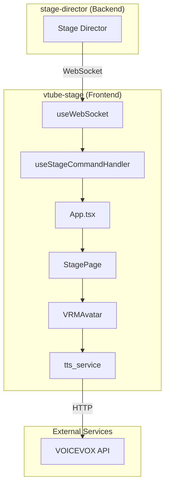
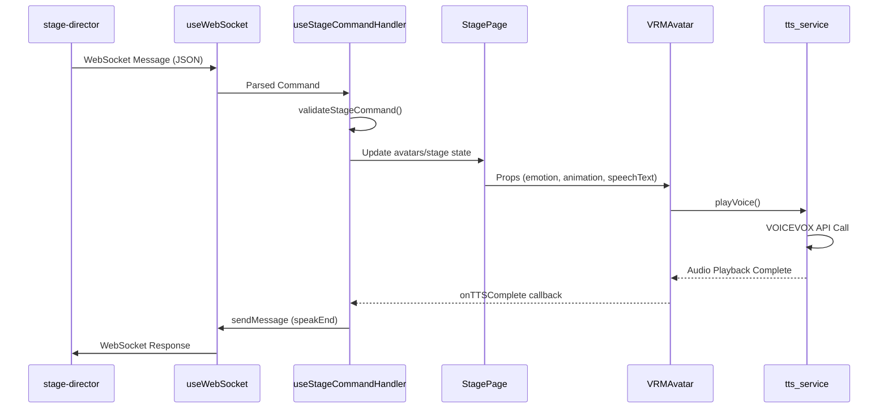

<!-- このドキュメントは .github/prompts/document-project.prompt.md によって生成・更新されています -->

# アーキテクチャ概要

## システム概要

`vtube-stage` は、AI V-Tuber システムのフロントエンド Web アプリケーションです。VRM (Virtual Reality Model) 形式の 3D アバターをリアルタイムでレンダリングし、バックエンドサービス (`stage-director`) からの WebSocket コマンドに基づいてキャラクターの表情、アニメーション、発話を制御します。

### 主な責務

1. **VRM モデルの読み込みとレンダリング** - Three.js と `@pixiv/three-vrm` を使用
2. **リアルタイムコマンド処理** - WebSocket 経由で `stage-director` からのコマンドを受信・実行
3. **表情・アニメーション制御** - キャラクターの感情表現とポーズ切り替え
4. **TTS (Text-to-Speech) 連携** - VOICEVOX API を使用した音声合成とリップシンク
5. **UI オーバーレイ** - 吹き出し、Markdown テキスト表示

## 主要コンポーネント

### React コンポーネント階層

```
App
├── ThemeProvider (MUI)
└── StagePage
    ├── Canvas (React Three Fiber)
    │   ├── CameraInit
    │   ├── AnimatedCamera
    │   └── SceneContent
    │       ├── Environment
    │       ├── Lights
    │       ├── VRMAvatar[] (各アバター)
    │       │   └── SpeechBubble
    │       └── OrbitControls
    ├── MarkdownOverlay
    └── Sidebar (デバッグ用)
```

### コンポーネント責務

| コンポーネント   | 責務                                                   |
| ---------------- | ------------------------------------------------------ |
| `App`            | アプリケーションルート、テーマ設定、WebSocket 接続管理 |
| `StagePage`      | メインステージ UI、Canvas とサイドバーのレイアウト     |
| `SceneContent`   | 3D シーン構成、環境・ライト・アバター配置              |
| `VRMAvatar`      | VRM モデル制御、アニメーション、表情、TTS 再生         |
| `AnimatedCamera` | カメラアニメーション制御                               |
| `SpeechBubble`   | 3D 空間内の吹き出し表示                                |
| `VRMController`  | デバッグ用の手動コントロール UI                        |

## アーキテクチャ図

### システム構成図



### コンポーネント間データフロー



## データフロー

### 1. コマンド受信フロー

1. `useWebSocket` が WebSocket 接続を確立・維持
2. サーバーからの JSON メッセージを受信
3. `useStageCommandHandler` がメッセージをパース
4. `command_validator` でバリデーション（class-validator 使用）
5. コマンドタイプに応じて状態を更新

### 2. アバター状態管理

```typescript
interface AvatarState {
  id: string;                    // アバター識別子
  vrmUrl: string;               // VRM ファイルパス
  animationUrls: Record<string, string>; // アニメーション定義
  currentEmotion: string;       // 現在の感情
  speechText: SpeakMessage | null; // 発話内容
  currentAnimationName: string | null; // 再生中アニメーション
  position: [number, number, number]; // 3D 位置
}
```

### 3. 対応コマンド

| コマンド           | 説明                                       |
| ------------------ | ------------------------------------------ |
| `speak`            | キャラクターに発話させる（TTS + 表情変更） |
| `triggerAnimation` | アニメーション再生                         |
| `displayMarkdown`  | Markdown テキストをオーバーレイ表示        |
| `logMessage`       | ログメッセージ出力                         |
| `setPose`          | ポーズ設定（将来用）                       |

## 設計の背景と判断理由

### React Three Fiber 採用理由

- **宣言的 3D レンダリング**: React のコンポーネントモデルで Three.js を扱える
- **React 統合**: 状態管理、ライフサイクル、Hooks が自然に使える
- **豊富なエコシステム**: `@react-three/drei` による便利なヘルパー

### @pixiv/three-vrm 採用理由

- **VRM 標準サポート**: VRM 1.0/0.x 両対応
- **表情・アニメーション**: VRM 標準の表情パラメータとアニメーション再生
- **VRMA 対応**: VRM Animation 形式のサポート

### WebSocket 通信

- **リアルタイム性**: HTTP ポーリングより低レイテンシ
- **双方向通信**: コマンド受信と完了通知の送信が可能
- **class-validator によるバリデーション**: 型安全なコマンド処理

### VOICEVOX TTS

- **高品質な日本語音声**: 複数話者対応
- **ローカル動作可能**: プライバシーとレイテンシの観点
- **REST API**: シンプルな統合

## 外部依存関係

| サービス       | 用途           | エンドポイント設定             |
| -------------- | -------------- | ------------------------------ |
| stage-director | コマンド送受信 | `VITE_STAGE_DIRECTER_ENDPOINT` |
| VOICEVOX       | TTS 音声合成   | `VITE_VOICEVOX_API_BASE`       |
