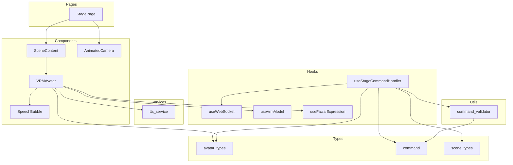

<!-- このドキュメントは .github/prompts/document-project.prompt.md によって生成・更新されています -->

# ディレクトリ構造ガイド

## 全体構成

```
vtube-stage/
├── agents-docs/           # LLM 向けドキュメント（本ディレクトリ）
├── dist/                  # ビルド出力
├── dist-electron/         # Electron ビルド出力（未使用）
├── public/                # 静的アセット
│   ├── avatars.json       # アバター設定
│   ├── avatar/            # VRM モデルファイル
│   └── vrma/              # VRMA アニメーションファイル
├── src/                   # ソースコード
│   ├── assets/            # 画像等のアセット
│   ├── components/        # React コンポーネント
│   ├── contexts/          # React Context（未使用）
│   ├── hooks/             # カスタム Hooks
│   ├── pages/             # ページコンポーネント
│   ├── services/          # 外部サービス連携
│   ├── types/             # TypeScript 型定義
│   └── utils/             # ユーティリティ関数
├── eslint.config.js       # ESLint 設定
├── index.html             # HTML エントリーポイント
├── package.json           # プロジェクト設定
├── tsconfig.json          # TypeScript 設定
├── tsconfig.app.json      # アプリ用 TS 設定
├── tsconfig.node.json     # Node 用 TS 設定
└── vite.config.ts         # Vite 設定
```

## 各ディレクトリの責務

### `/public/`

静的アセットを配置するディレクトリ。ビルド時にそのまま出力ディレクトリにコピーされます。

- **役割**: VRM モデル、アニメーション、設定ファイルのホスティング
- **主要ファイル**:
  - `avatars.json` - アバターの初期設定（ID、VRM パス、アニメーション定義、初期位置）
  - `avatar/*.vrm` - VRM 形式の 3D アバターモデル
  - `vrma/*.vrma` - VRMA 形式のアニメーションファイル
  - `background.jpg` - 背景画像（Environment で使用）

### `/src/components/`

再利用可能な React コンポーネントを配置。

- **役割**: UI コンポーネントと 3D シーンコンポーネント
- **主要ファイル**:

| ファイル             | 責務                                                             |
| -------------------- | ---------------------------------------------------------------- |
| `VRMAvatar.tsx`      | VRM モデルのレンダリング、アニメーション制御、表情制御、TTS 連携 |
| `SceneContent.tsx`   | 3D シーン構成（ライト、床、アバター配置、OrbitControls）         |
| `AnimatedCamera.tsx` | カメラのアニメーション（起動時のズームイン等）                   |
| `SpeechBubble.tsx`   | 3D 空間内の HTML 吹き出し表示                                    |
| `VRMController.tsx`  | デバッグ用の表情・アニメーション手動制御 UI                      |

- **依存関係**: `@react-three/fiber`, `@react-three/drei`, `@pixiv/three-vrm`

### `/src/hooks/`

カスタム React Hooks を配置。状態管理とロジックのカプセル化。

- **役割**: 再利用可能なロジックの抽象化
- **主要ファイル**:

| ファイル                    | 責務                                           |
| --------------------------- | ---------------------------------------------- |
| `useWebSocket.ts`           | WebSocket 接続管理、メッセージ送受信           |
| `useStageCommandHandler.ts` | コマンド解析、アバター/ステージ状態管理        |
| `useVrmModel.ts`            | VRM モデルのロード、アニメーションクリップ管理 |
| `useFacialExpression.ts`    | 表情制御、リップシンク                         |

- **依存関係**: `useWebSocket` ← `useStageCommandHandler`、`useVrmModel` → `useFacialExpression`

### `/src/pages/`

ページレベルのコンポーネント。ルーティング単位で分割（現在は単一ページ）。

- **役割**: ページ全体のレイアウトと構成
- **主要ファイル**:

  - `StagePage.tsx` - メインステージページ。Canvas、オーバーレイ、サイドバーを統合

- **依存関係**: `components/*`, `hooks/*`

### `/src/services/`

外部サービスとの連携ロジック。

- **役割**: API 呼び出し、外部サービス統合
- **主要ファイル**:

  - `tts_service.ts` - VOICEVOX API を使用した TTS 音声合成

- **依存関係**: `axios`（HTTP クライアント）

### `/src/types/`

TypeScript の型定義とコマンドクラス。

- **役割**: 型安全性の確保、コマンドバリデーション用クラス
- **主要ファイル**:

| ファイル          | 責務                                                   |
| ----------------- | ------------------------------------------------------ |
| `avatar_types.ts` | `AvatarState`, `SpeakMessage` インターフェース         |
| `command.ts`      | コマンドクラス定義（`class-validator` デコレータ付き） |
| `scene_types.ts`  | `StageState` インターフェース                          |

### `/src/utils/`

ユーティリティ関数。

- **役割**: 共通処理の抽象化
- **主要ファイル**:

  - `command_validator.ts` - コマンドのバリデーション処理

- **依存関係**: `class-validator`, `class-transformer`

## モジュール間の依存関係図



## レイヤー構造

```
┌─────────────────────────────────────────────────────┐
│                   Presentation Layer                 │
│  ┌─────────────────────────────────────────────────┐│
│  │ pages/StagePage.tsx                              ││
│  │ components/VRMAvatar.tsx, SceneContent.tsx, etc. ││
│  └─────────────────────────────────────────────────┘│
├─────────────────────────────────────────────────────┤
│                   Application Layer                  │
│  ┌─────────────────────────────────────────────────┐│
│  │ hooks/useStageCommandHandler.ts                  ││
│  │ hooks/useVrmModel.ts, useFacialExpression.ts     ││
│  │ utils/command_validator.ts                       ││
│  └─────────────────────────────────────────────────┘│
├─────────────────────────────────────────────────────┤
│                   Infrastructure Layer               │
│  ┌─────────────────────────────────────────────────┐│
│  │ hooks/useWebSocket.ts                            ││
│  │ services/tts_service.ts                          ││
│  └─────────────────────────────────────────────────┘│
├─────────────────────────────────────────────────────┤
│                   Domain Layer                       │
│  ┌─────────────────────────────────────────────────┐│
│  │ types/avatar_types.ts                            ││
│  │ types/command.ts                                 ││
│  │ types/scene_types.ts                             ││
│  └─────────────────────────────────────────────────┘│
└─────────────────────────────────────────────────────┘
```

## ファイル追加のガイドライン

| 新規ファイルの種類          | 配置先            |
| --------------------------- | ----------------- |
| 新しい React コンポーネント | `src/components/` |
| ページ追加（ルーティング）  | `src/pages/`      |
| カスタム Hook               | `src/hooks/`      |
| 外部 API 連携               | `src/services/`   |
| 型定義                      | `src/types/`      |
| 汎用ユーティリティ          | `src/utils/`      |
| VRM モデル                  | `public/avatar/`  |
| アニメーションファイル      | `public/vrma/`    |
