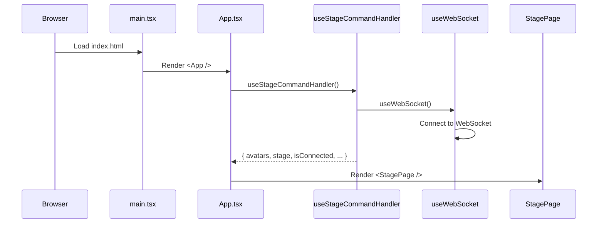
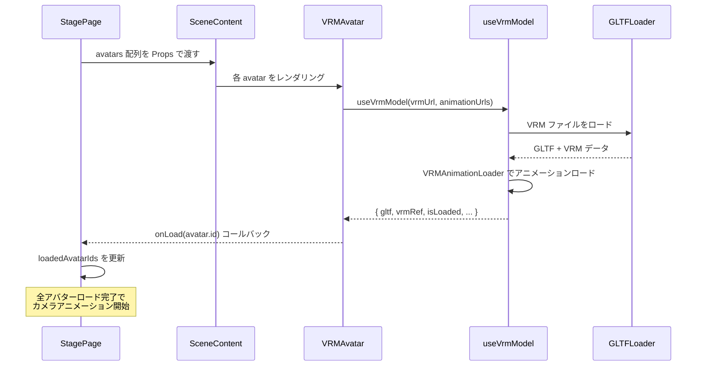
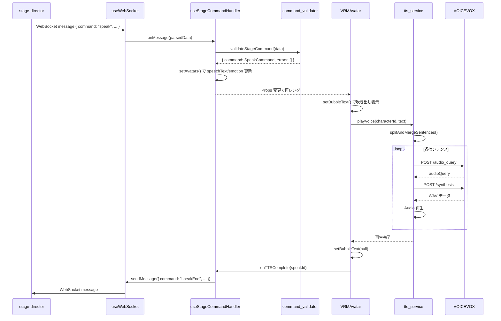
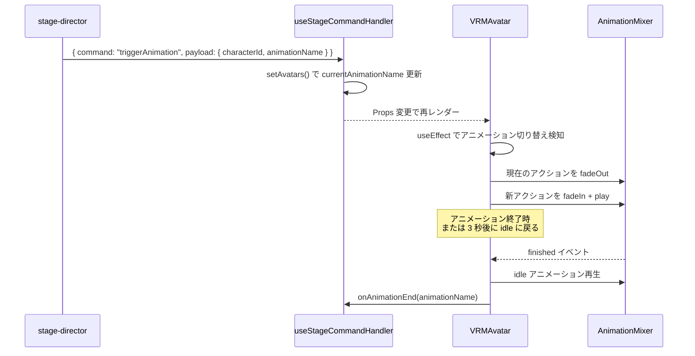
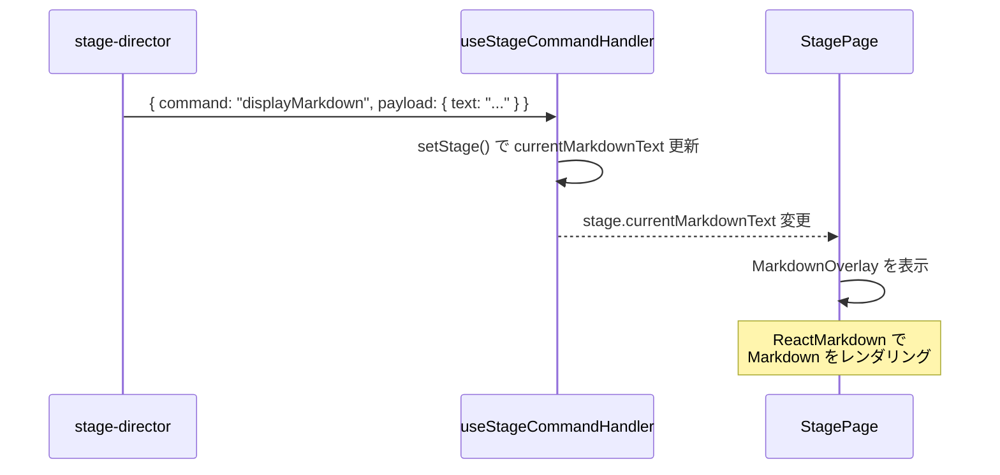
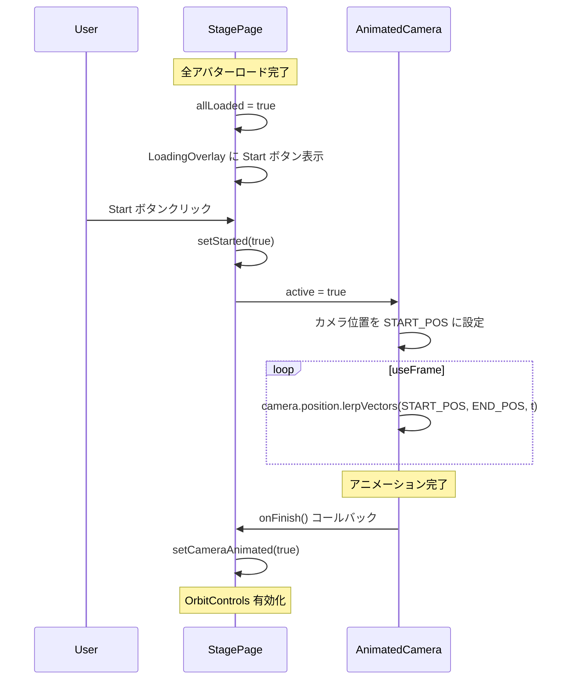

<!-- このドキュメントは .github/prompts/document-project.prompt.md によって生成・更新されています -->

# 主要な機能フロー

## エントリーポイント

### アプリケーション起動フロー

### 関連ファイル

- `src/main.tsx` - ReactDOM のマウント
- `src/App.tsx` - ルートコンポーネント、テーマ設定
- `src/hooks/useStageCommandHandler.ts` - コマンド処理と状態管理
- `src/hooks/useWebSocket.ts` - WebSocket 接続管理

### 処理の流れ

1. `index.html` がブラウザに読み込まれる
2. `main.tsx` が `App` コンポーネントをマウント
3. `App` が `useStageCommandHandler` を呼び出し
4. `useStageCommandHandler` 内で `useWebSocket` が WebSocket 接続を確立
5. `/avatars.json` からアバター設定を取得
6. 状態が Props として `StagePage` に渡される

---

## ユースケース 1: アバターのロードと表示

### 概要

VRM モデルとアニメーションファイルをロードし、3D シーンに配置する。

### シーケンス図

### 関連ファイル

- `src/pages/StagePage.tsx` - ロード状態管理、ローディングオーバーレイ
- `src/components/SceneContent.tsx` - アバター配置
- `src/components/VRMAvatar.tsx` - VRM レンダリング
- `src/hooks/useVrmModel.ts` - VRM/VRMA ロード処理

### 処理の流れ

1. `StagePage` が `avatars` 配列を `SceneContent` に渡す
2. `SceneContent` が各アバターに対して `VRMAvatar` をレンダリング
3. `VRMAvatar` が `useVrmModel` Hook を呼び出し
4. `useVrmModel` が GLTFLoader + VRMLoaderPlugin で VRM をロード
5. VRMAnimationLoaderPlugin でアニメーションファイルをロード
6. ロード完了後、`onLoad` コールバックで親に通知
7. 全アバターロード完了でカメラアニメーション開始

---

## ユースケース 2: 発話コマンドの処理 (speak)

### 概要

サーバーから `speak` コマンドを受信し、アバターがテキストを発話（TTS + 表情 + 吹き出し）。

### シーケンス図

### 関連ファイル

- `src/hooks/useWebSocket.ts` - WebSocket 接続
- `src/hooks/useStageCommandHandler.ts` - コマンド処理
- `src/utils/command_validator.ts` - バリデーション
- `src/components/VRMAvatar.tsx` - 発話制御
- `src/services/tts_service.ts` - VOICEVOX TTS
- `src/hooks/useFacialExpression.ts` - 表情・リップシンク

### 処理の流れ

1. `stage-director` が WebSocket で `speak` コマンドを送信
2. `useWebSocket` がメッセージを受信・パース
3. `useStageCommandHandler` が `validateStageCommand` でバリデーション
4. バリデーション成功後、`avatars` 状態を更新（speechText, currentEmotion）
5. `VRMAvatar` が Props 変更を検知
6. `setBubbleText` で吹き出し表示
7. `playVoice` で TTS 再生開始（`onPlay` コールバックでリップシンク開始）
8. VOICEVOX API で音声合成・再生（センテンス単位）
9. 再生完了後、吹き出しを閉じ、表情を neutral に戻す
10. `onTTSComplete` コールバックで `speakEnd` メッセージを送信

---

## ユースケース 3: アニメーション再生 (triggerAnimation)

### 概要

サーバーから `triggerAnimation` コマンドを受信し、アバターがアニメーションを再生。

### シーケンス図

### 関連ファイル

- `src/hooks/useStageCommandHandler.ts` - コマンド処理
- `src/components/VRMAvatar.tsx` - アニメーション切り替え
- `src/hooks/useVrmModel.ts` - アニメーションクリップ生成

### 処理の流れ

1. `stage-director` が `triggerAnimation` コマンドを送信
2. `useStageCommandHandler` が `avatars` の `currentAnimationName` を更新
3. `VRMAvatar` の `useEffect` がアニメーション名の変更を検知
4. 現在のアクションを `fadeOut` でフェードアウト
5. 新しいアニメーションクリップを生成・再生
6. アニメーションが `LoopOnce` の場合、終了時に `idle` に戻る
7. 3秒タイムアウトで強制的に `idle` に遷移（安全装置）
8. `onAnimationEnd` コールバックで終了を通知

---

## ユースケース 4: Markdown オーバーレイ表示 (displayMarkdown)

### 概要

サーバーから `displayMarkdown` コマンドを受信し、画面下部に Markdown テキストを表示。

### シーケンス図

### 関連ファイル

- `src/hooks/useStageCommandHandler.ts` - コマンド処理
- `src/pages/StagePage.tsx` - Markdown オーバーレイ表示

### 処理の流れ

1. `stage-director` が `displayMarkdown` コマンドを送信
2. `useStageCommandHandler` が `stage.currentMarkdownText` を更新
3. `StagePage` が `stage` Props の変更を検知
4. `currentMarkdownText` が非 null の場合、`MarkdownOverlay` を表示
5. `ReactMarkdown` + `remark-gfm` で Markdown をレンダリング

---

## ユースケース 5: カメラアニメーション

### 概要

全アバターロード完了後、ユーザーが「Start」ボタンを押すとカメラがズームイン。

### シーケンス図

### 関連ファイル

- `src/pages/StagePage.tsx` - ロード状態・開始状態管理
- `src/components/AnimatedCamera.tsx` - カメラアニメーション

### 処理の流れ

1. 全アバターロード完了で `allLoaded = true`
2. Start ボタンが表示される
3. ユーザーがクリックすると `started = true`
4. `AnimatedCamera` の `active` が `true` に
5. カメラが START_POS (0, 5, 10) から END_POS (0, 1.2, 3) へ移動
6. `lerpVectors` で 2.5 秒かけてスムーズに移動
7. 完了後 `onFinish` コールバックで `cameraAnimated = true`
8. `OrbitControls` が有効化され、ユーザーがカメラ操作可能に
