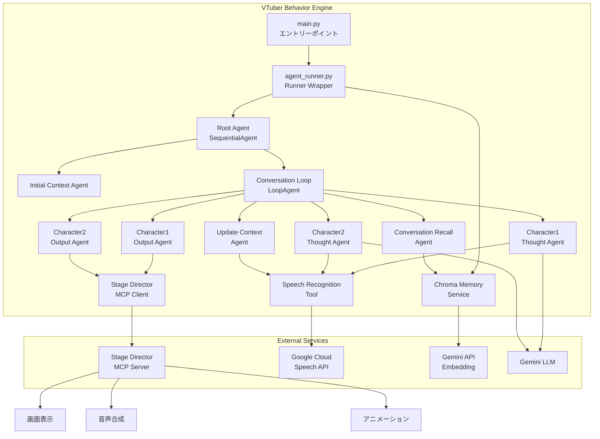
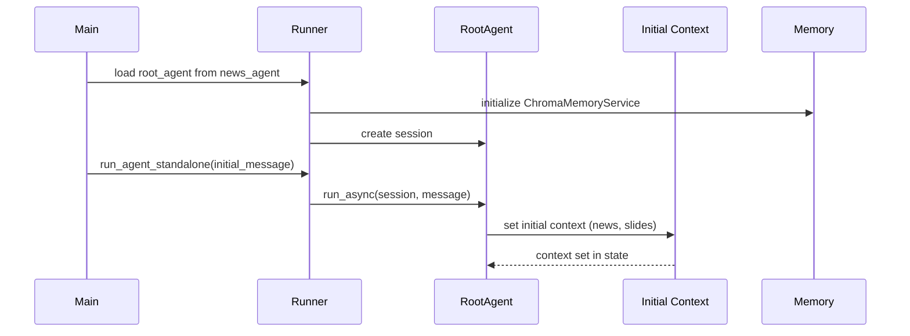
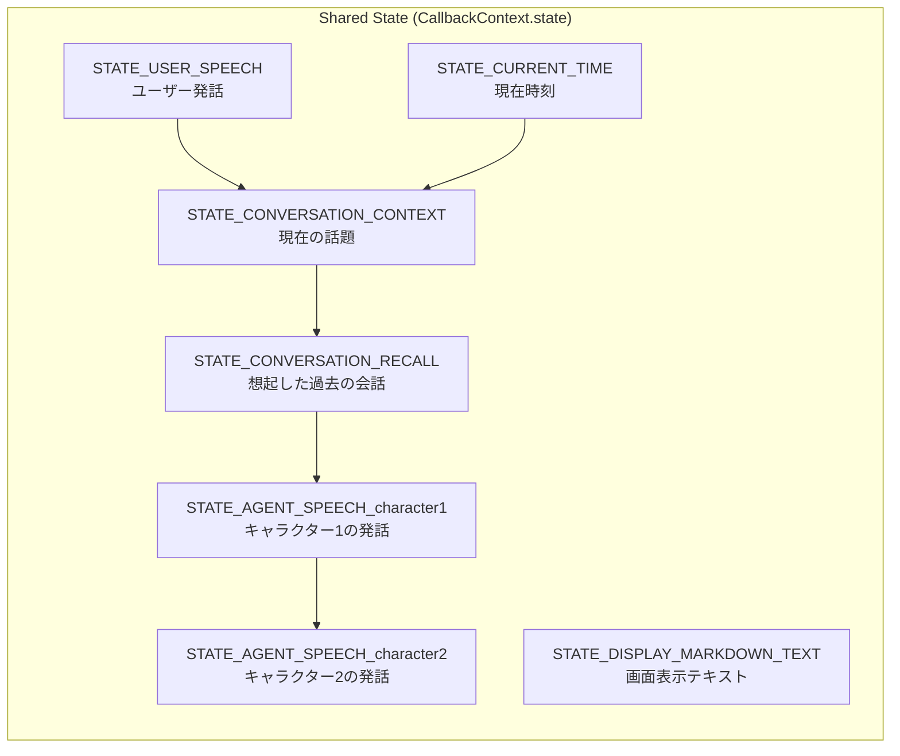

<!-- このドキュメントは .github/prompts/document-project.prompt.md によって生成・更新されています -->

# アーキテクチャ概要

## システム概要

`vtuber-behavior-engine` は、Google ADK (Agent Development Kit) をベースにしたマルチエージェントシステムで、AI VTuber の頭脳として機能します。複数の専門エージェントが協調して動作し、キャラクターの対話生成、感情分析、コンテキスト管理を行います。

このシステムは MCP (Model Context Protocol) Client として動作し、`stage-director` サーバーに接続してキャラクターの発話、アニメーション、画面表示などの実際の演出を制御します。

### 主な機能

- **マルチエージェント協調**: 役割の異なる複数のエージェント（キャラクター、ニュース、プレゼンテーションなど）が協調動作
- **MCP クライアント統合**: Stage Director の MCP Server に接続し、キャラクター制御ツールを使用
- **音声認識統合**: Google Cloud Speech API を使用してユーザーの発話をリアルタイムで取得
- **コンテキスト管理**: 会話履歴とキャラクター状態の永続化と検索（Chroma ベクトル DB）
- **構造化出力**: Pydantic モデルによる型安全な発話・感情表現

## 主要コンポーネント

### 1. Agent Runner (`agent_runner.py`)

ADK の `Runner` をラップし、以下を統合管理します：

- **InMemorySessionService**: セッション管理
- **InMemoryArtifactService**: アーティファクト管理
- **ChromaMemoryService**: 永続化された会話履歴の検索とベクトル埋め込み

### 2. Multi-Agent Pipeline

#### Root Agent (`stage_agents/agent_builder.py`)

`SequentialAgent` として構成され、以下の順序で実行：

1. **Initial Context Agent**: 初期コンテキスト設定（ニュース記事、プレゼンテーションスライドなど）
2. **Conversation Loop Agent**: 会話ループ（`LoopAgent`）
   - Conversation Recall Agent: 過去の会話を検索して想起
   - Character1 Thought Agent: キャラクター 1 の思考生成
   - Character1 Output Agent: キャラクター 1 の発話出力
   - Character2 Thought Agent: キャラクター 2 の思考生成
   - Character2 Output Agent: キャラクター 2 の発話出力
   - Update Context Agent: コンテキスト更新（ユーザー入力、時刻など）

#### Stage-Specific Agents

- **News Agent** (`news_agent/`): ニュース記事の解説と議論
- **Presentation Agent** (`presentation_agent/`): スライド資料に基づくプレゼンテーション
- **Theater Agent** (`stage_agents/theater/`): 劇場モード（今後の拡張）

### 3. Character Agent (`stage_agents/character_agent.py`)

各キャラクターの「思考」と「出力」を担当：

- **Thought Agent**: キャラクターの性格（ペルソナ）に基づいた対話内容を生成
- **Output Agent**: `AgentSpeech` モデルで構造化された発話データを Stage Director に送信

### 4. Stage Director MCP Client (`services/stage_director_mcp_client.py`)

MCP プロトコルで Stage Director サーバーと通信：

- **speak**: キャラクターの発話と感情表現
- **trigger_animation**: ポーズ変更
- **display_markdown_text**: 画面への情報表示

### 5. Speech Recognition Tool (`services/speech_recognition.py`)

Google Cloud Speech API を使用したリアルタイム音声認識：

- バックグラウンドスレッドで常時認識
- 確定した発話をキューに蓄積
- ADK の `BaseTool` として LLM から呼び出し可能

### 6. Memory Service (`services/memory/chroma_memory_service.py`)

Chroma ベクトルデータベースを使用した会話履歴の永続化：

- セッション終了時に会話イベントを保存
- Gemini API で埋め込み生成
- 過去の会話を検索して想起

## アーキテクチャ図



## データフロー

### 1. 起動フロー



### 2. 会話ループフロー

```mermaid
sequenceDiagram
    participant Loop as Conversation Loop
    participant Recall
    participant Char1Think
    participant Char1Out
    participant MCP as MCP Client
    participant StageDir as Stage Director
    participant Memory

    loop max_iterations
        Loop->>Recall: 想起
        Recall->>Memory: search_memory(query)
        Memory-->>Recall: past conversations
        Recall-->>Loop: STATE_CONVERSATION_RECALL

        Loop->>Char1Think: キャラクター1思考
        Char1Think->>Char1Think: get_user_speech()
        Char1Think-->>Loop: STATE_AGENT_SPEECH_character1

        Loop->>Char1Out: キャラクター1出力
        Char1Out->>MCP: speak(AgentSpeech)
        MCP->>StageDir: call_tool("speak")
        StageDir-->>MCP: speaking...

        Loop->>Loop: キャラクター2も同様

        Loop->>Loop: update context
    end

    Loop->>Memory: add_session_to_memory()
```

### 3. 状態管理フロー



## 設計の背景と判断理由

### 1. ADK の採用理由

- **マルチエージェント管理**: 複数のエージェントを宣言的に構成できる
- **状態管理**: `CallbackContext.state` で共有ステートを簡単に管理
- **ツール統合**: LLM が外部ツール（音声認識、MCP クライアントなど）を自然に呼び出し可能
- **セッション管理**: 会話履歴を構造化して保存・検索

### 2. MCP プロトコルの採用理由

- **疎結合**: 頭脳（Behavior Engine）と演出（Stage Director）を分離
- **拡張性**: Stage Director 側でツールを追加すれば、Behavior Engine 側のコード変更不要
- **標準化**: Model Context Protocol という標準に準拠

### 3. Chroma ベクトル DB の採用理由

- **セマンティック検索**: 過去の会話を意味的に類似したものから検索
- **軽量**: ローカル環境で動作し、別途サーバー不要
- **Gemini 統合**: Google の埋め込みモデルとシームレスに連携

### 4. SequentialAgent + LoopAgent 構成

- **初期化と反復の分離**: 初期コンテキスト設定は 1 回、会話は反復
- **明確な制御フロー**: エージェントの実行順序が可視化されている
- **柔軟性**: ステージ（ニュース、プレゼンテーションなど）ごとに Initial/Update Context Agent を差し替えるだけ

### 5. 構造化出力（Pydantic モデル）

- **型安全性**: LLM の出力を構造化して検証
- **バリデーション**: 不正な出力を早期に検出
- **開発体験**: IDE の補完やタイプチェックが効く
