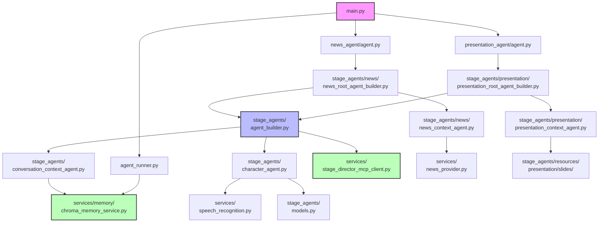

<!-- このドキュメントは .github/prompts/document-project.prompt.md によって生成・更新されています -->

# ディレクトリ構造ガイド

## 全体構成

```
vtuber-behavior-engine/
├── .github/                    # GitHub Actions、Copilot 設定
│   ├── copilot-instructions.md # Copilot 用のプロジェクトガイド
│   └── prompts/                # Copilot プロンプトテンプレート
│       └── document-project.prompt.md
├── agents-docs/                # LLM 向けプロジェクトドキュメント（本ディレクトリ）
├── copilot_log/               # Copilot セッションログ
├── docs/                      # 開発者向けドキュメント
│   ├── create-copilot-context-guide.md
│   └── speech_recognition_tool.md
├── examples/                  # 使用例
│   └── speech_recognition_tool_example.py
├── logs/                      # 実行時ログ出力先
├── src/                       # ソースコード
│   ├── google/adk/memory/     # ADK Memory Service 拡張
│   └── vtuber_behavior_engine/
│       ├── __init__.py
│       ├── agent_runner.py    # ADK Runner ラッパー
│       ├── main.py            # エントリーポイント
│       ├── path.py            # パス定義
│       ├── news_agent/        # ニュースエージェント
│       ├── presentation_agent/ # プレゼンテーションエージェント
│       ├── services/          # 外部サービス統合
│       ├── stage_agents/      # エージェント構成
│       └── utils/             # ユーティリティ
├── tests/                     # テストコード
├── pyproject.toml             # プロジェクト設定
├── README.md
└── .env_sample                # 環境変数サンプル
```

## 各ディレクトリの責務

### `/src/vtuber_behavior_engine/`

プロジェクトのメインソースコード。

#### エントリーポイント関連

- **`main.py`**: スタンドアロン実行のエントリーポイント
  - `news_agent.agent.root_agent` をインポートして実行
  - ステージを切り替える場合はここでインポートを変更
- **`agent_runner.py`**: ADK `Runner` のラッパー
  - `InMemorySessionService`, `InMemoryArtifactService`, `ChromaMemoryService` を統合
  - `run_agent_standalone()` でエージェント実行
- **`path.py`**: アプリケーションのパス定義
  - `APPLICATION_DB_DIR`: `%APPDATA%/vtuber-behavior-engine/db`

#### 依存関係

- `main.py` → `agent_runner.py` → `stage_agents/` → `services/`

### `/src/vtuber_behavior_engine/stage_agents/`

エージェントの構成とステージ管理。

- **役割**: マルチエージェントパイプラインの構築とステージ固有のロジック
- **主要ファイル**:
  - `agent_builder.py`: Root Agent のビルダー（`build_root_agent()`）
  - `agent_constants.py`: 共有ステートキー定義
  - `agents_config.py`: エージェント設定（`max_iterations` など）
  - `character_agent.py`: キャラクターエージェント生成
  - `conversation_context_agent.py`: 会話リコールエージェント
  - `display_utils.py`: 表示用ユーティリティ
  - `models.py`: Pydantic モデル（`AgentSpeech` など）
  - `resources.py`: プロンプトリソース読み込み

#### サブディレクトリ

- **`news/`**: ニュースステージ
  - `news_root_agent_builder.py`: ニュース用 Root Agent ビルダー
  - `news_context_agent.py`: ニュースコンテキスト管理
  - `news_agent_constants.py`: ニュース固有の定数
- **`presentation/`**: プレゼンテーションステージ
  - `presentation_root_agent_builder.py`: プレゼンテーション用 Root Agent ビルダー
  - `presentation_context_agent.py`: プレゼンテーションコンテキスト管理
  - `presentation_models.py`: プレゼンテーション用 Pydantic モデル
- **`theater/`**: 劇場ステージ（今後の拡張）
  - `theater_models.py`: 劇場用モデル
- **`resources/`**: プロンプトテンプレート（Markdown）
  - `character_prompt.md`: キャラクター思考プロンプト
  - `character_output_prompt.md`: キャラクター出力プロンプト
  - `recall_conversation_prompt.md`: 会話リコールプロンプト
  - `initial_message.md`: 初期メッセージ
  - `characters/`: キャラクター定義
    - `character1.md`, `character2.md`
  - `news/`: ニュース用プロンプト
    - `initial_context.md`, `update_context.md`
  - `presentation/`: プレゼンテーション用プロンプト
    - `initial_context.md`, `update_context.md`
    - `create_presentation_slides_json_template.md`
    - `slides/`: スライド JSON ファイル

#### 依存関係

- `agent_builder.py` → `character_agent.py`, `conversation_context_agent.py` → `services/`
- `news/news_root_agent_builder.py` → `agent_builder.py`
- `presentation/presentation_root_agent_builder.py` → `agent_builder.py`

### `/src/vtuber_behavior_engine/services/`

外部サービスとの統合と共通サービス。

- **役割**: Google Cloud API、MCP クライアント、外部データソースとの連携
- **主要ファイル**:
  - `stage_director_mcp_client.py`: Stage Director の MCP クライアント
    - `speak()`, `display_markdown_text()`, `trigger_animation()`
  - `speech_recognition.py`: 音声認識ツール
    - `SpeechRecognitionTool` (ADK `BaseTool`)
    - `SpeechRecognitionManager` (バックグラウンドスレッド)
  - `current_time_provider.py`: 現在時刻プロバイダー
  - `image_provider.py`: 画像プロバイダー
  - `news_provider.py`: ニュースプロバイダー（RSS 取得）
  - `youtube_comment_provider.py`: YouTube コメントプロバイダー

#### サブディレクトリ

- **`memory/`**: メモリサービス
  - `chroma_memory_service.py`: Chroma ベクトル DB による会話履歴管理
    - `add_session_to_memory()`, `search_memory()`

#### 依存関係

- `stage_director_mcp_client.py` → MCP Server (外部)
- `speech_recognition.py` → Google Cloud Speech API (外部)
- `chroma_memory_service.py` → Chroma, Gemini API (外部)

### `/src/vtuber_behavior_engine/news_agent/`

ニュースエージェントのエントリーポイント。

- **役割**: ニュースステージの起動設定
- **主要ファイル**:
  - `agent.py`: ニュース用 Root Agent のファクトリー
    - `root_agent` (async 変数): `build_root_news_agent()` を呼び出し

#### 依存関係

- `agent.py` → `stage_agents/news/news_root_agent_builder.py`

### `/src/vtuber_behavior_engine/presentation_agent/`

プレゼンテーションエージェントのエントリーポイント。

- **役割**: プレゼンテーションステージの起動設定
- **主要ファイル**:
  - `agent.py`: プレゼンテーション用 Root Agent のファクトリー
    - `root_agent` (async 変数): `build_root_presentation_agent()` を呼び出し

#### 依存関係

- `agent.py` → `stage_agents/presentation/presentation_root_agent_builder.py`

### `/src/vtuber_behavior_engine/utils/`

ユーティリティ関数。

- **役割**: ロギング設定など共通機能
- **主要ファイル**:
  - `logger.py`: ロガー設定
    - `setup_logger()`: コンソールとファイル（`logs/app_<date>.log`）にログ出力

#### 依存関係

- 他のモジュールから `utils.logger` をインポート

### `/src/google/adk/memory/`

ADK Memory Service の拡張（オプショナル）。

- **役割**: ADK のメモリサービスをカスタマイズ
- 現状は Chroma Memory Service を独自に実装

### `/tests/`

テストコード。

- **役割**: ユニットテスト、統合テスト
- **主要ファイル**:
  - `test_dummy.py`: ダミーテスト
  - `test_speech_recognition_tool.py`: 音声認識ツールのテスト
  - `test_speech_recognition_integration.py`: 音声認識の統合テスト

### `/docs/`

開発者向けドキュメント。

- **役割**: 特定機能の詳細説明
- **主要ファイル**:
  - `speech_recognition_tool.md`: 音声認識ツールの実装ドキュメント
  - `create-copilot-context-guide.md`: Copilot コンテキスト作成ガイド

### `/examples/`

使用例。

- **役割**: 個別機能の使用例
- **主要ファイル**:
  - `speech_recognition_tool_example.py`: 音声認識ツールの単体実行例

### `/copilot_log/`

Copilot セッションログ。

- **役割**: 開発時の Copilot とのやり取りを記録

### `/.github/`

GitHub 固有の設定。

- **役割**: Copilot 設定、プロンプトテンプレート
- **主要ファイル**:
  - `copilot-instructions.md`: Copilot 用のプロジェクトガイド
  - `prompts/document-project.prompt.md`: プロジェクトドキュメント生成プロンプト

## モジュール間の依存関係図



## レイヤー構造

### 1. エントリーポイント層

- `main.py`
- `news_agent/agent.py`, `presentation_agent/agent.py`

### 2. アプリケーション層

- `agent_runner.py`: ADK Runner の統合管理

### 3. エージェント構成層

- `stage_agents/agent_builder.py`: Root Agent 構築
- `stage_agents/news/`, `stage_agents/presentation/`: ステージ固有のエージェント構築

### 4. エージェント実装層

- `stage_agents/character_agent.py`: キャラクターエージェント
- `stage_agents/conversation_context_agent.py`: 会話リコールエージェント
- `stage_agents/news/news_context_agent.py`: ニュースコンテキストエージェント
- `stage_agents/presentation/presentation_context_agent.py`: プレゼンテーションコンテキストエージェント

### 5. サービス層

- `services/stage_director_mcp_client.py`: MCP クライアント
- `services/speech_recognition.py`: 音声認識
- `services/memory/chroma_memory_service.py`: メモリサービス
- `services/news_provider.py`, `services/image_provider.py`, など: データプロバイダー

### 6. モデル層

- `stage_agents/models.py`: Pydantic モデル
- `stage_agents/presentation/presentation_models.py`: プレゼンテーション用モデル

### 7. リソース層

- `stage_agents/resources/`: プロンプトテンプレート、キャラクター定義、スライド JSON

### 8. ユーティリティ層

- `utils/logger.py`: ロギング
- `path.py`: パス定義

## 新規ファイル追加時のガイドライン

### 新しいステージを追加する場合

1. `stage_agents/<stage_name>/` ディレクトリを作成
2. `<stage_name>_root_agent_builder.py` で Root Agent ビルダーを実装
3. `<stage_name>_context_agent.py` で Initial/Update Context Agent を実装
4. `<stage_name>_agent_constants.py` でステージ固有の定数を定義
5. `<stage_name>_agent/agent.py` でエントリーポイントを作成
6. `main.py` でインポートを変更

### 新しいサービスを追加する場合

1. `services/<service_name>.py` でサービスクラスを実装
2. 必要に応じて ADK の `BaseTool` を継承してツール化
3. エージェントからサービスを呼び出し

### 新しいプロンプトを追加する場合

1. `stage_agents/resources/<category>/<prompt_name>.md` に配置
2. `stage_agents/resources.py` で読み込み関数を追加
3. エージェントで `resources.<prompt_name>()` を呼び出し
