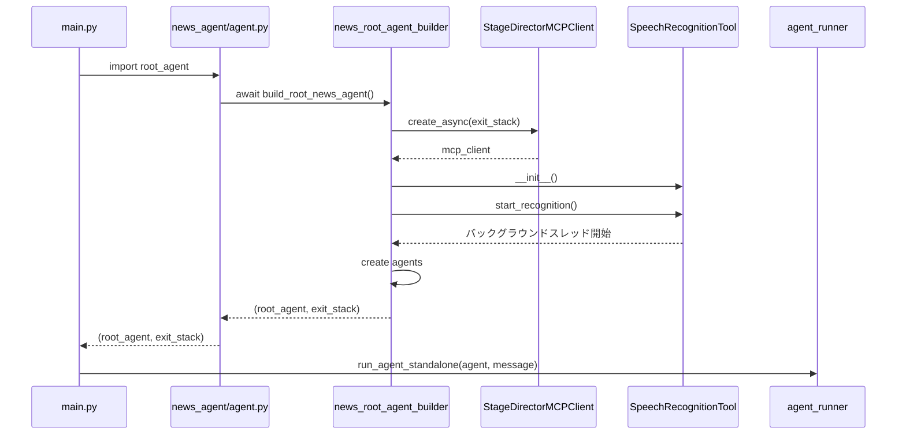
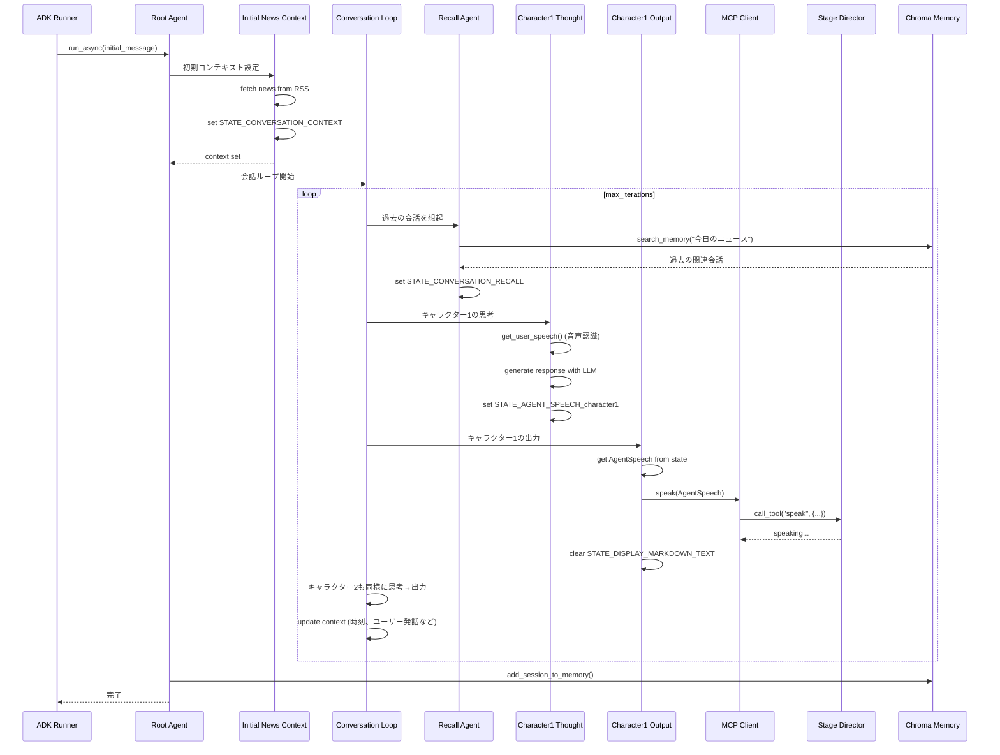
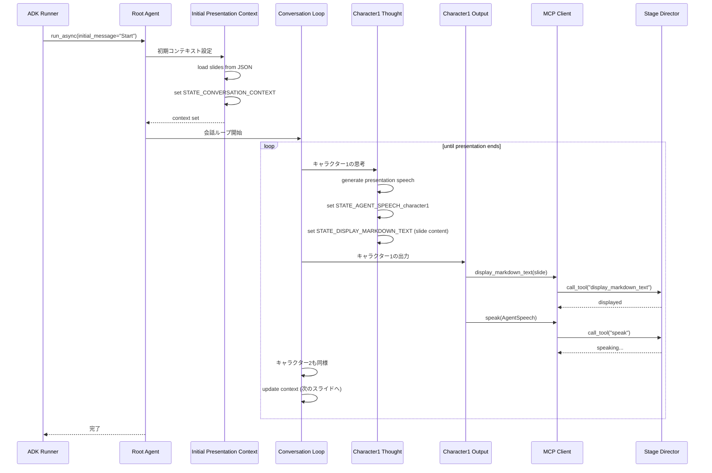
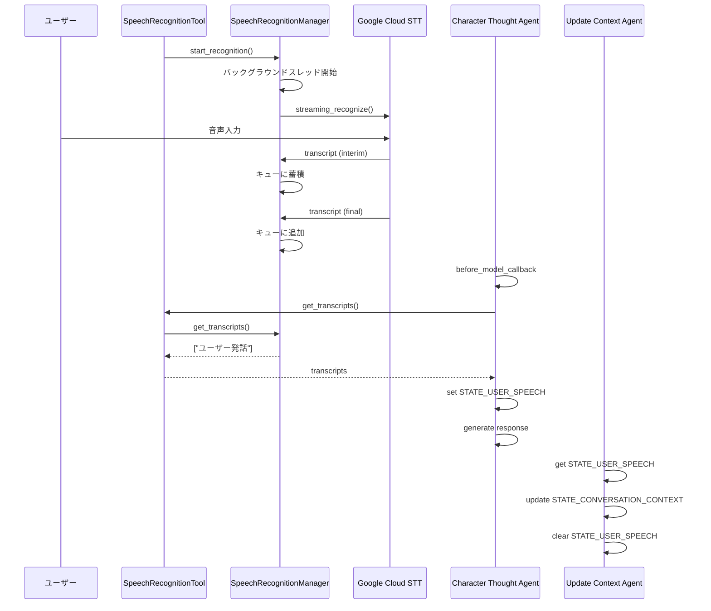
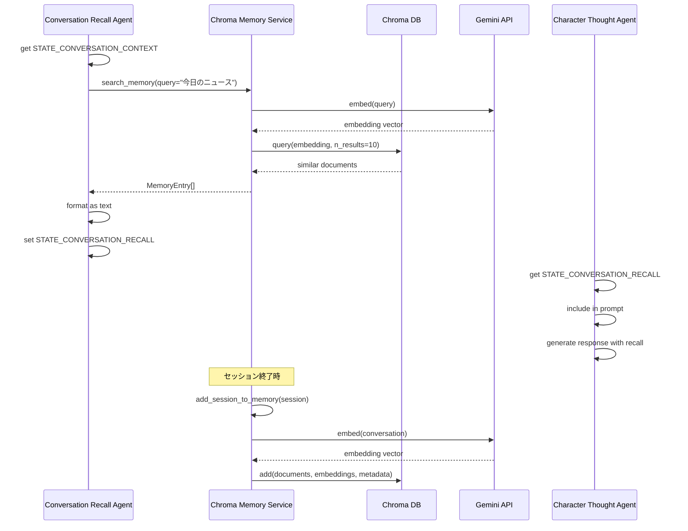
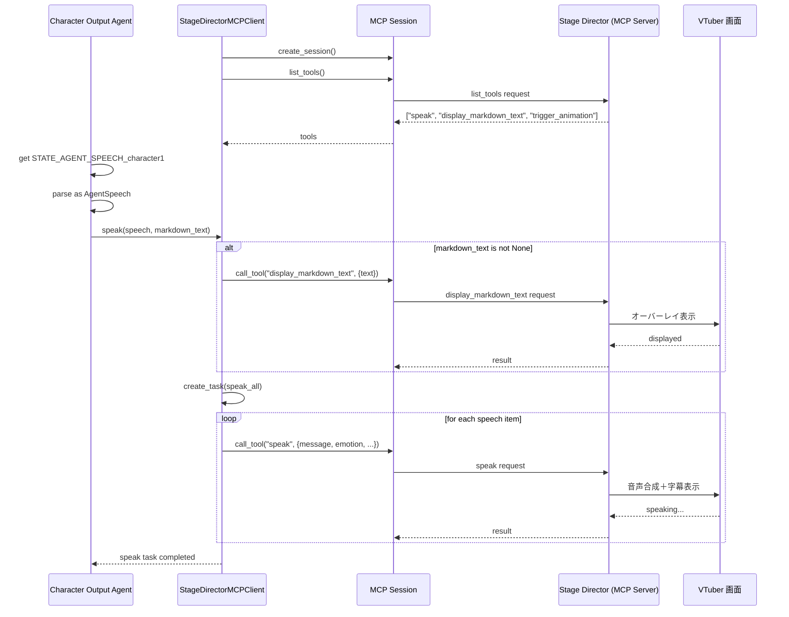

<!-- このドキュメントは .github/prompts/document-project.prompt.md によって生成・更新されています -->

# 主要な機能フロー

## エントリーポイント

### スタンドアロン実行フロー

**ファイル**: `src/vtuber_behavior_engine/main.py`

```python
async def main() -> None:
    from vtuber_behavior_engine.news_agent.agent import root_agent

    exit_stack: AsyncExitStack | None = None
    try:
        agent_tuple = await root_agent
        if agent_tuple is None:
            logger.error("Failed to create root agent.")
            raise Exception("Failed to create root agent.")
        character_agent, exit_stack = agent_tuple
        # initial message
        message = initial_message()
        await run_agent_standalone(character_agent, message)
    finally:
        if exit_stack is not None:
            await exit_stack.aclose()
```

### 初期化シーケンス



### 関連ファイル

- `src/vtuber_behavior_engine/main.py` - メインエントリーポイント
- `src/vtuber_behavior_engine/agent_runner.py` - ADK Runner ラッパー
- `src/vtuber_behavior_engine/news_agent/agent.py` - ニュースエージェントファクトリー
- `src/vtuber_behavior_engine/stage_agents/news/news_root_agent_builder.py` - Root Agent ビルダー

### 処理の流れ

1. `main.py` がエージェントをインポート（`news_agent.agent.root_agent`）
2. `build_root_news_agent()` で Root Agent を構築
3. Stage Director MCP Client を初期化
4. 音声認識ツールをバックグラウンドで開始
5. エージェントパイプライン（Initial Context → Conversation Loop）を構築
6. `run_agent_standalone()` で実行開始
7. 初期メッセージをエージェントに送信

---

## ユースケース 1: ニュース解説フロー

### 概要

2 人の AI キャラクターがニュース記事について対話・解説を行う。

### シーケンス図



### 関連ファイル

- `src/vtuber_behavior_engine/stage_agents/news/news_root_agent_builder.py` - ニュース用 Root Agent 構築
- `src/vtuber_behavior_engine/stage_agents/news/news_context_agent.py` - ニュースコンテキスト管理
- `src/vtuber_behavior_engine/stage_agents/character_agent.py` - キャラクター思考・出力
- `src/vtuber_behavior_engine/services/stage_director_mcp_client.py` - Stage Director 連携
- `src/vtuber_behavior_engine/services/news_provider.py` - ニュース取得

### 処理の流れ

1. **Initial News Context Agent** がニュース記事を RSS から取得し、`STATE_CONVERSATION_CONTEXT` に設定
2. **Conversation Loop** 開始（最大反復回数まで）
3. **Conversation Recall Agent** が過去の会話を検索して想起
4. **Character1 Thought Agent** がキャラクター 1 の思考を生成
   - 音声認識ツールでユーザー発話を取得
   - LLM でニュースに対するコメントを生成
   - `STATE_AGENT_SPEECH_character1` に保存
5. **Character1 Output Agent** が発話を Stage Director に送信
   - `AgentSpeech` を取得
   - MCP Client で `speak` ツールを呼び出し
   - 画面表示テキストをクリア
6. **Character2** も同様に思考 → 出力
7. **Update Context Agent** がコンテキストを更新（時刻、ユーザー発話など）
8. ループ終了後、セッションをメモリに保存

---

## ユースケース 2: プレゼンテーションフロー

### 概要

2 人の AI キャラクターがスライド資料に基づいてプレゼンテーションを行う。

### シーケンス図



### 関連ファイル

- `src/vtuber_behavior_engine/stage_agents/presentation/presentation_root_agent_builder.py` - プレゼンテーション用 Root Agent
- `src/vtuber_behavior_engine/stage_agents/presentation/presentation_context_agent.py` - プレゼンテーションコンテキスト管理
- `src/vtuber_behavior_engine/stage_agents/presentation/presentation_models.py` - プレゼンテーション用モデル
- `src/vtuber_behavior_engine/stage_agents/resources/presentation/slides/` - スライド JSON ファイル

### 処理の流れ

1. **Initial Presentation Context Agent** がスライド JSON を読み込み、`STATE_CONVERSATION_CONTEXT` に設定
2. **Conversation Loop** 開始
3. **Character1 Thought Agent** がスライド内容に基づいてプレゼンテーション発話を生成
   - `STATE_AGENT_SPEECH_character1` に保存
   - `STATE_DISPLAY_MARKDOWN_TEXT` にスライド内容を設定
4. **Character1 Output Agent** がスライドを表示し、発話を実行
   - `display_markdown_text` でスライド表示
   - `speak` で発話
5. **Character2** も同様
6. **Update Context Agent** が次のスライドに進む
7. すべてのスライドを消化したらループ終了

---

## ユースケース 3: 音声認識統合フロー

### 概要

ユーザーの発話をリアルタイムで認識し、キャラクターの対話に反映させる。

### シーケンス図



### 関連ファイル

- `src/vtuber_behavior_engine/services/speech_recognition.py` - 音声認識ツールとマネージャー
- `src/vtuber_behavior_engine/stage_agents/character_agent.py` - `get_user_speech` コールバック
- `src/vtuber_behavior_engine/stage_agents/news/news_context_agent.py` - ユーザー発話をコンテキストに統合

### 処理の流れ

1. **SpeechRecognitionManager** がバックグラウンドスレッドを開始
2. Google Cloud Speech API でストリーミング認識
3. 確定した発話（`is_final=True`）をキューに蓄積
4. **Character Thought Agent** の `before_model_callback` でユーザー発話を取得
5. `STATE_USER_SPEECH` に保存
6. LLM がユーザー発話を考慮して応答生成
7. **Update Context Agent** がユーザー発話を会話コンテキストに統合
8. `STATE_USER_SPEECH` をクリア

---

## ユースケース 4: メモリ検索・想起フロー

### 概要

過去の会話をベクトル検索で想起し、現在の対話に反映させる。

### シーケンス図



### 関連ファイル

- `src/vtuber_behavior_engine/stage_agents/conversation_context_agent.py` - Conversation Recall Agent
- `src/vtuber_behavior_engine/services/memory/chroma_memory_service.py` - Chroma Memory Service
- `src/vtuber_behavior_engine/agent_runner.py` - セッション保存

### 処理の流れ

1. **Conversation Recall Agent** が現在の話題を取得（`STATE_CONVERSATION_CONTEXT`）
2. **ChromaMemoryService** に検索クエリを送信
3. Gemini API でクエリを埋め込みベクトル化
4. Chroma DB でベクトル類似度検索（上位 10 件）
5. 検索結果をテキスト形式で整形
6. `STATE_CONVERSATION_RECALL` に保存
7. **Character Thought Agent** がリコール内容をプロンプトに含めて応答生成
8. セッション終了時、全ての会話イベントを Chroma DB に保存

---

## ユースケース 5: Stage Director 連携フロー

### 概要

生成した発話データを MCP プロトコルで Stage Director に送信し、キャラクターを制御する。

### シーケンス図



### 関連ファイル

- `src/vtuber_behavior_engine/services/stage_director_mcp_client.py` - MCP クライアント
- `src/vtuber_behavior_engine/stage_agents/character_agent.py` - Character Output Agent
- `src/vtuber_behavior_engine/stage_agents/models.py` - AgentSpeech モデル

### 処理の流れ

1. **StageDirectorMCPClient** が MCP Server に接続
2. 利用可能なツール一覧を取得（`speak`, `display_markdown_text`, `trigger_animation`）
3. **Character Output Agent** が `STATE_AGENT_SPEECH_character1` から `AgentSpeech` を取得
4. 画面表示テキストがあれば `display_markdown_text` を呼び出し
5. `speak` ツールをバックグラウンドタスクで実行
6. 各発話アイテムについて：
   - `tts_text`: 音声合成用テキスト
   - `caption`: 字幕用テキスト
   - `emotion`: 感情表現（`neutral`, `happy`, `sad`, `angry`, `excited`）
7. Stage Director が VTuber 画面に反映（音声合成、字幕表示、アニメーション）
8. 前のタスクが完了するまで待機してから次の発話を実行

---

## エラーハンドリングフロー

### MCP 接続エラー

```python
try:
    stage_director_client = await StageDirectorMCPClient.create_async(exit_stack)
except ValueError as e:
    logger.error("STAGE_DIRECTOR_MCP_SERVER_URL is not set.", exc_info=e)
    raise
```

### 音声認識エラー

```python
try:
    speech_tool.start_recognition()
except Exception as e:
    logger.error(f"Failed to start speech recognition: {e}", exc_info=e)
    # 音声認識なしで続行
```

### LLM 出力バリデーションエラー

```python
# AgentSpeech として parse できない場合は ADK が自動的にリトライ
agent = LlmAgent(
    output_schema=AgentSpeech,  # Pydantic モデルで検証
)
```

### セッション保存エラー

```python
try:
    await memory_service.add_session_to_memory(completed_session)
except Exception as e:
    logger.error(f"Failed to save session to memory: {e}", exc_info=e)
    # 保存失敗しても続行
```
