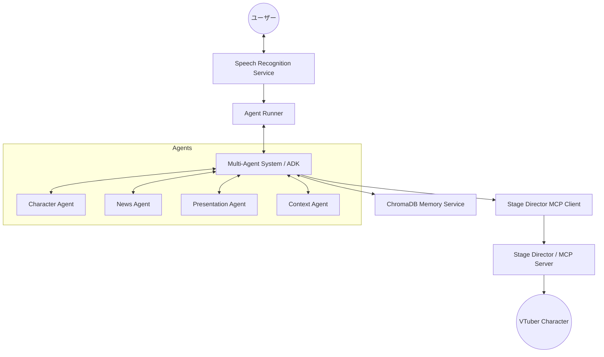

<!-- このドキュメントは .github/prompts/doc-sync.prompt.md によって生成および更新されています -->

# アーキテクチャ概要

## システム概要

`vtuber-behavior-engine` は、AI V-Tuber システムの「頭脳」として機能するコアコンポーネントです。Google ADK (Agent Development Kit) を基盤とし、複数の専門エージェントが協調して動作するマルチエージェントシステムを採用しています。このシステムは、ユーザーとの対話、感情分析、コンテキスト管理を行い、MCP (Model Context Protocol) を通じてキャラクターの動作を制御します。

## 主要コンポーネント

- **Agent Runner**: エージェントの実行とライフサイクルを管理します。
- **Multi-Agent System (ADK)**:
  - **Character Agent**: キャラクターの性格に基づいた対話を生成。
  - **News Agent**: ニュース情報の解説と議論を担当。
  - **Presentation Agent**: スライド資料に基づいたプレゼンを実行。
  - **Conversation Context Agent**: 会話の文脈とトピックを管理。
- **Services**:
  - **Speech Recognition**: Google Cloud Speech API を使用した音声入力処理。
  - **Stage MCP Client**: `vtube-stage` (MCP Server) と通信し、キャラクターの動作（発話、アニメーション）を指示。
  - **Memory Service**: ChromaDB を使用した長期・短期記憶の管理。

## アーキテクチャ図

## 設計方針

1. **モジュール性**: 各エージェントとサービスは独立しており、容易に拡張や差し替えが可能です。
2. **プロトコルベースの通信**: MCP を採用することで、外部の演出エンジンとの疎結合な連携を実現しています。
3. **コンテキスト重視**: ベクトルデータベースを活用し、過去の会話や関連情報を踏まえた高度な対話を実現します。
