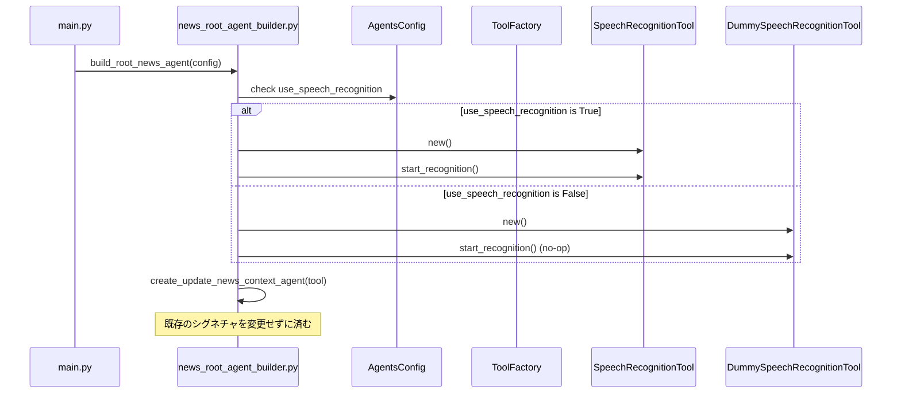

<!-- この文書は @Architect により生成されました -->

# 仕様: 音声認識の切り替えオプション (SpeechRecognitionToggle)

<metadata>

| Metadata       | Value                                                                 |
| :------------- | :-------------------------------------------------------------------- |
| **Status**     | Draft                                                                 |
| **要件ソース** | [requirements.md](docs/specs/SpeechRecognitionToggle/requirements.md) |

</metadata>

<overview>

## 1. 概要

### 背景

現在のシステムでは `SpeechRecognitionTool` が常に起動されますが、マイクがない環境や音声入力を必要としない場合にエラーやリソース消費の原因となります。

### 目標

`AgentsConfig` を通じて音声認識の有効/無効を制御できるようにします。既存のフローへの影響を最小限にするため、無効時には何もしない「ダミー」の音声認識ツールを使用する設計を採用します。

### スコープ

- **Included**:
  - `AgentsConfig` への `use_speech_recognition` フィールドの追加。
  - 何もしない `DummySpeechRecognitionTool` の実装。
  - `build_root_news_agent` における条件付きツール選択。
- **Excluded**:
  - 音声認識以外の入力ソース（YouTube コメント等）の動作変更。

</overview>

<requirements>

## 2. 要件

### ユーザーストーリー

- **開発者/ユーザー** として、**設定によって音声認識を無効に** したい。なぜなら **マイクがない環境でもエラーなくシステムを起動し、不要なリソース消費を抑える** ことができるから。
- **ユーザー** として、**音声認識を無効にしても**、**YouTube コメントなどの他の入力ソースでキャラクターと対話** し続けたい。

### 受け入れ基準（Gherkin）

<gherkin>

```gherkin
Feature: Speech Recognition Toggle with Dummy Tool

  Scenario: Enable speech recognition by default
    Given AgentsConfig is initialized with default values
    Then use_speech_recognition should be True

  Scenario: Disable speech recognition via config
    Given AgentsConfig is initialized with use_speech_recognition=False
    When build_root_news_agent is called
    Then DummySpeechRecognitionTool should be used
    And no real microphone or Google STT should be initialized
    And the system should start without errors

  Scenario: System continues to work with Dummy Tool
    Given use_speech_recognition is False
    When the agent loop runs
    Then the DummySpeechRecognitionTool should return empty transcripts
    And the character agent should continue its loop normally
```

</gherkin>

</requirements>

<technical_design>

## 3. 技術設計

### アーキテクチャ / フロー

<mermaid_diagram>



</mermaid_diagram>

### ロジック仕様

<logic_details>

1.  **`AgentsConfig` の拡張**:
    - `use_speech_recognition: bool = True` を追加。
2.  **`DummySpeechRecognitionTool` の実装**:
    - `SpeechRecognitionTool` と同じインターフェース（`__call__`, `start_recognition`, `stop_recognition`）を持つが、内部で `SpeechRecognitionManager` を作成せず、常に空の結果を返すクラス。
    - 既存の `SpeechRecognitionTool` を継承し、メソッドをオーバーライドするのが最も影響が少ない。
3.  **`build_root_news_agent` の修正**:
    - `agent_config.use_speech_recognition` に基づいて、`SpeechRecognitionTool` か `DummySpeechRecognitionTool` のいずれかをインスタンス化する。
    - その後の `start_recognition()` や `exit_stack.callback` は共通のコードとして残せる。

</logic_details>

### データモデル

<data_definitions>

```python
class AgentsConfig(BaseModel):
    max_iterations: int = Field(default=5)
    use_speech_recognition: bool = Field(default=True) # 追加
```

</data_definitions>

### API 変更

<api_definitions>

- 特になし（既存の `SpeechRecognitionTool` を期待する箇所に `DummySpeechRecognitionTool` を渡すため）。

</api_definitions>

</technical_design>

<verification_plan>

## 4. 検証計画

### 自動テスト

- `tests/tests_vtuber_behavior_engine/test_speech_recognition_toggle.py` を新規作成。
- `AgentsConfig(use_speech_recognition=False)` で `build_root_news_agent` を呼び出し、例外が発生しないことを確認。
- `create_update_news_context_agent(None)` が正常に作成され、実行時にエラーにならないことを確認。

### 手動検証

1.  `AgentsConfig` のデフォルト値で起動し、音声認識が動作することを確認。
2.  `AgentsConfig(use_speech_recognition=False)` を設定して起動し、音声認識が起動せず、かつシステムが正常に動作することを確認。
    </verification_plan>

<review_history>

| Date       | Reviewer   | Comment                                            | Status |
| :--------- | :--------- | :------------------------------------------------- | :----- |
| 2026-01-01 | @Architect | ダミーツール方式に変更（既存フローへの影響最小化） | Draft  |

</review_history>
